[Toc]

文档下载地址：[scc749/go-basic: Golang基础入门 (github.com)](https://github.com/scc749/go-basic)

# Golang基础入门

### 0.1 简介

**本篇教程适用于对Golang感兴趣的初学者，也适用于对Golang基础知识点不太熟练的初学者，也适用于对于Golang基础知识点查缺补漏的初学者，此文档知识内容丰富，收录了较为详细的Golang常用知识点，通过本篇文档，希望对大家Golang的基础学习有所帮助（如果有重要的知识点，博主未列出，请在下方评论处指出，谢谢！）。**

**（博主只是一个Golang的初学者之一，在此，仅希望各位初学者们在一开始学习Golang的时候，少走一些弯路，如果大家在阅读的过程中发现有很明显的错误或者说还有很多不足之处，欢迎大家指出，博主很乐意接受大家的建议，因为这样也可以帮助到博主自己，在此先提前谢谢大家。）**

### 0.2 先决条件

- **一些编程经验。**Golang的代码十分简洁、美观，这使得上手具有一定的难度，需要您有一定的编程经验，如：C/C++，Java，Python等，如果没有的话，也没关系，博主也会尽量用通俗易懂的语言来介绍。
- **用于编辑代码的工具。**大多数文本编辑器都对 Go 有很好的支持，都可以用于敲golang的代码，包括记事本。其中最受欢迎的是 VSCode（免费）、GoLand（付费）和Vim（免费）。（GoLand、IDEA等JetBrains全家桶系列，学生党可以白嫖）
- **会使用命令终端。**如Windows 中的 PowerShell 或 cmd。

### 0.3 参考文献

[Documentation - The Go Programming Language (google.cn)](https://golang.google.cn/doc/)

[Release History - The Go Programming Language (google.cn)](https://golang.google.cn/doc/devel/release)

[Go语言中文文档-地鼠文档 (topgoer.cn)](https://www.topgoer.cn/docs/golang/golang-1ccjbpfstsfi1)

[Go专家编程-地鼠文档 (topgoer.cn)](https://www.topgoer.cn/docs/gozhuanjia/gogfjhk)

[Gin教程_Golang+Gin框架入门实战教程-百度网盘下载地址 (itying.com)](http://bbs.itying.com/topic/6125d9fc2d11541aa0843713)

[Go语言、golang权威学习教程 (magedu.com)](https://www.magedu.com/wenzhang/golang/index.html)

[Go语言：环境变量GOPROXY和GO111MODULE设置_猪哥-嵌入式的博客-CSDN博客](https://blog.csdn.net/u012351051/article/details/115033956?ydreferer=aHR0cHM6Ly9jbi5iaW5nLmNvbS8%3D)

---

## 模块一：初识Go

### 1.1 什么是 Golang？

#### 1.1.1 Go发展历史

**Go的核心开发团队**

**Ken Thompson**

- 1966年：加入了贝尔实验室，在参与 Multics （多路信息计算）开发期间，创造出了B语言，并用一个月的时间用B语言开发了全新的操作系统UNICS，后来改名为我们所熟悉的UNIX 操作系统。
- 1971年：和丹尼斯·利奇（Dennis Ritchie）一起共同发明了C语言。
- 1973年：和丹尼斯·利奇（Dennis Ritchie）使用C语言重写了UNIX，并安装于PDP-11的机器之上。
- 1983年：美国计算机协会将图灵奖授予汤普森。
- 2000年：离开贝尔实验室，已退休的汤普森成为了一名飞行员。
- 2006年：加入Google工作。
- 2007年：64岁的高龄，与Rob Pike和Robert Griesemer主导了Go的开发。

**Rob Pike**

- Go项目总负责人。
- 贝尔实验室Unix团队成员，参与的项目包括Plan 9，Inferno操作系统和Limbo编程语言。
- UTF-8字符集规范唯二的发明人之一（另一位是Ken Thompson）。
- 《UNIX环境编程》和《程序设计实践》这两本书的作者之一。
- 第22届莫斯科夏季奥运会射箭项目的银牌得主。
- 业余天文学家，设计的珈玛射线望远镜差点被 NASA 用在航天飞机上。
- 他的媳妇Renee French 就是 Go 语言吉祥物的设计人。

**Robert Griesemer**

- 参与V8 JavaScript引擎的开发。
- 参与Java HotSpot虚拟机的研发。

**起源**

2007年，Google的几位大牛正在用C++开发一些比较繁琐但是核心的工作，主要是分布式集群，大牛觉得很闹心。此时C++委员会来他们公司做技术演讲，说C++将要添加35个新特性，大牛心里飘过一万个CNM，“C++特性还不够多吗”。于是Rob Pike说要不自己搞个简单一点的语言吧，首先名字得简单好记，大腿一拍就叫“go”。

**把事情搞复杂很容易，把事情搞简单才更深刻。**

**发展**

- 2007年9月21日，开始雏形设计。
- 2009年10月30日，Rob Pike宣布了Go的存在。
- 2009年11月10日，以完全开源的方式公布了Linux和Mac OSX上的版本，11月22日公布了Windows版本。
- 2010年1月8日，当选2009年年度语言。
- 2010年5月，谷歌投入使用。
- 2011年4月，谷歌开始抽调员工全职开发Go，并于5月宣布Google APP Engine支持Go。
- 2015年8月19日  ，Go1.5版本发布，本次更新中移除了“最后残余的C代码”，请内存管理方面权威专家Rick Hudson对GC进行重新设计
- 2018年8月24日 ， Go1.11版本发布，开始不支持WinXP系统
- 2022年3月15日，  Go1.18版本发布，开始全面支持泛型，以及新增Workspaces的概念

**现状**

从世界范围看，Go在**中国**的发展势头最猛，且远超第二名。在很多互联网大厂Go已成为主要开发语言。  

下图显示了在 [开发人者生态系统调查 2020](https://www.jetbrains.com/lp/devecosystem-2020/go/) 中调查的每个国家使用 Go 作为主要语言的开发者的分布情况（受访者最多可以选择 3 种主要语言）。 **中国**的开发者集中度最高，有 16% 的中国开发者使用 Go 语言。


资料来源于[Go 语言现状调查报告 | The GoLand Blog (jetbrains.com)](https://blog.jetbrains.com/zh-hans/go/2021/02/19/the-state-of-go/)

#### 1.1.2 Go的优劣

**优势**

- 语法简单，易于学习。类C的语法，同时比C/C++简洁和干净。

- 自带GC，方便使用。

- 快速编译，高效执行。

- 简单的依赖管理。

- 并发编程，轻松驾驭。

- 静态类型，同时有一些动态语言的特征(var声明)。

- 标准类库，规范统一

**劣势**

- 不支持动态加载代码。

- 发展时间短，生态不及Java、C++庞大，但是够用。 

#### 1.1.3 Go的应用场景

**应用场景总览**

- 巨型中央服务器领域。
- 高性能分布式领域。
- 游戏服务端开发。
- 复杂事件处理。
- 对实时性要求很高的软件开发。
- 可以在Intel和ARM处理器上运行，因此也可以在安卓上运行。

**go微服务开发**

- 零依赖，让我们可以最小化我们的镜像,节省存储与拉取镜像带宽。
- Runtime使用更小的内存，对比Java的JVM。
- 更好的并行能力，当你真的需求更多CPU的时候。
- 更高的性能，对比解释性语言，在处理数据已经并发方面优势明显。
- 简单，学习成本低，内部人员可以转入Go阵营。
- 使用Go能更接近云原生生态，比如docker，k8s, habor都是用Go开发的。 

---

## 模块二：Go环境配置

### 2.1 学习目标

1. 安装Go的安装包

2. 下载VSCode
3. 写出第一个Golang程序
4. 了解GOROOT，GOPATH，GOPROXY，GO111MODULE

### 2.2 安装Golang

**下载地址：**

[The Go Programming Language (golang.org)](http://golang.org/dl/)（官方链接，需要挂梯子）

[All releases - The Go Programming Language (google.cn)](https://golang.google.cn/dl/)（Golang官网的官方镜像，强烈推荐）

[Go下载 - Go中文网 - Golang中文社区 (studygolang.com)](https://studygolang.com/dl)（国内Golang的交流社区）

然后下载对应平台的安装包即可。**请记住您的Golang的安装位置，这一点很重要**

**go1.21.0.windows-amd64.msi**（windows推荐下载这个，直接下一步，下一步安装即可，**请记住安装位置**）

go1.21.0.windows-amd64.zip（下载这个虽然只需要解压就好了，但是不太推荐，**需要在Path中手动配置Go的路径**）


**好吧，如果你不记的话可能也没啥问题，如果是用`.msi`安装的话，`Path`会自己帮你配好，此外一般的编译器也会自动找到它的位置，如果是直接解压`.zip`的仁兄，请移步到`GOROOT`的配置**

**`Path`已经配好的（`.msi`安装请忽略），按`win`+`R`输入`cmd`回车，输入`go version`，即可看到相应版本信息，没配置`Path`的话，只能看到，'xxx'不是内部或外部命令，也不是可运行的程序或批处理文件**

### 2.3 配置GOPATH？

**不，咱先不配，后面将详细介绍什么是`GOROOT`，`GOPATH`，`GOPROXY`，`GO111MODULE`，然后去了解，为什么要配它们**

### 2.4 VSCode的安装及配置

**微软商店：（直接搜索就好）**


**官网下载：**

[Visual Studio Code - Code Editing. Redefined](https://code.visualstudio.com/)


**直接下一步，下一步安装即可**

**打开后点击左边的拓展**


**输入`Chinese`**


**安装之后，右下角有个弹窗**

!

**继续输入`Go`，安装第一个**

!

**此时VSCode即可用于写Golang的代码**

但是，刚装完Go插件的小伙伴应该会发现，右下角会出现一堆弹窗，不用管它们，全X掉就好，因为点了也没用。

### 2.5 第一个Golang程序

**先了解一下常用的几个go命令：**（也许学的过程中只会用到`go run`）

```
go env			用于打印Go的环境信息。
go run			命令可以编译并运行命令源码文件。
go get			可以根据要求和实际情况从互联网上下载或更新指定的代码包及其依赖包，并对它们进行编译和安装。
go build		命令用于编译我们指定的源码文件或代码包以及它们的依赖包。
go install		用于编译并安装指定的代码包及它们的依赖包。
go clean		命令会删除掉执行其它命令时产生的一些文件和目录。
go doc			命令可以打印附于Go程序实体上的文档。我们可以通过把程序实体的标识符作为该命令的参数来达到查看其文档的目的。
go test			命令用于对Go编写的程序进行测试。
go list			命令的作用是列出指定的代码包的信息。
go fix			会把指定代码包的所有Go源码文件中的旧版本代码修正为新版本的代码。
go vet			是一个用于检查Go源码中静态错误的简单工具。
go tool pprof	命令来交互式的访问概要文件的内容。
```

**打开此电脑，选择一个路径用于保存你的Golang项目代码**

这里我用的是`D:\`，在此目录下新建一个`go_project`文件夹，当然叫其他名字也可以。


**双击打开，并新建src，pkg，bin三个文件夹。**


不用太多疑惑，这是一个完整的Golang项目所需要的，实际上初学者所用到的只有`src`一个文件夹，或者说也不需要这么新建文件夹，随便在桌面空白处新建一个文本文档，然后把`.txt`改成`.go`，然后用VSCode打开，上手敲代码就好了，这里只是养成一个好习惯而已。

下面简单介绍这三个文件夹的作用：

**bin：用来存放编译后生成的可执行文件**

**pkg：用来存放编译后生成的归档文件**

**src：用来存放源码文件**

**接下来，我们将尝试用VSCode写你的第一个Golang程序**


**选择刚才创建的项目文件夹**


**右键`src`，选择`新建文件夹`**

前文提到`src`即是我们存放源码的地方，所以我们写的代码全放在该文件夹下。


文件夹名字随便起就行，这里就不得不提一嘴，为什么又要新建文件夹？直接新建文件不好吗？

新建文件夹是为了更好地去规范我们的代码的存放位置，说白了，要建立一种框架意识，共同起到一种功能的所有代码放一块，打包起来，你说包也行，模块也勉强可以（学过C++或者Java的会很好理解这一点）。

**项目 > 模块（可以没有） > 包 > 单元（说法不准确，理解就行）**

包就是文件夹，一个单元就是一个`.go`文件，从前往后的包含关系。

同时这也是为了去符合Golang的一个硬性规范，**Golang一个包下只能有一个`main()函数`（与Java不同）**（不信的可以去试试，看看会不会报错）。


**然后新建一个叫`hello.go`的文件**


**然后右下角会出现一堆弹窗，不用管它们，全X掉就好，因为点了也没用。**

**来到右边，我们开始写我们的第一个Golang程序**（报红很正常，咱们硬写，后面会解释为什么会报红）

**温馨小提示：正常来说package包名默认与文件夹保持一致，这里第一行默认应为`package day1`，但是Go硬性规定，`main()函数`所在的`.go`文件，包名必须为`main`，否则将无法运行，这一点很重要！**


```go
package main

import "fmt"

func main() {

  fmt.Println("Hello World!")

}

```

**写完后，记得按`ctrl`+`s`保存一下**

**然后我们选择在终端中打开**


**这里默认就是该文件所在的文件夹路径，注意右上角是`powershell`，可以理解为`cmd`的超集，把它当作`cmd`用就好了**


**然后输入`go run hello.go`**（也可以先`go build hello.go`生成可执行二进制文件`.exe`，然后输入`hello`运行，即先编译，再运行，有些类似Java的`-javac`、`-java`命令）


**回车后，就可以看到执行结果啦**


**后面解决，一堆报红及GOROOT，GOPATH，GOPROXY，GO111MODULE是什么。**

### 2.6 VSCode的Go工具插件（一）

**现在来介绍VSCode的Go工具插件：**

有趣的是这些Go插件都是**Go的第三方库的开源模块**(所以需要配置`GOPROXY`环境变量)。

**打开VSCode（已打开当我没说），按`ctrl`+`shift`+`p`**

**输入 `Go:Install/Update Tools`**


**选择全选，并点击确定**


**然后耐心等待一会儿，你就能在下方的窗口中看到全部下载失败了**


**不过不要心急，这是有办法解决的，配置一下`GOPROXY`代理就好了，此外请注意这里，是重点内容**


让我们先进入下一章节。

### 2.7 什么是GOROOT，GOPATH，GOPROXY，GO111MODULE？

**GOROOT：**`GOROOT`就是Go的安装目录，前面安装Go的时候让大家记住的（类似于java的JDK）。

**GOPATH：**`GOPATH`就是我们的工作空间，**保存go项目代码和第三方依赖包**（如果go项目没有配置`GOPATH`，则需要`go.mod`，`go.work`管理）。

**GOPROXY：**`GOPROXY`表示的是go的代理设置，之所以有这个环境变量，是因为go这种语言不像C语言，在C语言中，如果我们想要使用别人的第三方代码，一般有两种途径：

1. 将第三方代码源码合并到自己的工程文件中，再合并编译。
2. 将第三方代码编译生成的共享库**`.so`或`.dll`** 文件放到工程目录下，然后通过条件编译来使用。

Go中如何使用别人的第三方代码，即模块（MODULE），类似于java，我们可以在编程时，通过第三方代码的库地址，如git仓库，然后在编译的时候，IDE会帮我们自动的拉取第三方库文件到当前工程。

这样做虽然很方便，但是很多第三方代码库是在国外服务器上的，因为一些限制，我们不能很顺利的使用和下载这些仓库，这样就会导致下载缓慢或者失败，所以这个时候就需要一个代理来实现下载，这个代理就是中间商，可以跨过限制来访问。（说白点就是梯子）

**Golang官方默认的GOPROXY是`https://goproxy.io`，但是效果不太理想，我们可以使用国内的七牛云代理`https://goproxy.cn`。**

**GO111MODULE：**`GO111MODULE`是`go modules`功能的开关，关于`go modules`这里不详细说明，感兴趣的可以去搜一下。

在没有`go modules`机制时，go工程中对于第三方功能包的管理非常复杂，也非常专业，这就导致程序员在进行开发的时候，对于第三方功能包的管理很不方便，所以有了`go modules`机制。

这个机制的开关是通过`GO111MODULE`环境变量来配置的。

**接下来我们开始配置相关的环境变量**

**为了使所有的计算机用户都可以使用 Go 环境，我们就在系统变量之中配置。**

当然，在用户变量之中配置也是可以的，毕竟我们的电脑一般就一个用户用。

**先打开我们的环境变量**


**现在我们看到我们的环境变量是这个样子，先进入到我们的系统变量中的`Path`里面看一下**


**仔细看最后一个路径，是不是很眼熟，没错这就是我们安装`.msi`，go的安装包的时候，它帮我们配置好的`Path`路径。**

**如果是用`.zip`解压的，是没有这个路径的，需要自己手动配置，如果不配置这个`Path`，我们在使用终端中go命令的时候，就会显示'xxx'不是内部或外部命令，也不是可运行的程序或批处理文件，原因是终端中当前路径下，是没有go的命令文件的，添加到`Path`之后，终端中输入相应的命令，系统会优先在`Path`中搜索执行该指令的文件，然后执行，大家可以试着将任何软件的启动项路径写入`Path`，然后在任意位置打开`cmd`，直接调用启动文件**


**然后我们退出，返回环境变量页面**

#### 2.7.1 配置GOROOT

**接下来我们要修改一下`GOROOT`的写法，其实不改也没什么大问题**


**这样我们的`GOROOT`就配好了**

#### 2.7.2 配置GOPROXY和GO111MODULE


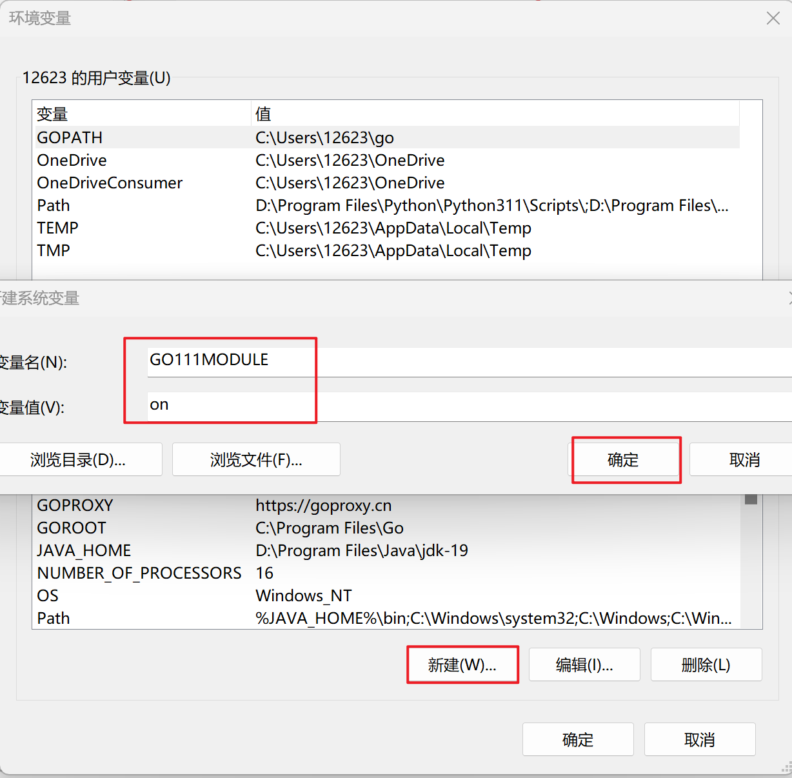

**最后`GOPATH`的配置，我们还是先不配，我们在 2.9.1 GOPATH配置中讲解**

**这里只需要留意一下用户变量中的这个`GOPATH`的路径，是我们在VSCode尝试下载Go工具插件的时候，帮我们配置的路径，也就是Go工具插件的安装路径**


**最后不要忘了点确定！**


### 2.8 VSCode的Go工具插件（二）

**现在我们重新下载Go工具插件**（可能需要重启一下VSCode）


现在就成功了，然后你会发现新增了很多实用的功能，自动导包，代码自动提示，保存后自动格式化代码，显示函数信息等等。

### 2.9 go mod，go work命令介绍

golang是从v1.11引入了go mod机制，为了完善go mod机制，又从v1.18引入了多模块工作区机制（要把哪些mod纳入到你的工作区内），即`go work`机制，从之前的版本升级到v1.18及之后，vscode工作环境可能会报错。

**vscode打开的文件夹的路径默认作为了其工作区（`workspace`），而这个工作区的根目录要有`go.mod`文件，如果根目录，或`src`下没有这个`go.mod`就要指定哪些子目录的`go.mod`纳入工作区**

一般是项目的根目录作为工作区，如这里的`D:\go_project`，工作区的根目录，或`src`下要有`go.mod`，我们需要用指令生成一个（自己手写也可以），如果不想在工作区目录下生成，就需要用`go work`命令指明工作区的子目录（这里就是`src`）下的哪些mod需要纳入工作区。

接下来，我们来解决这个报错信息。

**当我们没有给我们的项目路径设置`GOPATH`的时候，我们就需要依赖于`go.mod`和`go.work`来管理我们的项目。**


**首先，在集成终端中打开`day1`的路径**


**输入`go mod init day1`，初始化该模块**


**报错就消失了，但是不要着急，还没结束**


**之前提过，Golang一个包下只能有一个`main()函数`，所以下面这种就会报错**


**此时就需要像这样，新建一个包，这样就不会报错了，但是还没结束，我们并没有给`day2`这个包配置`go.mod`，尽管它没有报错**

（这里是一个文件夹，表示一个模块，即多模块项目）


**给`day2`配置完`go.mod`后，会发现，它又报错了**


**原因是，当一个go项目存在多个模块时，要使`go.mod`之间产生依赖，我们需要用`go.work`去管理`go.mod`（1.18之后的配置）**


**然后我们打开任意工作区子目录的集成终端**（emmm，我没有找到直接打开工作区的终端的选项）


**然后输入`cd ..`回退到工作区路径（`go.work`需要在工作区目录下，如果一开始打开的工作区（从VSCode打开的文件夹）为`src`，`go.work`就放在`src`目录下）**


**然后输入`go work init src\day1`初始化一下，再输入`go work use src\day2`，将day2纳入工作区**

**（也可以输入`go work init`初始化一个空的工作区，然后再用`go work use`纳入`day1`，`day2`）**


**最后就不会报错了**


**补充：**

**`go.mod`放在`src`目录下（不是子文件夹），可以不需要`go.work`（一开始的介绍里面讲的比较清晰）**

**也可以不使用`go.mod`和`go.work`，直接在`GOPATH`中加上项目路径即可**

#### 2.9.1 GOPATH配置（可以不配，使用go mod管理）

**可以借用一下之前用户变量里面的`GOPATH`，直接在末尾添加`;D:\go_project`（你的项目路径，不要忘了加';'）**


**或者添加在系统变量里面**


**最后不要忘了点确定！**


**这样也是可以的，最后重启一下VSCode就好了**


虽然上面很多东西不讲，后面也可以继续学，但是博主觉得，把这些东西弄明白挺重要的，虽然讲的都很粗浅，但是可以增加对Golang的一些理解，对于以后大家深入学习Golang有一定的帮助的。

### 拓展1：VSCode文件夹分层显示

**如果你的VSCode的子文件夹为一个时，会自动收缩成一行，感觉十分不方便，可以打开设置，点击工作区，点击功能，点击资源管理器，找到`Compact Folders`，取消勾选即可。**

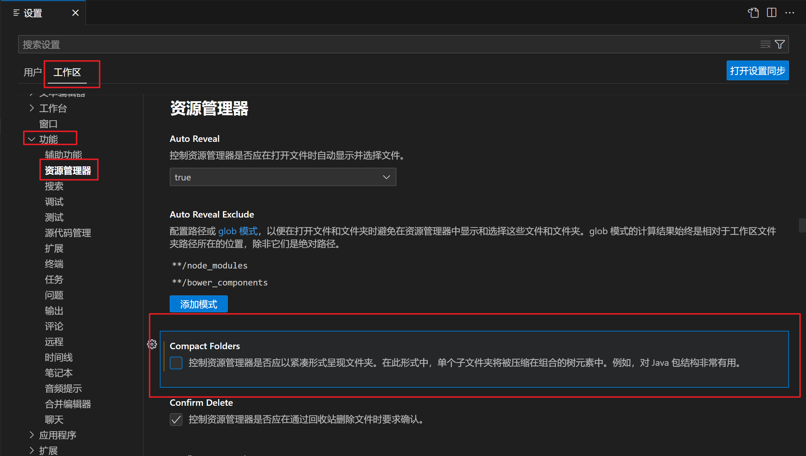

### 拓展2：Goland的方便之处（小特性）

**前面讲过：Golang一个包下只能有一个`main()函数`，所以正常而言，每写一个`main()函数`就要新建一个文件夹，但是Goland一个包下可以写好几个包含`.go`的文件，注意，这样写肯定不会给你运行，但是你可以按`ctrl`+`shift`+`F10`强行运行当前的`.go`文件（一个文件），就不需要每次都要创建文件夹了**

**初始配置已经全部讲完，正式开始你的Golang学习之旅吧！**

---

## 模块三：Go基础语法

### 3.1 学习目标

1. 认识基本的标识符与关键字
2. 了解基本的操作符与表达式
3. 熟练掌握变量、常量、字面量的相关操作

### 3.2 标识符与关键字

Go变量、常量、自定义类型、包、函数的命名方式必须遵循以下规则：

1. 首字符可以是任意`Unicode`字符或下划线。
2. 首字符之外的部分可以是`Unicode`字符、下划线或数字。
3. 名字的长度无限制。

理论上名字里可以有汉字，甚至可以全是汉字，但实际中不要这么做。

#### 3.2.1 Go关键字

```go
break  default  func  interface  select  case  defer  go  map  struct  chan  else  goto  package  switch  const  if  range  type  continue  for  import  return  fallthrough  var
```

#### 3.2.2 常量

```go
true  false  iota  nil   
```

#### 3.2.3 数据类型

```go
int  int8  int16  int32  int64  uint  uint8  uint16  uint32  uint64  uintptr  float32  float64  complex128  complex64  bool  byte  rune  string  error
```
#### 3.2.4 函数

```go
make  len  cap  new  append  copy  close  delete  complex  real  imag  panic  recover
```

### 3.3 操作符与表达式

Go 语言内置的运算符有：

1. 算术运算符
2. 关系运算符
3. 逻辑运算符
4. 位运算符
5. 赋值运算符

#### 3.3.1 算法术运算符

| 运算符 | 描述 |
| :----: | :--: |
|   +    | 相加 |
|   -    | 相减 |
|   *    | 相乘 |
|   /    | 相除 |
|   %    | 求余 |

```go
// arithmetic 算术运算
func arithmetic() {
	var a float32 = 8
	var b float32 = 3
	var c float32 = a + b
	var d float32 = a - b
	var e float32 = a * b
	var f float32 = a / b
	fmt.Printf("a=%.3f, b=%.3f, c=%.3f, d=%.3f, e=%.3f, f=%.3f\n", a, b, c, d, e, f)
}
```

#### 3.3.2 关系运算符  

| 运算符 | 描述                                                         |
| :----: | :----------------------------------------------------------- |
|   ==   | 检查两个值是否相等，如果相等返回 True 否则返回 False         |
|   !=   | 检查两个值是否不相等，如果不相等返回 True 否则返回 False     |
|   >    | 检查左边值是否大于右边值，如果是返回 True 否则返回 False     |
|   >=   | 检查左边值是否大于等于右边值，如果是返回 True 否则返回 False |
|   <    | 检查左边值是否小于右边值，如果是返回 True 否则返回 False     |
|   <=   | 检查左边值是否小于等于右边值，如果是返回 True 否则返回 False |

```go
// relational 关系运算符
func relational() {
	var a float32 = 8
	var b float32 = 3
	var c float32 = 8
	fmt.Printf("a==b吗 %t\n", a == b)
	fmt.Printf("a!=b吗 %t\n", a != b)
	fmt.Printf("a>b吗 %t\n", a > b)
	fmt.Printf("a>=b吗 %t\n", a >= b)
	fmt.Printf("a<c吗 %t\n", a < b)
	fmt.Printf("a<=c吗 %t\n", a <= c)
}
```

#### 3.3.3 逻辑运算符  

| 运算符 | 描述                                                         |
| :----: | :----------------------------------------------------------- |
|   &&   | 逻辑 AND 运算符。 如果两边的操作数都是 True，则为 True，否则为 False |
|  \|\|  | 逻辑 OR 运算符。 如果两边的操作数有一个 True，则为 True，否则为 False |
|   !    | 逻辑 NOT 运算符。 如果条件为 True，则为 False，否则为 True   |

```go
// logistic 逻辑运算符
func logistic() {
	var a float32 = 8
	var b float32 = 3
	var c float32 = 8
	fmt.Printf("a>b && b>c吗 %t\n", a > b && b > c)
	fmt.Printf("a>b || b>c吗 %t\n", a > b || b > c)
	fmt.Printf("a>b不成立，对吗 %t\n", !(a > b))
	fmt.Printf("b>c不成立，对吗 %t\n", !(b > c))
}
```

#### 3.3.4 位运算符

| 运算符 | 描述                                                         |
| :----: | :----------------------------------------------------------- |
|   &    | 参与运算的两数各对应的二进位相与（两位均为1才为1）           |
|   \|   | 参与运算的两数各对应的二进位相或（两位有一个为1就为1）       |
|   ^    | 参与运算的两数各对应的二进位相异或，当两对应的二进位相同时为0，不同时为1。作为一元运算符时表示按位取反，，符号位也跟着变 |
|   <<   | 左移n位就是乘以2的n次方。a<<b是把a的各二进位全部左移b位，高位丢弃，低位补0。通过左移，符号位可能会变 |
|   >>   | 右移n位就是除以2的n次方。a>>b是把a的各二进位全部右移b位，正数高位补0，负数高位补1 |

```go
// bit_op 位运算
func bit_op() {
	fmt.Printf("os arch %s, int size %d\n", runtime.GOARCH, strconv.IntSize) // int是4字节还是8字节，取决于操作系统是32位还是64位
	var a int32 = 260
	fmt.Printf("260     %s\n", BinaryFormat(a))
	fmt.Printf("-260    %s\n", BinaryFormat(-a)) // 负数用补码表示。在对应正数二进制表示的基础上，按拉取反，再末位加1
	fmt.Printf("260&4   %s\n", BinaryFormat(a&4))
	fmt.Printf("260|3   %s\n", BinaryFormat(a|3))
	fmt.Printf("260^7   %s\n", BinaryFormat(a^7))     // ^作为二元运算符时表示异或
	fmt.Printf("^-260   %s\n", BinaryFormat(^-a))     // ^作为一元运算符时表示按位取反，符号位也跟着变
	fmt.Printf("-260>>10 %s\n", BinaryFormat(-a>>10)) // 正数高位补0，负数高位补1
	fmt.Printf("-260<<3 %s\n", BinaryFormat(-a<<3))   // 负数左移，可能变成正数
	// Go没有循环（无符号）左/右移符号   >>>  <<<
}

// 输出一个int32对应的二进制表示
func BinaryFormat(n int32) string {
	a := uint32(n)               // 将传进来的int32类型数值转换为无符号的uint32并赋值给a
	sb := strings.Builder{}      // 拼接字符串
	c := uint32(math.Pow(2, 31)) // 求2的31次方的幂值 二进制为：10000000000000000000000000000000
	for i := 0; i < 32; i++ {
		if a&c > 0 {
			sb.WriteString("1")
		} else {
			sb.WriteString("0")
		}
		c >>= 1
	}
	return sb.String()
}
```

#### 3.3.5 赋值运算符

| 运算符 | 描述                                           |
| :----: | :--------------------------------------------- |
|   =    | 简单的赋值运算符，将一个表达式的值赋给一个左值 |
|   +=   | 相加后再赋值                                   |
|   -=   | 相减后再赋值                                   |
|   *=   | 相乘后再赋值                                   |
|   /=   | 相除后再赋值                                   |
|   %=   | 求余后再赋值                                   |
|  <<=   | 左移后赋值                                     |
|  >>=   | 右移后赋值                                     |
|   &=   | 按位与后赋值                                   |
|  \|=   | 按位或后赋值                                   |
|   ^=   | 按位异或后赋值                                 |

```go
// assignment 赋值运算
func assignment() {
	var a, b int = 8, 3
	a += b
	fmt.Printf("a+=b %d\n", a)
	a, b = 8, 3
	a -= b
	fmt.Printf("a-=b %d\n", a)
	a, b = 8, 3
	a *= b
	fmt.Printf("a*=b %d\n", a)
	a, b = 8, 3
	a /= b
	fmt.Printf("a/=b %d\n", a)
	a, b = 8, 3
	a %= b
	fmt.Printf("a%%=b %d\n", a) // %在fmt里有特殊含意，所以需要前面再加个%转义一下
	a, b = 8, 3
	a <<= b
	fmt.Printf("a<<=b %d\n", a)
	a, b = 8, 3
	a >>= b
	fmt.Printf("a>>=b %d\n", a)
	a, b = 8, 3
	a &= b
	fmt.Printf("a&=b %d\n", a)
	a, b = 8, 3
	a |= b
	fmt.Printf("a|=b %d\n", a)
	a, b = 8, 3
	a ^= b
	fmt.Printf("a^=b %d\n", a)
}
```

### 3.4 变量、常量、字面量

#### 3.4.1 变量

##### 3.4.1.1 变量类型

|   类型   |                         Go变量类型                         | fmt输出  |
| :------: | :--------------------------------------------------------: | :------: |
|   整型   | int int8 int16 int32 int64 uint uint8 uint16 uint32 uint64 |    %d    |
|  浮点型  |                      float32 float64                       | %f %e %g |
|  布尔型  |                            bool                            |    %t    |
|   指针   |                          uintptr                           |    %p    |
|   引用   |                     map slice channel                      |    %v    |
|   字节   |                            byte                            |    %c    |
| 任意字符 |                            rune                            |    %c    |
|  字符串  |                           string                           |    %s    |
|   错误   |                           error                            |    %v    |

##### 3.4.1.2 变量声明

Go中的变量需要声明后才能使用，同一作用域内不支持重复声明。并且Go的变量声明后必须使用。

**标准声明**

Go的变量声明格式为：

```go
	var 变量名 变量类型
```

变量声明以关键字`var`开头，变量类型放在变量的后面，行尾无需分号。 举个例子：

```go
	var name string 
	var age int 
	var isOk bool
```

**批量声明**

每声明一个变量就需要写`var`关键字会比较繁琐，Go中还支持批量变量声明：

```go
	var ( 
		name string 
		age int 
		isOk bool 
	)
```

##### 3.4.1.3 变量的初始化

Go在声明变量的时候，会自动对变量对应的内存区域进行初始化操作。每个变量会被初始化成其类型的默认值，例如： 整型和浮点型变量的默认值为`0`。 字符串变量的默认值为空字符串。 布尔型变量默认为`false`。 切片、函数、指针变量的默认为`nil`。

当然我们也可在声明变量的时候为其指定初始值。变量初始化的标准格式如下：

**标准格式**

```go
	var 变量名 类型 = 表达式
```

举个例子：

```go
	var name string = "pprof.cn"
	var sex int = 1
```

或者一次初始化多个变量

```go
	var name, sex = "pprof.cn", 1
```

**类型推导**

有时候我们会将变量的类型省略，这个时候编译器会根据等号右边的值来推导变量的类型完成初始化。

```go
	var name = "pprof.cn"
	var sex = 1
```

**短变量声明**

在函数内部，可以使用更简略的` := `方式声明并初始化变量。

**注意：短变量只能用于声明局部变量，不能用于全局变量的声明**

```go
package main

import "fmt"

// 全局变量m
var m = 100

func main() {
	n := 10
	m := 200 // 此处声明局部变量m
	fmt.Println(m, n)
}

```

**匿名变量**

在使用多重赋值时，如果想要忽略某个值，可以使用`匿名变量（anonymous variable）`。 匿名变量用一个下划线_表示，例如：

```go
package main

import "fmt"

func foo() (int, string) {
	return 10, "Q1mi"
}

func main() {
	x, _ := foo()
	_, y := foo()
	fmt.Println("x=", x)
	fmt.Println("y=", y)
}

```

匿名变量不占用命名空间，不会分配内存，所以匿名变量之间不存在重复声明。 

**注意事项：**

1. 函数外的每个语句都必须以关键字开始（`var`、`const`、`func` 等）
2. `:=`不能使用在函数外。
3. `_`多用于占位，表示忽略值

#### 3.4.2 常量

相对于变量，常量是恒定不变的值，多用于定义程序运行期间不会改变的那些值。 常量的声明和变量声明非常类似，只是把`var`换成了`const`，常量在定义的时候必须赋值。

```go
	const pi = 3.1415
	const e = 2.7182
```

声明了`pi`和`e`这两个常量之后，在整个程序运行期间它们的值都不能再发生变化了。

多个常量也可以一起声明：

```go
	const (
		pi = 3.1415
		e  = 2.7182
	)
```

`const`同时声明多个常量时，如果省略了值则表示和上面一行的值相同。 例如：

```go
	const (
		n1 = 100
		n2
		n3
	)
```

上面示例中，常量`n1、n2、n3`的值都是`100`。

##### 3.4.2.1 iota

`iota`是`go`语言的常量计数器，只能在常量的表达式中使用。
`iota`在`const`关键字出现时将被重置为`0`。`const`中每新增一行常量声明将使`iota`计数一次(`iota`可理解为`const`语句块中的行索引)。 使用`iota`能简化定义，在定义枚举时很有用。

举个例子：

```go
	const (
		n1 = iota //0
		n2        //1
		n3        //2
		n4        //3
	)
```

**几个常见的iota示例:**

使用`_`跳过某些值

```go
	const (
		n1 = iota //0
		n2        //1
		_
		n4 //3
	)
```

`iota`声明中间插队

```go
	const (
		n1 = iota //0
		n2 = 100  //100
		n3 = iota //2
		n4        //3
	)
	const n5 = iota //0
```

定义数量级 （这里的`<<`表示左移操作，`1 << 10`表示将`1`的二进制表示向左移`10`位，也就是由`1`变成了`10000000000`，也就是十进制的`1024`。同理`2 << 2`表示将`2`的二进制表示向左移`2`位，也就是由`10`变成了`1000`，也就是十进制的`8`。）

```go
	const (
		_  = iota
		KB = 1 << (10 * iota)
		MB = 1 << (10 * iota)
		GB = 1 << (10 * iota)
		TB = 1 << (10 * iota)
		PB = 1 << (10 * iota)
	)
```

多个`iota`定义在一行

```go
	const (
		a, b = iota + 1, iota + 2 //1,2
		c, d                      //2,3
		e, f                      //3,4
	)
```

#### 3.4.3 字面量

字面量：没有出现变量名，直接出现了值。

基础类型的字面量相当于是常量。

```go
	fmt.Printf("%t\n", 04 == 4.00)      // 用到了整型字面量和浮点型字面量
	fmt.Printf("%v\n", .4i)             // 虚数字面量 0.4i
	fmt.Printf("%t\n", '\u4f17' == '众') // Unicode和rune字面量
	fmt.Printf("Hello\nWorld\n!\n")     // 字符串字面量
```

#### 3.4.4 变量作用域

对于全局变量，如果以大写字母开头，所有地方都可以访问，跨`package`访问时需要带上`package`名称；如果以小写字母开头，则本`package`内都可以访问。
函数内部的局部变量，仅本函数内可以访问。`{}`可以固定一个作用域。内部声明的变量可以跟外部声明的变量有冲突，以内部的为准（就近原则）。

```go
var (
	A = 3 // 所有地方都可以访问
	b = 4 // 本package内可以访问
)

func foo() {
	b := 5 // 本函数内可以访问
	{
		b := 6 // 本作用域内可以访问
	}
}
```

### 3.5 注释

#### 3.5.1 注释的形式

- 单行注释，以`//`打头。
- 多行注释有2种形式：
  1. 连续多行以`//`打头，注意多行注释之间不能出现空行。
  2. 在段前使用`/*`，段尾使用`*/`。
- 注释行前加缩进即可写go代码。
- 注释中给定的关键词。`NOTE:`引人注意，`TODO:`将来需要优化，`Deprecated:`变量或函数强烈建议不要再使用。

```go
// Add 2个整数相加
// 返回和。
//
// NOTE: 注释可以有多行，但中间不能出现空行（仅有//不算空行）。
func Add(a, b int) int {
	return a + b
}

/*
Sub 函数使用示例：
  for i:=0;i<3;i++{
	  Sub(i+1, i)
  }
看到了吗？只需要行前缩进，注释里就可以写go代码，是不是很简单。
*/
func Sub(a, b int) int {
	return a - b
}

// TODO: Prod 该函数不能并发调用，需要优化
func Prod(a, b int) int {
	return a * b
}

// Deprecated: Div 不要再调用了
func Div(a, b int) int {
	return a / b
}
```

#### 3.5.2 注释的位置

针对行的注释在行上方或右侧。函数的上方在`func xxx()`上方。结构体的注释在`type xxx struct`上方。包注释在`package xxx`的上方。一个包只需要在一个地方写包注释，通常会专门写一个`doc.go`，里面只有一行`package xxx`和关于包的注释。

（关于`doc`这里不详细说明，感兴趣的可以去搜一下）

```go
// FormatBool, FormatFloat, FormatInt, and FormatUint convert values to strings:
//
//	s := strconv.FormatBool(true)
//	s := strconv.FormatFloat(3.1415, 'E', -1, 64)
//	s := strconv.FormatInt(-42, 16)
//	s := strconv.FormatUint(42, 16)
package fmt
```

### 3.6 Go 语言变量、常量命名规则

1. 变量名称必须由数字、字母、下划线组成。
2. 标识符开头不能是数字。
3. 标识符不能是保留字和关键字。
4. 变量的名字是区分大小写的如：`age`和`Age`是不同的变量。在实际的运用中,也建议,不要 用一个单词大小写区分两个变量。
5. 标识符（变量名称）一定要见名思意：变量名称建议用名词，方法名称建议用动词。
6. 变量命名一般采用驼峰式，当遇到特有名词（缩写或简称，如`DNS`）的时候，特有名词 根据是否私有全部大写或小写。

### 3.7 Go 语言代码风格

1. 代码每一行结束后不用写分号（;）

2. 运算符左右建议各加一个空格。

   ```go
   var username string = "scc749"
   ```

3. Go 语言程序员推荐使用驼峰式命名
     当名字有几个单词组成的时优先使用大小写分隔。

4. 强制的代码风格
     左括号必须紧接着语句不换行，这个特性刚开始会使开发者不习惯，但随着对 Go 语言的不断熟悉，就会发现风格统一让大家在阅读代码时把注意力集中到了解决问题上，而不是代码风格上。

5. `go fmt`主要用于格式化文档，让所有人的代码风格保持一致（命令行命令，已经安装VSCode的Go工具插件可以忽略，因为保存后可以自动格式化）

     D:\go_project\src\day1> go fmt hello.go   
     hello.go

---

## 模块四：Go数据类型

### 4.1 学习目标

1. 了解Go的数据类型
2. 熟练掌握数组、切片、字符串、map的相关知识点，并可以在复杂的环境下熟练使用

### 4.2 数据类型概览

#### 4.2.1 基础数据类型

|     类型      | 长度(字节) | 默认值 |                   说明                    |
| :-----------: | :--------: | :----: | :---------------------------------------: |
|     bool      |     1      | false  |                                           |
|     byte      |     1      |   0    |          uint8，取值范围[0,255]           |
|     rune      |     4      |   0    |         Unicode Code Point, int32         |
|   int, uint   |    4或8    |   0    |        32 或 64 位，取决于操作系统        |
|  int8, uint8  |     1      |   0    |            -128 ~ 127, 0 ~ 255            |
| int16, uint16 |     2      |   0    |         -32768 ~ 32767, 0 ~ 65535         |
| int32, uint32 |     4      |   0    | -21亿~ 21亿, 0 ~ 42亿，rune是int32 的别名 |
| int64, uint64 |     8      |   0    |                                           |
|    float32    |     4      |  0.0   |                                           |
|    float64    |     8      |  0.0   |                                           |
|   complex64   |     8      |        |                                           |
|  complex128   |     16     |        |                                           |
|    uintptr    |    4或8    |        |    以存储指针的 uint32 或 uint64 整数     |

```go
package main

import (
	"errors"
	"fmt"
	"runtime"
	"strconv"
	"unsafe"
)

func main() {
	fmt.Printf("os arch %s, int size %d\n", runtime.GOARCH, strconv.IntSize) // int是4字节还是8字节，取决于操作系统是32位还是64位
	var a int = 5
	var b int8 = 5
	var c int16 = 5
	var d int32 = 5
	var e int64 = 5
	var f uint = 5
	var g uint8 = 5
	var h uint16 = 5
	var i uint32 = 5
	var j uint64 = 5
	fmt.Printf("a=%d, b=%d, c=%d, d=%d, e=%d, f=%d, g=%d, h=%d, i=%d, j=%d\n", a, b, c, d, e, f, g, h, i, j)
	var k float32 = 5
	var l float64 = 5
	fmt.Printf("k=%f, l=%.2f\n", k, l) //%.2f保留2位小数
	var m complex128 = complex(4, 7)
	var n complex64 = complex(4, 7)
	fmt.Printf("type of m is %T, type of n is %T\n", m, n) // %T输出变量类型
	fmt.Printf("m=%v, n=%v\n", m, n)                       // 按值的本来值输出
	fmt.Printf("m=%+v, n=%+v\n", m, n)                     // 在 %v 基础上，对结构体字段名和值进行展开
	fmt.Printf("m=%#v, n=%#v\n", m, n)                     // 输出 Go 语言语法格式的值
	fmt.Printf("m的实部%f, m的虚部%f\n", real(m), imag(m))
	fmt.Printf("m的实部%e, m的虚部%g\n", real(m), imag(m)) // %e科学计数法，%g根据实际情况采用%e或%f格式（以获得更简洁、准确的输出）
	o := true                                        // 等价于var o bool = true
	fmt.Printf("o=%t\n", o)                          // %t布尔变量
	var pointer unsafe.Pointer = unsafe.Pointer(&a)
	var p uintptr = uintptr(pointer)
	var ptr *int = &a
	fmt.Printf("p=%x pointer=%p ptr=%p\n", p, pointer, ptr) // %p输出地址，%x十六进制
	var q byte = 100                                        // byte是uint，取值范围[0,255]
	fmt.Printf("q=%d, binary of q is %b\n", q, q)           // %b输出二进制
	var r rune = '☻'                                        // rune实际上是int32，即可以表示2147483647种字符，包括所有汉字和各种特殊符号
	fmt.Printf("r=%d, r=%U\n", r, r)                        // %U Unicode 字符
	var s string = "I'm 绝迹之春"
	fmt.Printf("s=%s\n", s)
	var t error = errors.New("my error")
	fmt.Printf("error is %v\n", t)
	fmt.Printf("error is %+v\n", t) // 在 %v 基础上，对结构体字段名和值进行展开
	fmt.Printf("error is %#v\n", t) // 输出 Go 语言语法格式的值
}

```

数值型变量的默认值是`0`，字符串的默认值是空字符串，布尔型变量的默认值是`false`，引用类型、函数、指针、接口的默认值是`nil`。数组的默认值取每个元素对应类型的默认值，结构体的默认值取每个成员变量对应类型的默认值。

```go
package main

import "fmt"

func main() {
	var a int
	var b byte
	var f float32
	var t bool
	var s string
	var r rune
	var arr [3]int
	var slc []int

	fmt.Printf("default value of int %d\n", a)
	fmt.Printf("default value of byte %d\n", b)
	fmt.Printf("default value of float %.2f\n", f)
	fmt.Printf("default value of bool %t\n", t)
	fmt.Printf("default value of string [%s]\n", s)
	fmt.Printf("default value of rune %d, [%c]\n", r, r)
	fmt.Printf("default int array is %v\n", arr) // 取每个元素对应类型的默认值
	fmt.Printf("default slice is nil %t\n", slc == nil)

	//输出
	/*
	   default value of int 0
	   default value of byte 0
	   default value of float 0.00
	   default value of bool false
	   default value of string []
	   default value of rune 0, []
	   default int array is [0 0 0]
	   default slice is nil true
	*/
}

```

#### 4.2.2 复合数据类型

|   类型    |             默认值             |     说明     |
| :-------: | :----------------------------: | :----------: |
|   array   |   取每个元素对应类型的默认值   |    值类型    |
|  struct   | 取每个成员变量对应类型的默认值 |    值类型    |
|  string   |               ""               | UTF-8 字符串 |
|   slice   |              nil               |   引用类型   |
|    map    |              nil               |   引用类型   |
|  channel  |              nil               |   引用类型   |
| interface |              nil               |     接口     |
| function  |              nil               |     函数     |

#### 4.2.3 自定义类型

**类型别名**

```go
type byte = uint8
type rune = int32
type semaphore = uint8
```

**自定义类型**

```go
type user struct {name string;age int}  // 用分号把多行代码隔开
type signal uint8
type ms map[string]string
type add func(a, b int) int
```

### 4.3 数组

  

1. 数组：是同一种数据类型的固定长度的序列。

2. 数组定义：`var a [len]int`，比如：`var a [5]int`，数组长度必须是常量，且是类型的组成部分。一旦定义，长度不能变。

3. 长度是数组类型的一部分，因此，`var a[5] int`和`var a[10]int`是不同的类型。

4. 数组可以通过下标进行访问，下标是从0开始，最后一个元素下标是：`len-1`

   ```go
   for i := 0; i < len(a); i++ {
   }
   for index, v := range a {
   }

5. 访问越界，如果下标在数组合法范围之外，则触发访问越界，会`panic`

6. 数组是值类型，赋值和传参会复制整个数组，而不是指针。因此改变副本的值，不会改变本身的值。

7. 支持 `==`、`!=` 操作符，因为内存总是被初始化过的。

8. 指针数组 `[n]*T`，数组指针 `*[n]T`。

#### 4.3.1 数组的初始化

##### 4.3.1.1 一维数组初始化

```go
package main

import "fmt"

var arr0 [5]int = [5]int{1, 2, 3}
var arr1 = [5]int{1, 2, 3, 4, 5}
var arr2 = [...]int{1, 2, 3, 4, 5, 6}
var str = [5]string{3: "hello world", 4: "tom"}

func main() {
	a := [3]int{1, 2}           // 未初始化元素值为 0。
	b := [...]int{1, 2, 3, 4}   // 通过初始化值确定数组长度。
	c := [5]int{2: 100, 4: 200} // 使用引号初始化元素。
	d := [...]struct {
		name string
		age  uint8
	}{
		{"user1", 10}, // 可省略元素类型。
		{"user2", 20}, // 别忘了最后一行的逗号。
	}
	fmt.Println(arr0, arr1, arr2, str)
	fmt.Println(a, b, c, d)
}

```

##### 4.3.1.2 二维数组初始化

```go
package main

import "fmt"

var arr0 [5][3]int
var arr1 [2][3]int = [...][3]int{{1, 2, 3}, {7, 8, 9}}

func main() {
	a := [2][3]int{{1, 2, 3}, {4, 5, 6}}
	b := [...][2]int{{1, 1}, {2, 2}, {3, 3}} // 第 2 纬度不能用 "..."。
	fmt.Println(arr0, arr1)
	fmt.Println(a, b)
}

```

#### 4.3.2 访问数组里的元素

- 通过index访问
  - 首元素 `arr[0]`
  - 末元素 `arr[len(arr)-1]`
- 访问二维数组里的元素
  - 位于第三行第四列的元素 `arr[2][3]`

#### 4.3.3 遍历数组

```go
// 遍历数组里的元素
for i, ele := range arr {
	fmt.Printf("index=%d, element=%d\n", i, ele)
}
// 或者这样遍历数组
for i := 0; i < len(arr); i++ { // len(arr)获取数组的长度
	fmt.Printf("index=%d, element=%d\n", i, arr[i])
}
// 遍历二维数组
for row, array := range arr { // 先取出某一行
	for col, ele := range array { // 再遍历这一行
		fmt.Printf("arr[%d][%d]=%d\n", row, col, ele)
	}
}
```

通过for range遍历数组时取得的是数组里每一个元素的拷贝。

```go
arr := [...]int{1, 2, 3}
for i, ele := range arr { // ele是arr中元素的拷贝
	arr[i] += 8 // 修改arr里的元素，不影响ele
	fmt.Printf("%d %d %d\n", i, arr[i], ele)
	ele += 1 // 修改ele不影响arr
	fmt.Printf("%d %d %d\n", i, arr[i], ele)
}
for i := 0; i < len(arr); i++ {
	fmt.Printf("%d %d\n", i, arr[i])
}
```

#### 4.3.4 内置函数 len() 和 cap() 

在数组上调用`cap()函数`表示capacity容量，即给数组分配的内存空间可以容纳多少个元素；`len()函数`代表length长度，即目前数组里有几个元素。由于数组初始化之后长度不会改变，不需要给它预留内存空间，所以`len(arr)==cap(arr)`。对于多维数组，其`cap`和`len`指第一维的长度。

#### 4.3.5 数组拷贝和传参

数组的长度和类型都是数组类型的一部分，函数传递数组类型时这两部分都必须吻合。Go没有按引用传参，全都是按值传参，即传递数组实际上传的是数组的拷贝，当数组的长度很大时，仅传参开销都很大。如果想修改函数外部的数组，就把它的指针（数组在内存里的地址）传进来。

```go
// 参数必须是长度为5的int型数组（注意长度必须是5）
func update_array1(arr [5]int) {
	fmt.Printf("array in function, address is %p\n", &arr[0])
	arr[0] = 888

}

func update_array2(arr *[5]int) {
	fmt.Printf("array in function, address is %p\n", &((*arr)[0]))
	arr[0] = 888 // 因为传的是数组指针，所以直接在原来的内存空间上进行修改
}
```

### 4.4 切片

切片是一个结构体，包含三个成员变量，`array`指向一块连续的内存空间，`cap`表示这块内存的大小，`len`表示目前该内存里存储了多少元素。

```go
type slice struct {
	array unsafe.Pointer
	len   int
	cap   int
}
```

   

需要说明，`slice`并不是数组或数组指针。它通过内部指针和相关属性引用数组片段，以实现变长方案。

1. 切片：切片是数组的一个引用，因此切片是引用类型。但自身是结构体，值拷贝传递。
2. 切片的长度可以改变，因此，切片是一个可变的数组。
3. 切片遍历方式和数组一样，可以用`len()`求长度。表示可用元素数量，读写操作不能超过该限制。 
4. `cap`可以求出`slice`最大扩张容量，不能超出数组限制。`0 <= len(slice) <= len(array)`，其中`array`是`slice`引用的数组。
5. 切片的定义：`var 变量名 []类型`，比如`var str []string  var arr []int`。
6. 如果`slice == nil`，那么`len`、`cap`结果都等于`0`。

#### 4.4.1 创建切片的各种方式

```go
package main

import "fmt"

func main() {
	//1.声明切片
	var s1 []int
	if s1 == nil {
		fmt.Println("是空")
	} else {
		fmt.Println("不是空")
	}
	// 2.:=
	s2 := []int{}
	// 3.make()
	var s3 []int = make([]int, 0)
	fmt.Println(s1, s2, s3)
	// 4.初始化赋值
	var s4 []int = make([]int, 0, 0)
	fmt.Println(s4)
	s5 := []int{1, 2, 3}
	fmt.Println(s5)
	// 5.从数组切片
	arr := [5]int{1, 2, 3, 4, 5}
	var s6 []int
	// 前包后不包
	s6 = arr[1:4]
	fmt.Println(s6)
}

```

#### 4.4.2 切片的初始化

```go
全局：
var arr = [...]int{0, 1, 2, 3, 4, 5, 6, 7, 8, 9}
var slice0 []int = arr[start:end] 
var slice1 []int = arr[:end]        
var slice2 []int = arr[start:]        
var slice3 []int = arr[:] 
var slice4 = arr[:len(arr)-1]      // 去掉切片的最后一个元素
局部：
arr2 := [...]int{9, 8, 7, 6, 5, 4, 3, 2, 1, 0}
slice5 := arr[start:end]
slice6 := arr[:end]        
slice7 := arr[start:]     
slice8 := arr[:]  
slice9 := arr[:len(arr)-1] // 去掉切片的最后一个元素
```

| **操作**              | **含义**                                                     |
| :-------------------- | :----------------------------------------------------------- |
| **s[n]**              | 切片 s 中索引位置为 n 的项                                   |
| **s[:]**              | 从切片 s 的索引位置 0 到 len(s)-1 处所获得的切片             |
| **s[low:]**           | 从切片 s 的索引位置 low到 len(s)-1 处所获得的切片            |
| **s[:high]**          | 从切片 s 的索引位置 0 到 high 处所获得的切片，len=high       |
| **s[low:high]**       | 从切片 s 的索引位置 low到 high 处所获得的切片，len=high-low  |
| **s[low\:high\:max]** | 从切片 s 的索引位置 low到 high 处所获得的切片，len=high-low，cap=max-low |
| **len(s)**            | 切片 s 的长度，总是<=cap(s)                                  |
| **cap(s)**            | 切片 s 的容量，总是>=len(s)                                  |

```go
package main

import "fmt"

var arr = [...]int{0, 1, 2, 3, 4, 5, 6, 7, 8, 9}
var slice0 []int = arr[2:8]
var slice1 []int = arr[0:6]        // 可以简写为 var slice []int = arr[:end]
var slice2 []int = arr[5:10]       // 可以简写为 var slice[]int = arr[start:]
var slice3 []int = arr[0:len(arr)] // var slice []int = arr[:]
var slice4 = arr[:len(arr)-1]      // 去掉切片的最后一个元素
func main() {
	fmt.Printf("全局变量：arr %v\n", arr)
	fmt.Printf("全局变量：slice0 %v\n", slice0)
	fmt.Printf("全局变量：slice1 %v\n", slice1)
	fmt.Printf("全局变量：slice2 %v\n", slice2)
	fmt.Printf("全局变量：slice3 %v\n", slice3)
	fmt.Printf("全局变量：slice4 %v\n", slice4)
	fmt.Printf("-----------------------------------\n")
	arr2 := [...]int{9, 8, 7, 6, 5, 4, 3, 2, 1, 0}
	slice5 := arr[2:8]
	slice6 := arr[0:6]         // 可以简写为 slice := arr[:end]
	slice7 := arr[5:10]        // 可以简写为 slice := arr[start:]
	slice8 := arr[0:len(arr)]  // slice := arr[:]
	slice9 := arr[:len(arr)-1] // 去掉切片的最后一个元素
	fmt.Printf("局部变量： arr2 %v\n", arr2)
	fmt.Printf("局部变量： slice5 %v\n", slice5)
	fmt.Printf("局部变量： slice6 %v\n", slice6)
	fmt.Printf("局部变量： slice7 %v\n", slice7)
	fmt.Printf("局部变量： slice8 %v\n", slice8)
	fmt.Printf("局部变量： slice9 %v\n", slice9)
}

```

#### 4.4.3 通过make来创建切片

```go
	var slice []type = make([]type, len)
    slice  := make([]type, len)
    slice  := make([]type, len, cap)
```

代码：

```go
package main

import "fmt"

var slice0 []int = make([]int, 10)
var slice1 = make([]int, 10)
var slice2 = make([]int, 10, 10)

func main() {
	fmt.Printf("make全局slice0 ：%v\n", slice0)
	fmt.Printf("make全局slice1 ：%v\n", slice1)
	fmt.Printf("make全局slice2 ：%v\n", slice2)
	fmt.Println("--------------------------------------")
	slice3 := make([]int, 10)
	slice4 := make([]int, 10)
	slice5 := make([]int, 10, 10)
	fmt.Printf("make局部slice3 ：%v\n", slice3)
	fmt.Printf("make局部slice4 ：%v\n", slice4)
	fmt.Printf("make局部slice5 ：%v\n", slice5)
}

```

#### 4.4.4 用append内置函数操作切片（切片追加）

切片相对于数组最大的特点就是可以追加元素，可以自动扩容。追加的元素放到预留的内存空间里，同时len加1。如果预留空间已用完，则会重新申请一块更大的内存空间，capacity大约变成之前的2倍(cap<1024)或1.25倍(cap>1024)。把原内存空间的数据拷贝过来，在新内存空间上执行append操作。  

```go
package main

import "fmt"

func main() {
	s := make([]int, 3, 5)
	for i := 0; i < 3; i++ {
		s[i] = i + 1
	} // s=[1,2,3]
	fmt.Printf("s[0] address %p, s=%v\n", &s[0], s)
	/*
	   capacity还够用，直接把追加的元素放到预留的内存空间上
	*/
	s = append(s, 4, 5) // 可以一次append多个元素
	fmt.Printf("s[0] address %p, s=%v\n", &s[0], s)
	/*
	   capacity不够用了，得申请一片新的内存，把老数据先拷贝过来，在新内存上执行append操作
	*/
	s = append(s, 6)
	fmt.Printf("s[0] address %p, s=%v\n", &s[0], s)
}

```

#### 4.4.5 slice中cap重新分配规律

```go
// 探究capacity扩容规律
func expansion() {
	s := make([]int, 0, 3)
	prevCap := cap(s)
	for i := 0; i < 100; i++ {
		s = append(s, i)
		currCap := cap(s)
		if currCap > prevCap {
			// 每次扩容都是扩到原先的2倍
			fmt.Printf("capacity从%d变成%d\n", prevCap, currCap)
			prevCap = currCap
		}
	}
}
```

#### 4.4.6 切片的拷贝

```go
package main

import "fmt"

func main() {

	s1 := []int{1, 2, 3, 4, 5}
	fmt.Printf("slice s1 : %v\n", s1)
	s2 := make([]int, 10)
	fmt.Printf("slice s2 : %v\n", s2)
	copy(s2, s1)
	fmt.Printf("copied slice s1 : %v\n", s1)
	fmt.Printf("copied slice s2 : %v\n", s2)
	s3 := []int{1, 2, 3}
	fmt.Printf("slice s3 : %v\n", s3)
	s3 = append(s3, s2...)
	fmt.Printf("appended slice s3 : %v\n", s3)
	s3 = append(s3, 4, 5, 6)
	fmt.Printf("last slice s3 : %v\n", s3)
}

```

输出结果：

```
slice s1 : [1 2 3 4 5]
slice s2 : [0 0 0 0 0 0 0 0 0 0]
copied slice s1 : [1 2 3 4 5]
copied slice s2 : [1 2 3 4 5 0 0 0 0 0]
slice s3 : [1 2 3]
appended slice s3 : [1 2 3 1 2 3 4 5 0 0 0 0 0]
last slice s3 : [1 2 3 1 2 3 4 5 0 0 0 0 0 4 5 6]
```

copy ：`copy()函数`在两个`slice`间复制数据，复制长度以`len`小的为准。两个`slice`可指向同一底层数组，允许元素区间重叠。

```go
package main

import "fmt"

func main() {
	data := [...]int{0, 1, 2, 3, 4, 5, 6, 7, 8, 9}
	fmt.Println("array data : ", data)
	s1 := data[8:]
	s2 := data[:5]
	fmt.Printf("slice s1 : %v\n", s1)
	fmt.Printf("slice s2 : %v\n", s2)
	copy(s2, s1)
	fmt.Printf("copied slice s1 : %v\n", s1)
	fmt.Printf("copied slice s2 : %v\n", s2)
	fmt.Println("last array data : ", data)
}

```

输出结果:

```
array data :  [0 1 2 3 4 5 6 7 8 9]
slice s1 : [8 9]
slice s2 : [0 1 2 3 4]
copied slice s1 : [8 9]
copied slice s2 : [8 9 2 3 4]
last array data :  [8 9 2 3 4 5 6 7 8 9]
```

应及时将所需数据`copy`到较小的`slice`，以便释放超大号底层数组内存。

#### 4.4.7 切片resize（调整大小）

通过指定起止下标，可以从大切片中截取一个子切片。  

```go
s := make([]int, 3, 5)	// len=3, cap=5
sub_slice = s[1:3]		// len=2, cap=4
```

刚开始，子切片和母切片共享底层的内存空间，修改子切片会反映到母切片上，在子切片上执行`append()函数`会把新元素放到母切片预留的内存空间上。当子切片不断执行`append()函数`，耗完了母切片预留的内存空间，子切片跟母切片就会发生内存分离，此后两个切片没有任何关系。

 

```go
package main

import "fmt"

func sub_slice() {
	/*
		截取一部分，创造子切片，此时子切片与母切片(或母数组)共享底层内存空间，母切片的capacity子切片可能直接用
	*/
	s := make([]int, 3, 5)
	for i := 0; i < 3; i++ {
		s[i] = i + 1
	} // s=[1,2,3]
	fmt.Printf("s[1] address %p\n", &s[1])
	sub_slice := s[1:3] // 从切片创造子切片，len=cap=2
	fmt.Printf("len %d cap %d\n", len(sub_slice), cap(sub_slice))
	/*
		母切片的capacity还允许子切片执行append操作
	*/
	sub_slice = append(sub_slice, 6, 7) // 可以一次append多个元素
	sub_slice[0] = 8
	fmt.Printf("s=%v, sub_slice=%v, s[1] address %p, sub_slice[0] address %p\n", s, sub_slice, &s[1], &sub_slice[0])
	/*
		母切片的capacity用完了，子切片再执行append就得申请一片新的内存，把老数据先拷贝过来，在新内存上执行append操作。此时的append操作跟母切片没有任何关系
	*/
	sub_slice = append(sub_slice, 8)
	sub_slice[0] = 9
	fmt.Printf("s=%v, sub_slice=%v, s[1] address %p, sub_slice[0] address %p\n", s, sub_slice, &s[1], &sub_slice[0])

	arr := [5]int{1, 2, 3, 4, 5}
	fmt.Printf("arr[1] address %p\n", &arr[1])
	sub_slice = arr[1:3] // 从数组创造子切片，len=cap=2
	fmt.Printf("len %d cap %d\n", len(sub_slice), cap(sub_slice))
	/*
		母数组的capacity还允许子切片执行append操作
	*/
	sub_slice = append(sub_slice, 6, 7) // 可以一次append多个元素
	sub_slice[0] = 8
	fmt.Printf("arr=%v, sub_slice=%v, arr[1] address %p, sub_slice[0] address %p\n", arr, sub_slice, &arr[1], &sub_slice[0])
	/*
		母数组的capacity用完了，子切片再执行append就得申请一片新的内存，把老数据先拷贝过来，在新内存上执行append操作。此时的append操作跟母数组没有任何关系
	*/
	sub_slice = append(sub_slice, 8)
	sub_slice[0] = 9
	fmt.Printf("arr=%v, sub_slice=%v, arr[1] address %p, sub_slice[0] address %p\n", arr, sub_slice, &arr[1], &sub_slice[0])
}

func main() {
	sub_slice()
}

```

输出结果：

```
s[1] address 0xc00000e368
len 2 cap 4
s=[1 8 3], sub_slice=[8 3 6 7], s[1] address 0xc00000e368, sub_slice[0] address 0xc00000e368
s=[1 8 3], sub_slice=[9 3 6 7 8], s[1] address 0xc00000e368, sub_slice[0] address 0xc000012240
arr[1] address 0xc00000e398
len 2 cap 4
arr=[1 8 3 6 7], sub_slice=[8 3 6 7], arr[1] address 0xc00000e398, sub_slice[0] address 0xc00000e398
arr=[1 8 3 6 7], sub_slice=[9 3 6 7 8], arr[1] address 0xc00000e398, sub_slice[0] address 0xc0000122c0
```

#### 4.4.8 切片的传参

Go函数传参，传的都是值，即传切片会把切片的{`arrayPointer`, `len`, `cap`}这3个字段拷贝一份传进来。由于传的是底层数组的指针，所以可以直接修改底层数组里的元素。  

```go
package main

import "fmt"

func update_slice(s []int) {
	s[0] = 888
}

func main() {
	s := []int{1, 2, 3}
	update_slice(s)
	fmt.Printf("s=%v\n", s)
}

```

### 4.5 字符串

字符串里可以包含任意`Unicode`字符。

```go
s := " My name is 绝迹之春☻"
```

字符串里可以包含转义字符。

```go
s := "He say:\"I'm fine.\" \n\\Thank\tyou.\\"
```

字符串也可以用反引号来定义，反引号里的转义字符无效。反引号里的内容原封不动地输出，包括空白符和换行符。

```go
s := `here is first line. 

  there is third line.
`
```

#### 4.5.1 字符串常用操作

|                方法                 |      介绍      |
| :---------------------------------: | :------------: |
|              len(str)               |     求长度     |
|            strings.Split            |      分割      |
|          strings.Contains           |  判断是否包含  |
| strings.HasPrefix,strings.HasSuffix | 前缀/后缀判断  |
| strings.Index(),strings.LastIndex() | 子串出现的位置 |

```go
s := "born to win, born to die."
fmt.Printf("sentence length %d\n", len(s))
fmt.Printf("\"s\" length %d\n", len("s"))  // 英文字母的长度为1
fmt.Printf("\"中\"  length %d\n", len("中")) // 一个汉字占3个长度
arr := strings.Split(s, " ")
fmt.Printf("arr[3]=%s\n", arr[3])
fmt.Printf("contain die %t\n", strings.Contains(s, "die"))          // 包含子串
fmt.Printf("contain wine %t\n", strings.Contains(s, "wine"))        // 包含子串
fmt.Printf("first index of born %d\n", strings.Index(s, "born"))    // 寻找子串第一次出现的位置
fmt.Printf("last index of born %d\n", strings.LastIndex(s, "born")) // 寻找子串最后一次出现的位置
fmt.Printf("begin with born %t\n", strings.HasPrefix(s, "born"))    // 以xxx开头
fmt.Printf("end with die. %t\n", strings.HasSuffix(s, "die."))      // 以xxx结尾
```

#### 4.5.2 字符串拼接

把多个字符串拼接成一个长的字符串有多种方式。

1. 加号连接。
2. `func fmt.Sprintf(format string, a ...interface{}) string`
3. `func strings.Join(elems []string, sep string) string`
4. 当有大量的`string`需要拼接时，用`strings.Builder`效率最高

```go
s1 := "Hello"
s2 := "how"
s3 := "are"
s4 := "you"
merged := s1 + " " + s2 + " " + s3 + " " + s4
fmt.Println(merged)
merged = fmt.Sprintf("%s %s %s %s", s1, s2, s3, s4)
fmt.Println(merged)
merged = strings.Join([]string{s1, s2, s3, s4}, " ")
fmt.Println(merged)
// 当有大量的string需要拼接时，用strings.Builder效率最高
sb := strings.Builder{}
sb.WriteString(s1)
sb.WriteString(" ")
sb.WriteString(s2)
sb.WriteString(" ")
sb.WriteString(s3)
sb.WriteString(" ")
sb.WriteString(s4)
sb.WriteString(" ")
merged = sb.String()
fmt.Println(merged)
```

#### 4.5.3 字符串中的字符

`string`中每个元素叫“字符”，字符有两种：

1. `byte`：1个字节， 代表`ASCII码`的一个字符。
2. `rune`：4个字节，代表一个`UTF-8`字符，一个汉字可用一个`rune`表示。

`string`是常量，不能修改其中的字符。  
`string`可以转换为`[]byte`或`[]rune类型`。  
`string`底层是`byte数组`，`string`的长度就是该`byte数组`的长度， `UTF-8`编码下一个汉字占3个`byte`，即一个汉字占3个长度。

```go
s1 := "My name is 绝迹之春"
arr := []byte(s1)
brr := []rune(s1)
fmt.Printf("last byte %d\n", arr[len(arr)-1]) // string可以转换为[]byte或[]rune类型
fmt.Printf("last byte %c\n", arr[len(arr)-1]) // byte或rune可以转为string
fmt.Printf("last rune %d\n", brr[len(brr)-1])
fmt.Printf("last rune %c\n", brr[len(brr)-1])
L := len(s1)
fmt.Printf("string len %d byte array len %d rune array len %d\n", L, len(arr), len(brr))
for _, ele := range s1 {
	fmt.Printf("%c ", ele) // string中的每个元素是字符
}
fmt.Println()
for i := 0; i < L; i++ {
	fmt.Printf("%c ", s1[i]) // [i]前面应该出现数组或切片，这里自动把string转成了[]byte（而不是[]rune）
}
```

### 4.6 数据类型转换

强制类型转换的基本方法就是把目标类型放在变量前面，把变量括起来。

```go
var i int = 9
var by byte = byte(i) // int转为byte
i = int(by)           // byte转为int
```

- 低精度向高精度转换没问题，高精度向低精度转换会丢失位数。
- 无符号向有符号转换，最高位是符号位。
- `byte`和`int`可以互相转换。
- `float`和`int`可以互相转换，小数位会丢失。
- `bool`和`int`不能相互转换。
- 不同长度的`int`或`float`之间可以相互转换。

```go
// 高精度向低精度转换，数字很小时这种转换没问题
var ua uint64 = 1
i8 := int8(ua)
fmt.Printf("i8=%d\n", i8)

// 最高位的1变成了符号位
ua = uint64(math.MaxUint64)
i64 := int64(ua)
fmt.Printf("i64=%d\n", i64)

// 位数丢失
ui32 := uint32(ua)
fmt.Printf("ui32=%d\n", ui32)

// 单个字符可以转为int
var i int = int('a')
fmt.Printf("i=%d\n", i)

// bool和int不能相互转换

// byte和int可以互相转换
var by byte = byte(i)
i = int(by)
fmt.Printf("i=%d\n", i)

// float和int可以互相转换，小数位会丢失
var ft float32 = float32(i)
i = int(ft)
fmt.Printf("i=%d\n", i)
```

#### 4.6.1 string和其他数据类型互转

```go
var err error
var i int = 8
var i64 int64 = int64(i)
// int转string
var s string = strconv.Itoa(i) //内部调用FormatInt
s = strconv.FormatInt(i64, 10)
// string转int
i, err = strconv.Atoi(s)
// string转int64
i64, err = strconv.ParseInt(s, 10, 64)

// float转string
var f float64 = 8.123456789
s = strconv.FormatFloat(f, 'f', 2, 64) //保留2位小数
fmt.Println(s)
// string转float
f, err = strconv.ParseFloat(s, 64)

// string<-->[]byte
var arr []byte = []byte(s)
s = string(arr)

// string<-->[]rune
var brr []rune = []rune(s)
s = string(brr)

fmt.Printf("err %v\n", err)
```

### 4.7 map

`map`是一种无序的基于`key-value`的数据结构，Go中的`map`是引用类型，必须初始化才能使用。

#### 4.7.1 map定义

Go语言`map`的底层实现是`hash table`，根据`key`查找`value`的时间复杂度是O(1)。


Go中 `map`的定义语法如下

```go
    map[KeyType]ValueType
```

其中，

```
    KeyType:表示键的类型。

    ValueType:表示键对应的值的类型。
```

`map`类型的变量默认初始值为`nil`，需要使用`make()函数`来分配内存。语法为：

```go
    make(map[KeyType]ValueType, [cap])
```

其中`cap`表示`map`的容量，该参数虽然不是必须的，但是我们应该在初始化`map`的时候就为其指定一个合适的容量。

#### 4.7.2 map的初始化

```go
var m map[string]int                  // 声明map，指定key和value的数据类型
m = make(map[string]int)              // 初始化，容量为0
m = make(map[string]int, 200)         // 初始化，容量为5。强烈建议初始化时给一个合适的容量，减少扩容的概率
m = map[string]int{"语文": 0, "数学": 39} // 初始化时直接赋值
```

#### 4.7.3 添加和删除key

```go
m["英语"] = 59    // 往map里添加key-value对
m["英语"] = 70    // 会覆盖之前的值
delete(m, "数学") // 从map里删除key-value对
```

`len(m)`获取`map`的长度，Go不支持对`map`上执行`cap`函数。

#### 4.7.4 判断某个键是否存在

Go中有个判断`map`中`key`是否存在的特殊写法，格式如下:

```go
    value, ok := map[key]   
```

读取`key`对应的`value`时，如果`key`不存在，则返回`value`类型的默认值，所以强烈建议先判断`key`是否存在。

```go
if value, ok := m["语文"]; exists {
	fmt.Println(value)
} else {
	fmt.Println("map里不存在[语文]这个key")
}
```

#### 4.7.5 遍历map

```go
// 遍历map
for key, value := range m {
	fmt.Printf("%s=%d\n", key, value)
}
fmt.Println("-----------")
// 多次遍历map返回的顺序是不一样的，但相对顺序是一样的，因为每次随机选择一个开始位置，然后顺序遍历
for key, value := range m {
	fmt.Printf("%s=%d\n", key, value)
}
fmt.Println("-----------")

// 一边遍历一边修改
for key, value := range m {
	m[key] = value + 1
}
for key, value := range m {
	fmt.Printf("%s=%d\n", key, value)
}
fmt.Println("-----------")

// for range取得的是值拷贝
for _, value := range m {
	value = value + 1
}
for key, value := range m {
	fmt.Printf("%s=%d\n", key, value)
}
```

但我们只想遍历`key`的时候，可以按下面的写法：

```go
for key := range m {
	fmt.Println(key)
}
```

注意： 遍历`map`时的元素顺序与添加键值对的顺序无关。

#### 4.7.6 按照指定顺序遍历map

```go
package main

import (
	"fmt"
	"math/rand"
	"sort"
	"time"
)

func main() {
	rand.Seed(time.Now().UnixNano()) //初始化随机数种子

	var scoreMap = make(map[string]int, 200)

	for i := 0; i < 100; i++ {
		key := fmt.Sprintf("stu%02d", i) //生成stu开头的字符串
		value := rand.Intn(100)          //生成0~99的随机整数
		scoreMap[key] = value
	}
	//取出map中的所有key存入切片keys
	var keys = make([]string, 0, 200)
	for key := range scoreMap {
		keys = append(keys, key)
	}
	//对切片进行排序
	sort.Strings(keys)
	//按照排序后的key遍历map
	for _, key := range keys {
		fmt.Println(key, scoreMap[key])
	}
}

```

#### 4.7.7 元素为map类型的切片

下面的代码演示了切片中的元素为`map`类型时的操作：

```go
package main

import "fmt"

func main() {
	var mapSlice = make([]map[string]string, 3)
	for index, value := range mapSlice {
		fmt.Printf("index:%d value:%v\n", index, value)
	}
	fmt.Println("after init")
	// 对切片中的map元素进行初始化
	mapSlice[0] = make(map[string]string, 10)
	mapSlice[0]["name"] = "王五"
	mapSlice[0]["password"] = "123456"
	mapSlice[0]["address"] = "红旗大街"
	for index, value := range mapSlice {
		fmt.Printf("index:%d value:%v\n", index, value)
	}
}

```

输出结果：

```
index:0 value:map[]
index:1 value:map[]
index:2 value:map[]
after init
index:0 value:map[address:红旗大街 name:王五 password:123456]
index:1 value:map[]
index:2 value:map[]
```

#### 4.7.8 值为切片类型的map

下面的代码演示了`map`中值为切片类型的操作：

```go
package main

import "fmt"

func main() {
	var sliceMap = make(map[string][]string, 3)
	fmt.Println(sliceMap)
	fmt.Println("after init")
	key := "中国"
	value, ok := sliceMap[key]
	if !ok {
		value = make([]string, 0, 2)
	}
	value = append(value, "北京", "上海")
	sliceMap[key] = value
	fmt.Println(sliceMap)
}

```

输出结果：

```
map[]
after init
map[中国:[北京 上海]]
```

#### 4.7.9 map的键值类型

`map`中的`key`可以是任意能够用`==`操作符比较的类型，不能是函数、`map`、切片，以及包含上述3中类型成员变量的的`struct`。`map`的`value`可以是任意类型。  

```go
type f func(int) bool
type m map[int]byte
type s []int

type i int

var m1 map[i]f
fmt.Println(m1)

/** 函数、map、切片不能当key **/
// var m2 map[f]bool
// fmt.Println(m2)
// var m3 map[m]bool
// fmt.Println(m3)
// var m4 map[s]bool
// fmt.Println(m4)

type user struct {
	scores float32 // 如果scores是slice，则user不能作为map的key
}

u := user{}
m5 := make(map[user]interface{})
m5[u] = 5
fmt.Println(m5)
```

### 4.8 channel（初步了解）

`channel`(管道)底层是一个环形队列(先进先出)，`send`(插入)和`recv`(取走)从同一个位置沿同一个方向顺序执行。`sendx`表示最后一次插入元素的位置，`recvx`表示最后一次取走元素的位置。

  

```go
var ch chan int        // 管道的声明
ch = make(chan int, 8) // 管道的初始化，环形队列里可容纳8个int
ch <- 1                // 往管道里写入(send)数据
ch <- 2
ch <- 3
ch <- 4
ch <- 5
v := <-ch // 从管道里取走(recv)数据
fmt.Println(v)
v = <-ch
fmt.Println(v)
```

```go
read_only := make(<-chan int)  // 定义只读的channel
write_only := make(chan<- int) // 定义只写的channel
```

定义只读和只写的`channe`l意义不大，一般用于在参数传递中。  

```go
// 只能向channel里写数据
func send(c chan<- int) {
	c <- 1
}

// 只能取channel中的数据
func recv(c <-chan int) {
	_ = <-c
}

// 返回一个只读channel
func (c *Context) Done() <-chan struct{} {
	return nil
}
```

可以通过`for range`的方式遍历管道，遍历前必须先关闭管道，禁止再写入元素。

```go
close(ch) // 遍历前必须先关闭管道，禁止再写入元素
// 遍历管道里剩下的元素
for ele := range ch {
	fmt.Println(ele)
}
```

`slice`、`map`和`channel`是Go里的3种引用类型，都可以通过`make()函数`来进行初始化（申请内存分配）。因为它们都包含一个指向底层数据结构的指针，所以称之为“引用”类型。引用类型未初始化时都是`nil`，可以对它们执行`len()函数`，返回`0`。

### 拓展：使用map实现hashset

利用空`struct`（struct{}）内存占用为`0`的特点，在Go中可以这么实现：

```go
var hashset =  make(map[interface{}]struct{})	// 空接口可以存储任意类型的值
```

下面以LeetCode的题目作为参考：

LeetCode：[1207. 独一无二的出现次数](https://leetcode.cn/problems/unique-number-of-occurrences/)

**1207. 独一无二的出现次数**

给你一个整数数组 `arr`，请你帮忙统计数组中每个数的出现次数。

如果每个数的出现次数都是独一无二的，就返回 `true`；否则返回 `false`。

 

**示例 1：**

```
输入：arr = [1,2,2,1,1,3]
输出：true
解释：在该数组中，1 出现了 3 次，2 出现了 2 次，3 只出现了 1 次。没有两个数的出现次数相同。
```

**示例 2：**

```
输入：arr = [1,2]
输出：false
```

**示例 3：**

```
输入：arr = [-3,0,1,-3,1,1,1,-3,10,0]
输出：true
```

 

**提示：**

- `1 <= arr.length <= 1000`
- `-1000 <= arr[i] <= 1000`


分析：

首先使用`map`记录每个数字的出现次数。（键为数字，值为次数）

随后再利用`hashset`，统计不同的出现次数的数目。（利用`hashset`去重的原理，进行查重）

如果不同的出现次数的数目等于不同数字的数目，则返回`true`，否则返回`false`。


参考答案（或许博主的答案不是最佳答案，但是只是用于理解）：

```go
func uniqueOccurrences(arr []int) bool {
	numberMap := make(map[int]int) // 新建map，用于记录每个数字的出现次数
	for _, ele := range arr {      // 遍历数组元素
		v, ok := numberMap[ele] // 使key为当前数组元素的value加一，即统计当前数组元素总共出现的次数
		if ok {                 // 如果key存在当前数组元素，则value加一
			numberMap[ele] = v + 1
		} else { // 如果key不存在当前数组元素，则将当前数组元素作为key添加进map，并将其value初始化为1
			numberMap[ele] = 1
		}
	}
	occurrencesMap := make(map[int]struct{}) // 使用map构建hashset，用于对不同数字的出现次数进行查重
	for _, v := range numberMap {            // 遍历map的value，即遍历不同数字的出现次数
		_, ok := occurrencesMap[v] // 判断当前hashset是否存在相同的出现次数
		if ok {                    // 如果存在，则说明不同的出现次数的数目不等于不同数字的数目，返回false
			return false
		} // 如果hashset当前不存在该次数，则将该次数放入hashset
		occurrencesMap[v] = struct{}{}
	}
	return true // 最后不同的出现次数的数目等于不同数字的数目，返回true
}
```

---

## 模块五：流程控制

### 5.1 学习目标

1. 了解基本的流程控制语句
2. 熟练使用if、switch、for、break、continue、goto以及Label解决复杂问题

### 5.2 if

基本格式：

```go
if 布尔表达式 {
	/* 在布尔表达式为 true 时执行 */
}
```

举例：

```go
if 5 > 9 {
	fmt.Println("5>9")
}
```

- 如果逻辑表达式成立，就会执行`{}`里的内容。
- 逻辑表达式不需要加`()`。
- `{`必须紧跟在逻辑表达式后面，不能另起一行。

`if条件判断`还有一种特殊的写法，可以在`if表达式`之前添加一个执行语句，再根据变量值
进行判断。

```go
if c, d, e := 5, 9, 2; c < d && (c > e || c > 3) { // 初始化多个局部变量。复杂的逻辑表达式
	fmt.Println("fit")
}
```

注意：

- 逻辑表达中可以含有变量或常量。
- `if`句子中允许包含1个(仅1个)`分号`，在分号前初始化一些局部变量(即只在`if块`内可见)。  

#### 5.2.1 if-else的用法

```go
color := "black"
if color == "red" { // if只能有一个
	fmt.Println("stop")
} else if color == "green" {
	fmt.Println("go")
} else if color == "yellow" { // else if可以有0个、一个或者连续多个
	fmt.Println("stop")
} else { // else有0个或1个
	fmt.Printf("invalid traffic signal: %s\n", strings.ToUpper(color))
}
```

#### 5.2.2 if表达式嵌套

```go
if xxx {
	if xxx {
	} else if xxx {
	} else {
	}
} else {
	if xxx {
	} else {
	}
}
```

注意太深的嵌套不利于代码的维护，比如

```go
if true {
	if true {
		if true {
			if true {
				if true {
				}
			}
		}
	}
}
```

### 5.3 switch

#### 5.3.1 switch-case

使用`switch`语句可方便地对大量的值进行条件判断。

```go
color := "black"
switch color {
case "green": // 相当于if color== "green"
	fmt.Println("go")
    // break
case "red": // 相当于else if color== "red"
	fmt.Println("stop")
    // break
default: // 相当于else
	fmt.Printf("invalid traffic signal: %s\n", strings.ToUpper(color))
}
```

- `switch-case-default`可能模拟`if-else if-else`，但只能实现相等判断。
- `switch`和`case`后面可以跟常量、变量或函数表达式，只要它们表示的数据类型相同就行。
- `case`后面可以跟多个值，只要有一个值满足就行。
- Go语言规定每个`switch`只能有一个`default`。
- Go语言中每个`case`语句中可以不写`break`，不加`break`也不会出现穿透的现象。

```go
func add(a int) int {
	return a + 10
}

func switch_expression() {
	var a int = 5
	switch add(a) { // switch后跟一个函数表达式
	case 15: // case后跟一个常量
		fmt.Println("right")
	default:
		fmt.Println("wrong")
	}

	const B = 15
	switch B { // switch后跟一个常量
	case add(a): // case后跟一个函数表达式
		fmt.Println("right")
	default:
		fmt.Println("wrong")
	}
}
```

#### 5.3.2 switch不带与后带表达式

`switch`后带表达式时，`switch-case`只能模拟相等的情况；

如果`switch`后不带表达式，`case`后就可以跟任意的条件表达式。  

```go
func add(a int) int {
	return a + 10
}

func switch_condition() {
	color := "yellow"
	switch color {
	case "green":
		fmt.Println("go")
	case "red", "yellow": // 用逗号分隔多个condition，它们之间是“或”的关系，只需要有一个condition满足就行
		fmt.Println("stop")
	}

	// switch后带表达式时，switch-case只能模拟相等的情况；如果switch后不带表达式，case后就可以跟任意的条件表达式
	switch {
	case add(5) > 10:
		fmt.Println("right")
	default:
		fmt.Println("wrong")
	}
}
```

#### 5.3.3 switch Type

```go
func switch_type() {
	var num interface{} = 6.5
	switch num.(type) { // 获取interface的具体类型。.(type)只能用在switch后面
	case int:
		fmt.Println("int")
	case float32:
		fmt.Println("float32")
	case float64:
		fmt.Println("float64")
	case byte:
		fmt.Println("byte")
	default:
		fmt.Println("neither")
	}

	switch value := num.(type) { // 相当于在每个case内部申明了一个变量value
	case int: // value已被转换为int类型
		fmt.Printf("number is int %d\n", value)
	case float64: // value已被转换为float64类型
		fmt.Printf("number is float64 %f\n", value)
	case byte, string: // 如果case后有多个类型，则value还是interface{}类型
		fmt.Printf("number is inerface %v\n", value)
	default:
		fmt.Println("neither")
	}

	// 等价形式
	switch num.(type) {
	case int:
		value := num.(int)
		fmt.Printf("number is int %d\n", value)
	case float64:
		value := num.(float64)
		fmt.Printf("number is float64 %f\n", value)
	case byte:
		value := num.(byte)
		fmt.Printf("number is byte %d\n", value)
	default:
		fmt.Println("neither")
	}
}
```

#### 5.3.4 fallthrough

当命中某一个`case`时，强行进入下一个`case`。

```go
func fall_throth(age int) {
	fmt.Printf("您的年龄是%d, 您可以：\n", age)
	switch {
	case age > 50:
		fmt.Println("出任国家首脑")
		fallthrough
	case age > 25:
		fmt.Println("生育子女")
		fallthrough
	case age > 22:
		fmt.Println("结婚")
		fallthrough
	case age > 38:
		fmt.Println("开车")
		fallthrough
	case age > 16:
		fmt.Println("参加工作")
	case age > 15:
		fmt.Println("上高中")
		fallthrough
	case age > 3:
		fmt.Println("上幼儿园")
	}
}
```

### 5.4 for

Go语言中的所有循环类型均可以使用`for`关键字来完成。

#### 5.4.1 for init; condition; post { }

基本格式：

```go
for 初始语句; 条件表达式; 结束语句 {
	循环体语句
}
```

举例：

```go
arr := []int{1, 2, 3, 4, 5}
for i := 0; i < len(arr); i++ { // 正序遍历切片
	fmt.Printf("%d: %d\n", i, arr[i])
}
```

- 条件表达式返回`true`时循环体不停地进行循环，直到条件表达式返回`false`时自动退出循环。

- 局部变量指仅在`for`块内可见。

- 初始化变量可以放在`for`上面（但是初始语句后的分号必须要写）。

计算1~100的和

```go
sum := 0
for i := 0; i <= 100; i++ {
	sum += i
}
fmt.Println(sum)
```

#### 5.4.2 for condition { }

只有条件判断时，前后的分号可以不要（这种写法类似于其他编程语言中的`while`，在`while`后添加一个条件表达式，满足条件表达 式时持续循环，否则结束循环）。

```go
i := 0
for i < 10 {
	fmt.Println(i)
	i++
}
```

注意：Go语言中是没有`while`语句的，我们可以通过`for`代替。

#### 5.4.3 for { }

```go
for {
	循环体语句
}
```

`for`循环可以通过`break`、`goto`、`return`、`panic`语句强制退出循环。

```go
k := 1
for { // 这里也等价for ; ; {
	if k <= 10 {
		fmt.Println("ok~~", k)
	} else {
		break // break就是跳出这个for循环
	}
	k++
}
```

#### 5.4.4 for循环嵌套

在`for`循环中嵌套一个或多个`for`循环

基本格式（双层`for`循环）：

```go
for 初始语句; 条件表达式; 结束语句 {
	for 初始语句; 条件表达式; 结束语句 {
		循环体语句
	}
	循环体语句
}
```

以下实例使用循环嵌套来输出`2`到`100`间的素数：

```go
package main

import "fmt"

func main() {
	/* 定义局部变量 */
	var i, j int

	for i = 2; i < 100; i++ {
		for j = 2; j <= (i / j); j++ {
			if i%j == 0 {
				break // 如果发现因子，则不是素数
			}
		}
		if j > (i / j) {
			fmt.Printf("%d  是素数\n", i)
		}
	}
}

```

百钱百鸡：

我国古代数学家张丘建在《算经》一书中提出的数学问题：鸡翁一值钱五，鸡母一值钱三，鸡雏三值钱一。百钱买百鸡，问鸡翁、鸡母、鸡雏各几何？

使用三层`for`循环嵌套（暴力解法且没有剪枝，只是用于理解）

```go
package main

import "fmt"

func main() {
	for i := 0; i <= 100; i++ {
		for j := 0; j <= 100; j++ {
			for k := 0; k <= 100; k++ {
				if i+j+k == 100 && i*5+j*3+k/3 == 100 {
					fmt.Printf("公鸡=%d 母鸡=%d 小鸡=%d\n", i, j, k)
				}
			}
		}
	}
}
```

输出结果：

```
公鸡=0 母鸡=25 小鸡=75
公鸡=3 母鸡=20 小鸡=77
公鸡=4 母鸡=18 小鸡=78
公鸡=7 母鸡=13 小鸡=80
公鸡=8 母鸡=11 小鸡=81
公鸡=11 母鸡=6 小鸡=83
公鸡=12 母鸡=4 小鸡=84
```

#### 5.4.5 for range

Golang `range`类似迭代器操作，返回 (索引, 值) 或 (键, 值)。

`for`循环的`range`格式可以对`slice`、`map`、`数组`、`字符串`等进行迭代循环。

- 遍历数组或切片
  - `for i, ele := range arr `
- 遍历string
  - `for i, ele := range "我会唱ABC"	//ele是rune类型`
- 遍历map，go不保证遍历的顺序
  - `for key, value := range m`
- 遍历channel，遍历前一定要先close
  - `for ele := range ch`
  - `for range`拿到的是数据的拷贝

格式如下：

```go
for key, value := range oldMap {
	newMap[key] = value
}
```

|             | 1st value | 2nd value |               |
| :---------- | :-------- | :-------- | :------------ |
| string      | index     | s[index]  | unicode, rune |
| array/slice | index     | s[index]  |               |
| map         | key       | m[key]    |               |
| channel     | element   |           |               |

可忽略不想要的返回值，或 `_` 这个特殊变量。

```go
package main

func main() {
	s := "abc"
	// 忽略 2nd value，支持 string/array/slice/map。
	for i := range s {
		println(s[i])
	}
	// 忽略 index。
	for _, c := range s {
		println(c)
	}
	// 忽略全部返回值，仅迭代。
	for range s {

	}

	m := map[string]int{"a": 1, "b": 2}
	// 返回 (key, value)。
	for k, v := range m {
		println(k, v)
	}
}
  
```

输出结果：

```
97
98
99
97
98
99
a 1
b 2
```

**注意：`range`会复制对象。**

```go
package main

import "fmt"

func main() {
	a := [3]int{0, 1, 2}

	for i, v := range a { // index、value 都是从复制品中取出。

		if i == 0 { // 在修改前，我们先修改原数组。
			a[1], a[2] = 999, 999
			fmt.Println(a) // 确认修改有效，输出 [0, 999, 999]。
		}

		a[i] = v + 100 // 使用复制品中取出的 value 修改原数组。

	}

	fmt.Println(a) // 输出 [100, 101, 102]。
}

```

输出结果：

```
[0 999 999]
[100 101 102]
```

建议改用引用类型，其底层数据不会被复制。

```go
package main

import "fmt"

func main() {
	s := []int{1, 2, 3, 4, 5}

	for i, v := range s { // 复制 struct slice { pointer, len, cap }。

		if i == 0 {
			s = s[:3]  // 对 slice 的修改，不会影响 range。
			s[2] = 100 // 对底层数据的修改。
		}

		fmt.Println(i, v)
	}
}

```

输出结果:

```
0 1
1 2
2 100
3 4
4 5
```

另外两种引用类型`map`、`channel`是指针包装，而不像`slice`是` struct`。

##### 5.4.5.1 for和for range有什么区别?

主要是使用场景不同

`for`可以

遍历`array`和`slice`

遍历`key`为整型递增的`map`

遍历`string`

`for range`可以完成所有`for`可以做的事情，却能做到`for`不能做的，包括

遍历`key`为`string`类型的`map`并同时获取`key`和`value`

遍历`channel`

### 5.4.6 break与continue

- `break`与`continue`用于控制`for`循环的代码流程，并且只针对最靠近自己的外层`for`循环。
- `break`：退出`for`循环，且本轮`break`下面的代码不再执行。
- `continue`：本轮`continue`下面的代码不再执行，进入`for`循环的下一轮。

```go
// break和continue都是针对for循环的，不针对if或switch
// break和continue都是针对套在自己外面的最靠里的那层for循环，不针对更外层的for循环（除非使用Label）
func complex_break_continue() {
	const SIZE = 5
	arr := [SIZE][SIZE]int{}
	for i := 0; i < SIZE; i++ {
		fmt.Printf("开始检查第%d行\n", i)
		if i%2 == 1 {
			for j := 0; j < SIZE; j++ {
				fmt.Printf("开始检查第%d列\n", j)
				if arr[i][j]%2 == 0 {
					continue // 针对第二层for循环
				}
				fmt.Printf("将要检查第%d列\n", j+1)
			}
			break // 针对第一层for循环
		}
	}
}
```

### 5.4.7 goto与Label

```go
	var i int = 4
MY_LABEL:
	i += 3
	fmt.Println(i)
	goto MY_LABEL //返回定义MY_LABEL的那一行，把代码再执行一遍（会进入一个无限循环）
```

```go
	if i%2 == 0 {
		goto L1 //Label指示的是某一行代码，并没有圈定一个代码块，所以goto L1也会执行L2后的代码
	} else {
		goto L2 //先使用Label
	}
L1:
	i += 3
L2: //后定义Label。Label定义后必须在代码的某个地方被使用
	i *= 3
```

`goto`与`Label`结合可以实现`break`的功能，甚至比`break`更强大。  

```go
	for i := 0; i < SIZE; i++ {
	L2:
		for j := 0; j < SIZE; j++ {
			goto L1
		}
	}
L1:
	xxx
```

- `break`、`continue`与`Label`结合使用可以跳转到更外层的`for`循环。
- `continue`和`break`针对的`Label`必须写在`for`前面，而`goto`可以针对任意位置的`Label`。

```go
func break_label() {
	const SIZE = 5
	arr := [SIZE][SIZE]int{}
L1:
	for i := 0; i < SIZE; i++ {
	L2:
		fmt.Printf("开始检查第%d行\n", i)

		if i%2 == 1 {
		L3:
			for j := 0; j < SIZE; j++ {
				fmt.Printf("开始检查第%d列\n", j)
				if arr[i][j]%3 == 0 {
					break L1 //直接退出最外层的fot循环
				} else if arr[i][j]%3 == 1 {
					goto L2 //continue和break针对的Label必须写在for前面，而goto可以针对任意位置的Label
				} else {
					break L3
				}
			}
		}
	}
}
```

---

## 模块六：结构体

### 6.1 学习目标

1. 了解结构体的基本概念
2. 熟练掌握并使用结构体解决相关问题
3. 了解匿名结构体、结构体指针、结构体方法、嵌套结构体等知识点

### 6.2 Golang结构体

Golang中没有“类”的概念，Golang中的结构体和其他语言中的类有点相似。和其他面向对象语言中的类相比，Golang中的结构体具有更高的扩展性和灵活性。

Golang中的基础数据类型可以表示一些事物的基本属性，但是当我们想表达一个事物的全部或部分属性时，这时候再用单一的基本数据类型就无法满足需求了，Golang提供了一种自定义数据类型，可以封装多个基本数据类型，这种数据类型叫结构体，英文名称`struct`。也就是我们可以通过`struct`来定义自己的类型了。

### 6.3 Golang type关键词自定义类型和类型别名

Golang中通过`type`关键词定义一个结构体，在讲解结构体之前，我们首先给大家看看通过`type`自定义类型以及定义类型别名。

1. 自定义类型 在Go语言中有一些基本的数据类型，如`string`、`整型`、`浮点型`、`布尔`等数据类型， Go语言中可以使用`type`关键字来定义自定义类型

```go
type myInt int
```

上面代码表示：将`myInt`定义为`int`类型，通过`type`关键字的定义，`myInt`就是一种新的类型，它具有`int`的特性。

2. 类型别名Golang1.9版本以后添加的新功能。 类型别名规定：`TypeAlias`只是`Type`的别名，本质上`TypeAlias`与`Type`是同一个类型。就像 一个孩子小时候有大名、小名、英文名，但这些名字都指的是他本人。

```go
type TypeAlias = Type
```

我们之前见过的`rune`和`byte`就是类型别名，他们的底层定义如下：

```go
type byte = uint8
type rune = int32
```

3、自定义类型和类型别名的区别

类型别名与自定义类型表面上看只有一个等号的差异，我们通过下面的这段代码来理解它们 之间的区别。

```go
package main

import "fmt"

// 类型定义
type newInt int

// 类型别名
type myInt = int

func main() {
	var a newInt
	var b myInt
	fmt.Printf("type of a:%T\n", a) //type of a:main.newInt
	fmt.Printf("type of b:%T\n", b) //type of b:int
}

```

结果显示`a`的类型是`main.newInt`，表示`main`包下定义的`newInt`类型。`b`的类型是`int`类型。

### 6.4 结构体的定义

```go
type 类型名 struct {
	字段名 字段类型
	字段名 字段类型
	…
}
```

其中：
1. 类型名：标识自定义结构体的名称，在同一个包内不能重复。
2. 字段名：表示结构体字段名。结构体中的字段名必须唯一。
3. 字段类型：表示结构体字段的具体类型。 

举个例子，我们定义一个`Person`（人）结构体，代码如下：

```go
type person struct {
	name string
	city string
	age  int8
}
```

同样类型的字段也可以写在一行，

```go
type person1 struct {
	name, city string
	age        int8
}
```

#### 6.4.1 结构体实例化（第一种方法）

只有当结构体实例化时，才会真正地分配内存。也就是必须实例化后才能使用结构体的字段。

结构体本身也是一种类型，我们可以像声明内置类型一样使用`var`关键字声明结构体类型。

```go
var 结构体实例 结构体类型
```

```go
package main

import "fmt"

type person struct {
	name string
	city string
	age  int
}

func main() {
	var p1 person
	p1.name = "绝迹之春"
	p1.city = "芜湖"
	p1.age = 18
	fmt.Printf("p1=%v\n", p1)  // p1={绝迹之春 芜湖 18}
	fmt.Printf("p1=%#v\n", p1) // p1=main.person{name:"绝迹之春", city:"芜湖", age:18}
}

```

#### 6.4.2 结构体实例化（第二种方法）

我们还可以通过使用`new`关键字对结构体进行实例化，得到的是结构体的地址。

格式如下：

```go
package main

import "fmt"

type person struct {
	name string
	city string
	age  int
}

func main() {
	var p2 = new(person)
	p2.name = "绝迹之春"
	p2.age = 18
	p2.city = "芜湖"
	fmt.Printf("%T\n", p2)     // *main.person
	fmt.Printf("p2=%#v\n", p2) //p2=&main.person{name:"绝迹之春", city:"芜湖", age:18}
}

```

从打印的结果中我们可以看出`p2`是一个结构体指针。

注意：在Golang中支持对结构体指针直接使用.来访问结构体的成员。`p2.name = "张三"`其实在底层是`(*p2).name = "张三"`

#### 6.4.3 结构体实例化（第三种方法）

使用&对结构体进行取地址操作相当于对该结构体类型进行了一次`new`实例化操作。

```go
package main

import "fmt"

type person struct {
	name string
	city string
	age  int
}

func main() {
	p3 := &person{}
	fmt.Printf("%T\n", p3)     // *main.person
	fmt.Printf("p3=%#v\n", p3) // p3=&main.person{name:"", city:"", age:0}
	p3.name = "绝迹之春"
	p3.age = 18
	p3.city = "芜湖"
	(*p3).age = 12             // 这样也是可以的
	fmt.Printf("p3=%#v\n", p3) // p3=&main.person{name:"绝迹之春", city:"芜湖", age:12}
}

```

#### 6.4.4 结构体实例化（第四种方法） 键值对初始化

```go
package main

import "fmt"

type person struct {
	name string
	city string
	age  int
}

func main() {
	p4 := person{
		name: "绝迹之春",
		city: "芜湖",
		age:  18,
	}
	fmt.Printf("p4=%#v\n", p4) // p4=main.person{name:"绝迹之春", city:"芜湖", age:18}
}

```

注意：最后一个属性的`,`要加上（Goland好像不会报错，但是不符合语法规范，要么给最后一个属性的后面加上`,`，要么将`}`直接写在最后一个属性的后面，如：`age:  18}`，也许Goland不报错是因为这个的原因）

#### 6.4.5 结构体实例化（第五种方法） 结构体指针进行键值对初始化

```go
package main

import "fmt"

type person struct {
	name string
	city string
	age  int
}

func main() {
	p5 := &person{
		name: "绝迹之春",
		city: "芜湖",
		age:  18,
	}
	fmt.Printf("p5=%#v\n", p5) // p5=&main.person{name:"绝迹之春", city:"芜湖", age:18}
}

```

当某些字段没有初始值的时候，这个字段可以不写。此时，没有指定初始值的字段的值就是该字段类型的`零值`。

```go
package main

import "fmt"

type person struct {
	name string
	city string
	age  int
}

func main() {
	p6 := &person{
		city: "芜湖",
	}
	fmt.Printf("p6=%#v\n", p6) // p6=&main.person{name:"", city:"芜湖", age:0}
}

```

#### 6.4.6 结构体实例化（第六种方法） 使用值的列表初始化

```go
package main

import "fmt"

type person struct {
	name string
	city string
	age  int
}

func main() {
	// 初始化结构体的时候可以简写，也就是初始化的时候不写键，直接写值：
	p7 := &person{
		"绝迹之春",
		"芜湖",
		18,
	}
	fmt.Printf("p7=%#v\n", p7) // p7=&main.person{name:"绝迹之春", city:"芜湖", age:18}
}

```

使用这种格式初始化时，需要注意：

1. 必须初始化结构体的所有字段。

2. 初始值的填充顺序必须与字段在结构体中的声明顺序一致。

3. 该方式不能和键值初始化方式混用。

### 6.5 结构体内存布局

Go 语言中，结构体和它所包含的数据在内存中是以连续块的形式存在的。

即使结构体中嵌套有其他的结构体，这在性能上带来了很大的优势。

（实际上，Golang对结构体的内存处理还有很多细节，如果是不同类型的数据类型，所占内存的大小是不一样的，有时会采用内存对齐这一概念，这里不详细说明，感兴趣的可以去搜一下）

```go
type test struct {
	a int8
	b int8
	c int8
	d int8
}
n := test{
	1, 2, 3, 4,
}
fmt.Printf("n.a %p\n", &n.a)
fmt.Printf("n.b %p\n", &n.b)
fmt.Printf("n.c %p\n", &n.c)
fmt.Printf("n.d %p\n", &n.d)
```

输出结果：

```
n.a 0xc00000a0b8
n.b 0xc00000a0b9
n.c 0xc00000a0ba
n.d 0xc00000a0bb
```

### 6.6 结构体的可见性

- Go语言关于可见的统一规则：大写字母开头跨`package`也可以访问；否则只能本`package`内部访问。
- 结构体名称以大写开头时，`package`外部可见，在此前提下，结构体中以大写开头在成员变量或成员方法在`package`外部也可见。  

### 6.7 匿名结构体

```go
var stu struct { // 声明stu是一个结构体，但这个结构体是匿名的
	Name string
	Addr string
}
stu.Name = "绝迹之春"
stu.Addr = "芜湖"
```

匿名结构体通常用于只使用一次的情况。  

### 6.8 结构体中含有匿名成员

结构体允许其成员字段在声明时没有字段名而只有类型，这种没有名字的字段就称为`匿名字段`。

```go
type Student struct {
	Id      int
	string  // 匿名字段
	float32 // 直接使用数据类型作为字段名，所以匿名字段中不能出现重复的数据类型
}
var stu = Student{Id: 749, string: "绝迹之春", float32: 425.0}
fmt.Printf("anonymous_member string member=%s float member=%f\n", stu.string, stu.float32) // 直接使用数据类型访问匿名成员
```

`匿名字段`默认采用类型名作为字段名，结构体要求字段名称必须唯一，因此一个结构体中同种类型的`匿名字段`只能有一个。


### 6.9  结构体指针

由于结构体是`值类型`，在方法传递时希望传递`结构体地址`，可以使用`结构体指针`完成。

```go
var p8 Person
person1 := &p8      // 通过取址符&得到指针
person2 := &Person{ // 直接创建结构体指针
	Name: "绝迹之春",
	city: "anhui",
	age:  18,
}
person3 := new(Person) // 通过new()函数实体化一个结构体，并返回其指针
```

代码：

```go
package main

import "fmt"

func main() {
	type Person struct {
		Name string
		city string
		age  int
	}

	var p8 Person
	person1 := &p8      // 通过取址符&得到指针
	person2 := &Person{ // 直接创建结构体指针
		Name: "绝迹之春",
		city: "anhui",
		age:  18,
	}
	person3 := new(Person) // 通过new()函数实体化一个结构体，并返回其指针

	fmt.Println(person1)
	fmt.Println(person2)
	fmt.Println(person3)
}

```

#### 6.9.1 构造函数

Go语言的结构体没有构造函数，我们可以自己实现。

例如，下方的代码就实现了一个`person`的构造函数。 因为`struct`是值类型，如果结构体比较复杂的话，值拷贝性能开销会比较大，所以该构造函数返回的是结构体指针类型。

```go
func newPerson(name, city string, age int) *person {
	return &person{
		name: name,
		city: city,
		age:  age,
	}
}
```

调用构造函数

```go
p9 := newPerson("绝迹之春", "芜湖", 18)
fmt.Printf("%#v\n", p9)
```

代码：

```go
package main

import "fmt"

type person struct {
	name string
	city string
	age  int
}

func newPerson(name, city string, age int) *person {
	return &person{
		name: name,
		city: city,
		age:  age,
	}
}

func main() {
	p9 := newPerson("绝迹之春", "芜湖", 18)
	fmt.Printf("%#v\n", p9)
}

```

### 6.10 方法和接收者

Go语言中的`方法（Method）`是一种作用于特定类型变量的函数。这种特定类型变量叫做`接收者（Receiver）`。接收者的概念就类似于其他语言中的`this`或者`self`。

方法的定义格式如下：

```go
func (接收者变量 接收者类型) 方法名(参数列表) (返回参数) {
	函数体
}
```

其中，

1. 接收者变量：接收者中的参数变量名在命名时，官方建议使用接收者类型名的第一个小写字母，而不是`self`、`this`之类的命名。例如，`Person`类型的接收者变量应该命名为`p`，`Connector`类型的接收者变量应该命名为`c`等。
2. 接收者类型：接收者类型和参数类似，可以是指针类型和非指针类型。
3. 方法名、参数列表、返回参数：具体格式与函数定义相同。

举个例子：

```go
package main

import "fmt"

// Person 结构体
type Person struct {
	name string
	age  int
}

// NewPerson 构造函数
func NewPerson(name string, age int) *Person {
	return &Person{
		name: name,
		age:  age,
	}
}

// Dream Person做梦的方法
func (p Person) Dream() {
	fmt.Printf("%s的梦想是学好Go语言！\n", p.name)
}

func main() {
	p1 := NewPerson("绝迹之春", 18)
	p1.Dream()
}

```

方法与函数的区别是，函数不属于任何类型，方法属于特定的类型。

#### 6.10.1 指针类型的接收者

指针类型的接收者由一个结构体的指针组成，由于指针的特性，调用方法时修改接收者指针的任意成员变量，在方法结束后，修改都是有效的。这种方式就十分接近于其他语言中面向对象中的`this`或者`self`。 例如我们为`Person`添加一个`SetAge`方法，来修改实例变量的年龄。

```go
// SetAge 设置p的年龄
// 使用指针接收者
func (p *Person) SetAge(newAge int) {
	p.age = newAge
}
```

调用该方法：

```go
func main() {
	p1 := NewPerson("绝迹之春", 18)
	fmt.Println(p1.age) // 18
	p1.SetAge(12)
	fmt.Println(p1.age) // 12
}
```

#### 6.10.2 值类型的接收者

当方法作用于值类型接收者时，Go语言会在代码运行时将接收者的值复制一份。在值类型接收者的方法中可以获取接收者的成员值，但修改操作只是针对副本，无法修改接收者变量本身。

```go
// SetAge2 设置p的年龄
// 使用值接收者
func (p Person) SetAge2(newAge int) {
	p.age = newAge
}

func main() {
	p1 := NewPerson("绝迹之春", 18)
	p1.Dream()
	fmt.Println(p1.age) // 18
	p1.SetAge2(12)      // (*p1).SetAge2(12)
	fmt.Println(p1.age) // 18
}
```

#### 6.10.3 什么时候应该使用指针类型接收者

1. 需要修改接收者中的值。
2. 接收者是拷贝代价比较大的大对象。
3. 保证一致性，如果有某个方法使用了指针接收者，那么其他的方法也应该使用指针接收者。

#### 6.10.4 任意类型添加方法

在Go语言中，接收者的类型可以是任何类型，不仅仅是结构体，任何类型都可以拥有方法。

举个例子，我们基于内置的`int`类型使用`type`关键字可以定义新的自定义类型，然后为我们的自定义类型添加方法。

```go
package main

import "fmt"

// MyInt 将int定义为自定义MyInt类型
type MyInt int

// SayHello 为MyInt添加一个SayHello的方法
func (m MyInt) SayHello() {
	fmt.Println("Hello, 我是一个int。")
}
func main() {
	var m1 MyInt
	m1.SayHello() // Hello, 我是一个int。
	m1 = 100
	fmt.Printf("%#v  %T\n", m1, m1) //  100  main.MyInt
}

```

注意事项：非本地类型不能定义方法，也就是说我们不能给别的包的类型定义方法。

### 6.11 嵌套结构体

一个结构体中可以嵌套包含另一个结构体或结构体指针。

```go
package main

import "fmt"

// Address 地址结构体
type Address struct {
	Province string
	City     string
}

// User 用户结构体
type User struct {
	Name    string
	Gender  string
	Address Address
}

func main() {
	user1 := User{
		Name:   "绝迹之春",
		Gender: "男",
		Address: Address{
			Province: "安徽",
			City:     "芜湖",
		},
	}
	fmt.Printf("user1=%#v\n", user1) // user1=main.User{Name:"绝迹之春", Gender:"男", Address:main.Address{Province:"安徽", City:"芜湖"}}
}

```

#### 6.11.1 嵌套匿名结构体

```go
package main

import "fmt"

// Address 地址结构体
type Address struct {
	Province string
	City     string
}

// User 用户结构体
type User struct {
	Name    string
	Gender  string
	Address //匿名结构体
}

func main() {
	var user2 User
	user2.Name = "绝迹之春"
	user2.Gender = "男"
	user2.Address.Province = "安徽"    // 通过匿名结构体.字段名访问
	user2.City = "芜湖"                // 直接访问匿名结构体的字段名
	fmt.Printf("user2=%#v\n", user2) // user2=main.User{Name:"绝迹之春", Gender:"男", Address:main.Address{Province:"安徽", City:"芜湖"}}
}

```

当访问结构体成员时会先在结构体中查找该字段，找不到再去匿名结构体中查找。

#### 6.11.2 嵌套结构体的字段名冲突

嵌套结构体内部可能存在相同的字段名。这个时候为了避免歧义需要指定具体的内嵌结构体的字段。

```go
package main

// Address 地址结构体
type Address struct {
	Province   string
	City       string
	CreateTime string
}

// Email 邮箱结构体
type Email struct {
	Account    string
	CreateTime string
}

// User 用户结构体
type User struct {
	Name   string
	Gender string
	Address
	Email
}

func main() {
	var user3 User
	user3.Name = "绝迹之春"
	user3.Gender = "男"
	// user3.CreateTime = "2010" // ambiguous selector user3.CreateTime
	user3.Address.CreateTime = "2010" // 指定Address结构体中的CreateTime
	user3.Email.CreateTime = "2010"   // 指定Email结构体中的CreateTime
}

```

### 6.12 结构体的“继承”

Go语言中使用结构体也可以实现其他编程语言中面向对象的继承。

```go
package main

import "fmt"

// Animal 动物
type Animal struct {
	name string
}

func (a *Animal) move() {
	fmt.Printf("%s会动！\n", a.name)
}

// Dog 狗
type Dog struct {
	Feet    int8
	*Animal // 通过嵌套匿名结构体实现继承
}

func (d *Dog) wang() {
	fmt.Printf("%s会汪汪汪~\n", d.name)
}

func main() {
	d1 := &Dog{
		Feet: 4,
		Animal: &Animal{ // 注意嵌套的是结构体指针
			name: "狗狗",
		},
	}
	d1.wang() // 狗狗会汪汪汪~
	d1.move() // 狗狗会动！
}

```

### 6.13 深拷贝与浅拷贝

```go
type User struct {
	Name string
}
type Vedio struct {
	Length int
	Author User
}
```

Go语言里的赋值都会发生值拷贝。  

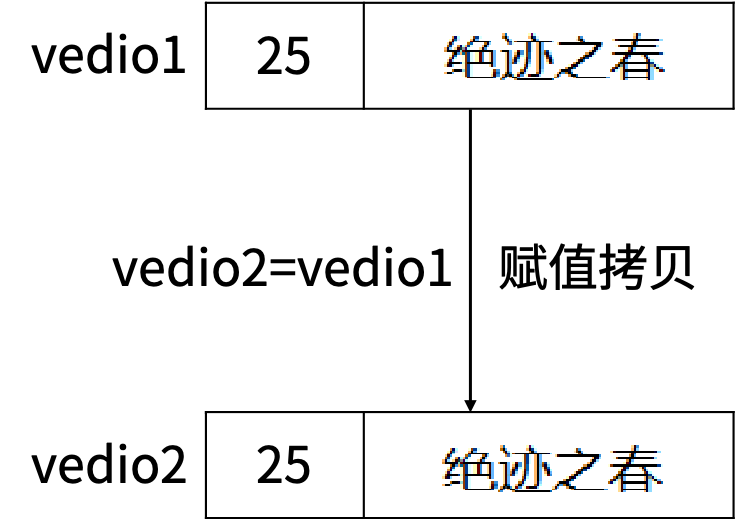  

```go
type User struct {
	Name string
}
type Vedio struct {
	Length int
	Author *User
}
```

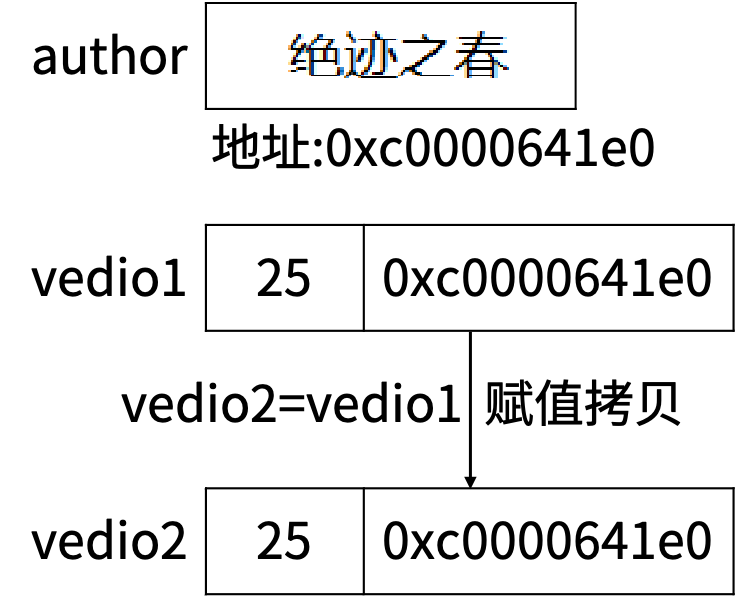  

- 深拷贝，拷贝的是值，比如`Vedio.Length`。
- 浅拷贝，拷贝的是指针，比如`Vedio.Author`。
- 深拷贝开辟了新的内存空间，修改操作不影响原先的内存。
- 浅拷贝指向的还是原来的内存空间，修改操作直接作用在原内存空间上。

传`slice`，对`sclice`的3个字段进行了拷贝，拷贝的是底层数组的指针，所以修改底层数组的元素会反应到原数组上。  

```go
users := []User{{Name: "康熙"}}
func update_users(users []User) {
    users[0].Name = "光绪"
}
```

### 拓展：Golang结构体序列化与反序列化

#### 1.关于 JSON 数据

`JSON（JavaScript Object Notation）`是一种轻量级的数据交换格式。易于人阅读和编写。同时也易于机器解析和生成。

`JSON`的基本格式如下：

```json
{
  "a": "Hello",
  "b": "World"
}
```

稍微复杂点的`JSON`：

```json
{
  "squadName": "Super hero squad",
  "homeTown": "Metro City",
  "formed": 2016,
  "secretBase": "Super tower",
  "active": true,
  "members": [
    {
      "name": "Molecule Man",
      "age": 29,
      "secretIdentity": "Dan Jukes",
      "powers": ["Radiation resistance", "Turning tiny", "Radiation blast"]
    },
    {
      "name": "Madame Uppercut",
      "age": 39,
      "secretIdentity": "Jane Wilson",
      "powers": [
        "Million tonne punch",
        "Damage resistance",
        "Superhuman reflexes"
      ]
    },
    {
      "name": "Eternal Flame",
      "age": 1000000,
      "secretIdentity": "Unknown",
      "powers": [
        "Immortality",
        "Heat Immunity",
        "Inferno",
        "Teleportation",
        "Interdimensional travel"
      ]
    }
  ]
}
```

#### 2.结构体与 JSON 序列化

比如我们Golang要给App或者小程序提供Api接口数据，这个时候就需要涉及到结构体和`JSON`之间的相互转换。

Golang `JSON`序列化是指把结构体数据转化成`JSON`格式的字符串，Golang `JSON`的反序列化 是指把`JSON`数据转化成Golang中的结构体对象。

Golang中的序列化和反序列化主要通过`"encoding/json"`包中的`json.Marshal()`和`json.Unmarshal()`方法实现。

1. 结构体对象转化成`JSON`字符串

```go
package main

import (
	"encoding/json"
	"fmt"
)

type Student struct { // 私有属性不能被 json 包访问
	ID     int
	Gender string
	Name   string
	Sno    string
}

func main() {
	var s1 = Student{
		ID:     1,
		Gender: "男",
		Name:   "张三",
		Sno:    "s0001",
	}
	fmt.Printf("%#v\n", s1)
	var s, _ = json.Marshal(s1)
	jsonStr := string(s)
	fmt.Println(jsonStr)
}

```

2. `JSON`字符串转换成结构体对象

```go
package main

import (
	"encoding/json"
	"fmt"
)

type Student struct {
	ID     int
	Gender string
	Name   string
	Sno    string
}

func main() {
	// var jsonStr = "{\"ID\":1,\"Gender\":\"男\",\"Name\":\"李四\",\"Sno\":\"s0001\"}"
	var jsonStr = `{"ID":1,"Gender":"男","Name":"李四","Sno":"s0001"}`
	// 定义一个 Monster 实例
	var student Student
	err := json.Unmarshal([]byte(jsonStr), &student)
	if err != nil {
		fmt.Printf("unmarshal err=%v\n", err)
	}
	fmt.Printf("反序列化后 student=%#v student.Name=%v \n", student, student.Name)
}

```

#### 3.结构体标签 Tag

`Tag`是结构体的元信息，可以在运行的时候通过反射的机制读取出来。`Tag`在结构体字段的后方定义，由一对反引号包裹起来，具体的格式如下：

```go
`key1:"value1" key2:"value2"`
```

结构体`Tag`由一个或多个键值对组成。键与值使用冒号分隔，值用双引号括起来。同一个结 构体字段可以设置多个键值对`Tag`，不同的键值对之间使用空格分隔。

注意事项：为结构体编写`Tag`时，必须严格遵守键值对的规则。结构体标签的解析代码的容错能力很差，一旦格式写错，编译和运行时都不会提示任何错误，通过反射也无法正确取值。例如不要在`key`和`value`之间添加空格。

```go
package main

import (
	"encoding/json"
	"fmt"
)

type Student struct {
	ID     int    `json:"id"` //通过指定 tag 实现 json 序列化该字段时的 key
	Gender string `json:"gender"`
	Name   string
	Sno    string
}

func main() {
	var s1 = Student{
		ID: 1, Gender: "男", Name: "李四", Sno: "s0001"}
	fmt.Printf("%#v\n", s1)
	var s, _ = json.Marshal(s1)
	jsonStr := string(s)
	fmt.Println(jsonStr)
}

```

```go
package main

import (
	"encoding/json"
	"fmt"
)

type Student struct {
	ID     int    `json:"id"` //通过指定 tag 实现 json 序列化该字段时的 key
	Gender string `json:"gender"`
	Name   string
	Sno    string
}

func main() {
	var s2 Student
	var str = "{\"id\":1,\"gender\":\"男\",\"Name\":\"李四\",\"Sno\":\"s0001\"}"
	err := json.Unmarshal([]byte(str), &s2)
	if err != nil {
		fmt.Println(err)
	}
	fmt.Printf("%#v", s2)
}

```

关于嵌套结构体的序列化与反序列化以及其他相关知识点，这里不详细说明，感兴趣的可以去搜一下。

---

## 模块七：函数

### 7.1 学习目标

1. 了解函数的定义方式
2. 熟练掌握函数的相关知识点，并可以在复杂的环境下熟练解决相关问题
3. 了解并熟练掌握defer语句
4. 掌握基础的Go语言异常处理方式

### 7.2 函数定义

函数是组织好的、可重复使用的、用于执行指定任务的代码块。

Go语言中定义函数使用`func`关键字，具体格式如下：

```go
func 函数名(参数) (返回值) {
	函数体
}
```

其中，

1. 函数名：由`字母`、`数字`、`下划线`组成。但函数名的第一个字母不能是数字。在同一个包内，函数名也称不能重名。

2. 参数：参数由`参数变量`和`参数变量的类型`组成，多个参数之间使用`,`分隔。

3. 返回值：返回值由`返回值变量`和其`变量类型`组成，也可以只写`返回值的类型`，多个返回值必须用`()`包裹，并用`,`分隔。

4. 函数体：实现指定功能的`代码块`。

定义一个求两个数之和的函数：

```go
func intSum(x int, y int) int {
	return x + y
}
```

函数的`参数`和`返回值`都是可选的，例如我们可以实现一个既不需要`参数`也没有`返回值`的函数：

```go
func sayHello() {
	fmt.Println("Hello")
}
```

### 7.3 函数调用

定义了函数之后，我们可以通过`函数名()`的方式调用函数。

例如我们调用上面定义的两个函数，代码如下：

```go
package main

import "fmt"

func intSum(x int, y int) int {
	return x + y
}

func sayHello() {
	fmt.Println("Hello")
}

func main() {
	sayHello()
	result := intSum(1, 2)
	fmt.Println(result)
}

```

注意：调用有`返回值`的函数时，可以不接收其`返回值`。

### 7.4 函数参数

#### 7.4.1 类型简写

函数的参数中如果相邻变量的类型相同，则可以省略类型，例如：

```go
func intSum(x, y int) int {
	return x + y
}
```

上面的代码中，`intSum函数`有两个参数，这两个参数的类型均为`int`，因此可以省略`x`的类型，因为`y`后面有类型说明，`x`参数也是该类型。

#### 7.4.2 可变参数

`可变参数`是指函数的参数数量不固定。Go语言中的`可变参数`通过在参数名后加`...`来标识。

 注意：`可变参数`通常要作为函数的最后一个参数。

举个例子：

```go
package main

import "fmt"

func intSum2(x ...int) int {
	fmt.Println(x) //x 是一个切片
	sum := 0
	for _, v := range x {
		sum = sum + v
	}
	return sum
}

func main() {
	ret1 := intSum2()
	ret2 := intSum2(10)
	ret3 := intSum2(10, 20)
	ret4 := intSum2(10, 20, 30)
	fmt.Println(ret1, ret2, ret3, ret4) // 0 10 30 60
}

```

`固定参数`搭配`可变参数`使用时，`可变参数`要放在`固定参数`的后面，示例代码如下：

```go
package main

import "fmt"

func intSum3(x int, y ...int) int {
	fmt.Println(x, y)
	sum := x
	for _, v := range y {
		sum = sum + v
	}
	return sum
}

func main() {
	ret5 := intSum3(100)
	ret6 := intSum3(100, 10)
	ret7 := intSum3(100, 10, 20)
	ret8 := intSum3(100, 10, 20, 30)
	fmt.Println(ret5, ret6, ret7, ret8) // 100 110 130 160
}

```

本质上，函数的`可变参数`是通过`切片`来实现的。

### 7.5 函数返回值

Go语言中通过`return`关键字向外输出`返回值`。

#### 7.5.1 函数多返回值

Go语言中函数支持`多返回值`，函数如果有多个`返回值`时必须用`()`将所有`返回值`包裹起来。

举个例子：

```go
func calc(x, y int) (int, int) {
	sum := x + y
	sub := x - y
	return sum, sub
}
```

不能用`容器对象`接收`多返回值`。只能用`多个变量`，或`_`忽略。

举个例子：

```go
package main

func calc(x, y int) (int, int) {
	sum := x + y
	sub := x - y
	return sum, sub
}

func main() {
	// s := make([]int, 2)
	// s = calc(1, 2) // assignment mismatch: 1 variable but calc returns 2 values

	x, _ := calc(1, 2)
	println(x)
}

```

#### 7.5.2 返回值命名

函数定义时可以给返回值命名，并在函数体中直接使用这些变量，最后通过`return`关键字返回。

举个例子：

```go
func calc(x, y int) (sum, sub int) {
	sum = x + y
	sub = x - y
	return
}
```

### 7.6 函数变量作用域

#### 7.6.1 全局变量

`全局变量`是定义在函数外部的`变量`，它在程序整个运行周期内都有效。

在函数中可以访问到`全局变量`。

```go
package main

import "fmt"

// 定义全局变量 num
var num int64 = 10

func testGlobalVar() {
	fmt.Printf("num=%d\n", num) // 函数中可以访问全局变量 num
}

func main() {
	testGlobalVar() // num=10
}

```

#### 7.6.2 局部变量

`局部变量`是函数内部定义的变量。

1. 函数内定义的变量无法在该函数外使用

例如下面的示例代码`main()函数`中无法使用`testLocalVar函数`中定义的变量`x`：

```go
package main

import "fmt"

func testLocalVar() {
	// 定义一个函数局部变量 x,仅在该函数内生效
	var x int64 = 100
	fmt.Printf("x=%d\n", x)
}

func main() {
	testLocalVar()
	// fmt.Println(x) // 此时无法使用变量 x
}

```

2. 如果局部变量和全局变量重名，优先访问局部变量

```go
package main

import "fmt"

// 定义全局变量 num
var num int64 = 10

func testNum() {
	num := 100
	fmt.Printf("num=%d\n", num) // 函数中优先使用局部变量
}

func main() {
	testNum() // num=100
}

```

### 7.7 函数类型与变量

#### 7.7.1 定义函数类型

我们可以使用`type`关键字来定义一个函数类型，具体格式如下：

```go
type calculation func(int, int)
```

上面语句定义了一个`calculation`类型，它是一种函数类型，这种函数接收两个`int`类型的参 数并且返回一个`int`类型的返回值。

简单来说，凡是满足这个条件的函数都是`calculation`类型的函数，例如下面的`add`和`sub`是`calculation`类型。

```go
func add(x, y int) int {
	return x + y
}

func sub(x, y int) int {
	return x - y
}
```

`add`和`sub`都能赋值给`calculation`类型的变量。

```go
var c calculation
c = add
```

#### 7.7.2 函数类型变量

我们可以声明`函数类型的变量`并且为该变量赋值：

```go
package main

import "fmt"

type calculation func(int, int) int

func add(x, y int) int {
	return x + y
}

func sub(x, y int) int {
	return x - y
}

func main() {
	var c calculation               // 声明一个 calculation 类型的变量 c
	c = add                         // 把 add 赋值给 c
	fmt.Printf("type of c:%T\n", c) // type of c:main.calculation
	fmt.Println(c(1, 2))            // 像调用 add 一样调用 c
	f := add                        // 将函数 add 赋值给变量 f1
	fmt.Printf("type of f:%T\n", f) // type of f:func(int, int) int
	fmt.Println(f(10, 20))          // 像调用 add 一样调用 f
}

```

### 7.8 高阶函数

高阶函数分为函数作为参数和函数作为返回值两部分。

#### 7.8.1 函数作为参数

函数可以作为参数：

```go
package main

import "fmt"

func add(x, y int) int {
	return x + y
}

func calc(x, y int, op func(int, int) int) int {
	return op(x, y)
}

func main() {
	ret2 := calc(10, 20, add)
	fmt.Println(ret2) // 30
}

```

#### 7.8.2 函数作为返回值

函数也可以作为返回值：

```go
package main

import "fmt"

func add(x, y int) int {
	return x + y
}

func sub(x, y int) int {
	return x - y
}

func do(s string) func(int, int) int {
	switch s {
	case "+":
		return add
	case "-":
		return sub
	default:
		return nil
	}
}

func main() {
	var a = do("+")
	fmt.Println(a(10, 20))
}

```

### 7.9 匿名函数和闭包

#### 7.9.1 匿名函数

函数当然还可以作为返回值，但是在 Go 语言中函数内部不能再像之前那样定义函数了，只能定义`匿名函数`。`匿名函数`就是没有函数名的函数，`匿名函数`的定义格式如下：

```go
func(参数) (返回值) {
	函数体
}
```

`匿名函数`因为没有函数名，所以没办法像普通函数那样调用，所以`匿名函数`需要保存到某个`变量`或者作为立即执行`函数`:

```go
package main

import "fmt"

func main() {
	// 将匿名函数保存到变量
	add := func(x, y int) {
		fmt.Println(x + y)
	}
	add(10, 20) // 通过变量调用匿名函数
	// 自执行函数：匿名函数定义完加()直接执行
	func(x, y int) {
		fmt.Println(x + y)
	}(10, 20)
}

```

`匿名函数`多用于实现`回调函数`和`闭包`。

#### 7.9.2 闭包

`闭包`可以理解成”定义在一个函数内部的函数“。在本质上，`闭包`是将`函数内部`和`函数外部`连接起来的桥梁。或者说是函数和其引用环境的组合体。

首先我们来看一个例子：

```go
package main

import "fmt"

func adder() func(int) int {
	var x int
	return func(y int) int {
		x += y
		return x
	}
}

func main() {
	var f = adder()
	fmt.Println(f(10)) // 10
	fmt.Println(f(20)) // 30
	fmt.Println(f(30)) // 60
	f1 := adder()
	fmt.Println(f1(40)) // 40
	fmt.Println(f1(50)) // 90
}

```

变量`f`是一个函数并且它引用了其外部作用域中的`x`变量，此时`f`就是一个`闭包`。 在`f`的生命周期内，变量`x`也一直有效。

##### 7.9.2.1 闭包进阶示例 1

```go
package main

import "fmt"

func adder2(x int) func(int) int {
	return func(y int) int {
		x += y
		return x
	}
}

func main() {
	var f = adder2(10)
	fmt.Println(f(10)) // 20
	fmt.Println(f(20)) // 40
	fmt.Println(f(30)) // 70
	f1 := adder2(20)
	fmt.Println(f1(40)) // 60
	fmt.Println(f1(50)) // 110
}

```

##### 7.9.2.2 闭包进阶示例 2

```go
package main

import (
	"fmt"
	"strings"
)

func makeSuffixFunc(suffix string) func(string) string {
	return func(name string) string {
		if !strings.HasSuffix(name, suffix) {
			return name + suffix
		}
		return name
	}
}

func main() {
	jpgFunc := makeSuffixFunc(".jpg")
	txtFunc := makeSuffixFunc(".txt")
	fmt.Println(jpgFunc("test")) // test.jpg
	fmt.Println(txtFunc("test")) // test.txt
}

```

##### 7.9.2.3 闭包进阶示例 3

```go
package main

import "fmt"

func calc(base int) (func(int) int, func(int) int) {
	add := func(i int) int {
		base += i
		return base
	}
	sub := func(i int) int {
		base -= i
		return base
	}
	return add, sub
}

func main() {
	f1, f2 := calc(10)
	fmt.Println(f1(1), f2(2)) // 11 9
	fmt.Println(f1(3), f2(4)) // 12 8
	fmt.Println(f1(5), f2(6)) // 13 7
}

```

闭包其实并不复杂，只要牢记闭包=函数+引用环境

### 7.10 defer 语句

简介：

- `defer`用于注册一个延迟调用（在函数返回之前调用）。
- `defer`典型的应用场景是释放资源，比如关闭文件句柄，释放数据库连接等。
- 如果同一个函数里有多个`defer`，则后注册的先执行。
- `defe`r后可以跟一个`func`，`func`内部如果发生`panic`，会把`panic`暂时搁置，当把其他`defer`执行完之后再来执行这个。
- `defer`后不是跟`func`，而直接跟一条执行语句，则相关变量在注册`defer`时被拷贝或计算。

```go
func basic() {
	fmt.Println("A")
	defer fmt.Println(1)
	fmt.Println("B")
	// 如果同一个函数里有多个defer，则后注册的先执行
	defer fmt.Println(2)
	fmt.Println("C")
}
```

```go
func defer_exe_time() (i int) {
	i = 9
	defer func() { // defer后可以跟一个func
		fmt.Printf("first i=%d\n", i) // 打印5，而非9。充分理解“defer在函数返回前执行”的含义，不是在“return语句前执行defer”
	}()
	defer func(i int) {
		fmt.Printf("second i=%d\n", i) // 打印9
	}(i)
	defer fmt.Printf("third i=%d\n", i) // defer后不是跟func，而直接跟一条执行语句，则相关变量在注册defer时被拷贝或计算
	return 5
}
```

由于`defer`语句延迟调用的特性，所以`defer`语句能非常方便的处理资源释放问题。比如： 资源清理、文件关闭、解锁及记录时间等。

#### 7.10.1 规则一：延迟函数的参数在defer语句出现时就已经确定下来了

官方给出一个例子，如下所示：

```go
func a() {
	i := 0
	defer fmt.Println(i)
	i++
	return
}
```

`defer`语句中的`fmt.Println()`参数`i`值在`defer`出现时就已经确定下来，实际上是拷贝了一份。后面对变量`i`的修改不会影响fmt.Println()函数的执行，仍然打印”0”。

注意：对于指针类型参数，规则仍然适用，只不过延迟函数的参数是一个地址值，这种情况下，`defer`后面的语句对变量的修改可能会影响延迟函数。

#### 7.10.2 规则二：延迟函数执行按后进先出顺序执行，即先出现的defer最后执行

这个规则很好理解，定义`defer`类似于入栈操作，执行`defer`类似于出栈操作。

设计`defer`的初衷是简化函数返回时资源清理的动作，资源往往有依赖顺序，比如先申请`A资源`，再根据`A资源`申请`B资源`，根据`B资源`申请`C资源`，即申请顺序是：`A–>B–>C`，释放时往往又要反向进行。这就是把`defer`设计成`LIFO`的原因。

每申请到一个用完需要释放的资源时，立即定义一个`defer`来释放资源是个很好的习惯。

#### 7.10.3 规则三：延迟函数可能操作主函数的具名返回值

定义`defer`的函数，即主函数可能有返回值，返回值有没有名字没有关系，`defer`所作用的函数，即延迟函数可能会影响到返回值。

若要理解延迟函数是如何影响主函数返回值的，只要明白函数是如何返回的就足够了。

##### 7.10.3.1 函数返回过程

有一个事实必须要了解，关键字`return`不是一个原子操作，实际上`return`只代理汇编指令`ret`，即将跳转程序执行。比如语句`return i`，实际上分两步进行，即将`i`值存入栈中作为返回值，然后执行跳转，而`defer`的执行时机正是跳转前，所以说`defer`执行时还是有机会操作返回值的。

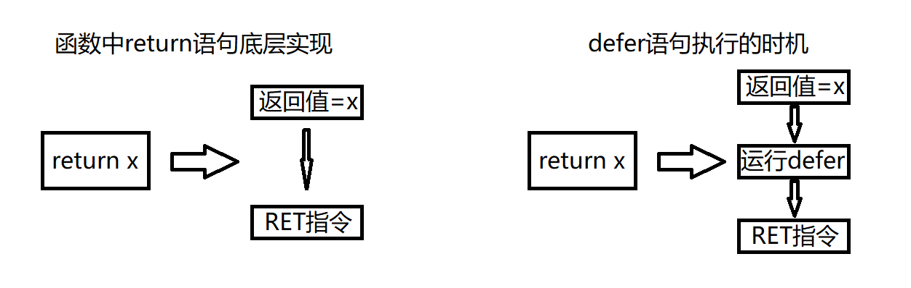

举个实际的例子进行说明这个过程：

```go
func deferFuncReturn() (result int) {
	i := 1

	defer func() {
		result++
	}()

	return i
}
```

该函数的`return`语句可以拆分成下面两行：

```go
result = i
return
```

而延迟函数的执行正是在`return`之前，即加入`defer`后的执行过程如下：

```go
result = i
result++
return
```

所以上面函数实际返回`i++`值。

关于主函数有不同的返回方式，但返回机制就如上机介绍所说，只要把`return`语句拆开都可以很好的理解，下面分别举例说明

##### 7.10.3.2 主函数拥有匿名返回值，返回字面值

一个主函数拥有一个匿名的返回值，返回时使用字面值，比如返回`”1”、”2”、”Hello”`这样的值，这种情况下`defer`语句是无法操作返回值的。

一个返回字面值的函数，如下所示：

```go
func foo() int {
	var i int

	defer func() {
		i++
	}()

	return 1
}
```

上面的`return`语句，直接把`1`写入栈中作为返回值，延迟函数无法操作该返回值，所以就无法影响返回值。

##### 7.10.3.3 主函数拥有匿名返回值，返回变量

一个主函数拥有一个匿名的返回值，返回使用本地或全局变量，这种情况下defer语句可以引用到返回值，但不会改变返回值。

一个返回本地变量的函数，如下所示：

```go
func foo() int {
	var i int

	defer func() {
		i++
	}()

	return i
}
```

上面的函数，返回一个局部变量，同时`defer`函数也会操作这个局部变量。对于匿名返回值来说，可以假定仍然有一个变量存储返回值，假定返回值变量为`anony`，上面的返回语句可以拆分成以下过程：

```go
anony = i
i++
return
```

由于i是整型，会将值拷贝给`anony`，所以`defer`语句中修改i值，对函数返回值不造成影响。

##### 7.10.3.4 主函数拥有具名返回值

主函声明语句中带名字的返回值，会被初始化成一个局部变量，函数内部可以像使用局部变量一样使用该返回值。如果`defer`语句操作该返回值，可能会改变返回结果。

一个影响函返回值的例子：

```go
func foo() (ret int) {
	defer func() {
		ret++
	}()

	return 0
}
```

上面的函数拆解出来，如下所示：

```go
ret = 0
ret++
return
```

函数真正返回前，在`defer`中对返回值做了`+1`操作，所以函数最终返回`1`。

### 7.11 异常处理

Go语言没有`try catch`，它提倡返回`error`。  

```go
package main

import (
	"errors"
	"fmt"
)

func divide(a, b int) (int, error) {
	if b == 0 {
		return -1, errors.New("divide by zero")
	}
	return a / b, nil
}

func main() {
	if res, err := divide(3, 0); err != nil { // 函数调用方判断error是否为nil
		fmt.Println(err.Error())
		fmt.Println(res)
	}
}

```

Go语言定义了`error`这个接口，自定义的`erro`r要实现`Error()方法`。  

```go
type PathError struct { // 自定义error
	path       string
	op         string
	createTime string
	message    string
}

func (err PathError) Error() string { // error接口要求实现Error() string方法
	return err.createTime + ": " + err.op + " " + err.path + " " + err.message
}
```

#### 7.11.1 内置函数 panic/recove

|     内置函数     |                             介绍                             |
| :--------------: | :----------------------------------------------------------: |
|      close       |                     主要用来关闭 channel                     |
|       len        |     用来求长度，比如 string、array、slice、map、channel      |
|       new        | 用来分配内存，主要用来分配值类型，比如 int、struct，返回的是指针 |
|       make       |  用来分配内存，主要用来分配引用类型，比如 chan、map、slice   |
|      append      |                 用来追加元素到数组、slice 中                 |
| panic 和 recover |                        用来做错误处理                        |

何时会发生`panic`:  

- 运行时错误会导致`panic`，比如数组越界、除0。
- 程序主动调用`panic(error)`。

`panic`会执行什么：  

1. 逆序执行当前`goroutine`的`defer`链（`recover`从这里介入）。
2. 打印错误信息和调用堆栈。
3. 调用`exit(2)`结束整个进程。

##### 7.11.1.1 panic/recover 的基本使用

```go
package main

import "fmt"

func funcA() {
	fmt.Println("func A")
}

func funcB() {
	panic("panic in B")
}

func funcC() {
	fmt.Println("func C")
}

func main() {
	funcA()
	funcB()
	funcC()
}

```

输出结果：

```
func A
panic: panic in B

goroutine 1 [running]:
main.funcB(...)
        D:/go_project/src/day1/main.go:10
main.main()
        D:/go_project/src/day1/main.go:19 +0x65
exit status 2
```

程序运行期间`funcB`中引发了`panic`导致程序崩溃，异常退出了。这个时候我们就可以通过`recover`将程序恢复回来，继续往后执行。

```go
package main

import "fmt"

func funcA() {
	fmt.Println("func A")
}

func funcB() {
	defer func() {
		err := recover()
		//如果程序出出现了 panic 错误,可以通过 recover 恢复过来
		if err != nil {
			fmt.Println("recover in B")
		}
	}()
	panic("panic in B")
}

func funcC() {
	fmt.Println("func C")
}

func main() {
	funcA()
	funcB()
	funcC()
}

```

输出结果：

```
func A
recover in B
func C
```

注意：

1. `recover()`必须搭配`defer`使用。
2. `defer`一定要在可能引发`panic`的语句之前定义。

##### 7.11.1.2 defer 、recover 实现异常处理

```go
package main

import "fmt"

func fn2() {
	defer func() {
		err := recover()
		if err != nil {
			fmt.Println("抛出异常给管理员发送邮件")
			fmt.Println(err)
		}
	}()
	num1 := 10
	num2 := 0
	res := num1 / num2
	fmt.Println("res=", res)
}

func main() {
	fn2()
}

```

输出结果：

```
抛出异常给管理员发送邮件
runtime error: integer divide by zero
```

##### 7.11.1.3 defer 、panic、recover 抛出异常

```go
package main

import (
	"errors"
	"fmt"
)

func readFile(fileName string) error {
	if fileName == "main.go" {
		return nil
	}
	return errors.New("读取文件错误")
}

func fn3() {
	defer func() {
		err := recover()
		if err != nil {
			fmt.Println("抛出异常给管理员发送邮件")
		}
	}()
	var err = readFile("xxx.go")
	if err != nil {
		panic(err)
	}
	fmt.Println("继续执行")
}

func main() {
	fn3()
}

```

输出结果：

```
抛出异常给管理员发送邮件
```

---

## 模块八：面向对象

### 8.1 学习目标

1. 了解接口的定义，并熟练掌握及使用
2. 了解面向对象的思想
3. 学会使用面向对象的思想解决具体问题
4. 了解泛型的概念

### 8.2 接口

#### 8.2.1 接口的介绍

Golang中的接口是一种抽象数据类型，Golang中接口定义了对象的行为规范，只定义规范不实现。接口中定义的规范由具体的对象来实现。

通俗的讲接口就一个标准，它是对一个对象的行为和规范进行约定，约定实现接口的对象必须得按照接口的规范。

#### 8.2.2 接口的定义

在Golang中`接口（interface）`是一种类型，一种抽象的类型。`接口（interface）`是一组函数`method`的集合，Golang中的接口不能包含任何变量。

在Golang中接口中的所有方法都没有方法体，接口定义了一个对象的行为规范，只定 义规范不实现。接口体现了程序设计的多态和高内聚低耦合的思想。

Golang中的接口也是一种数据类型，不需要显示实现。只需要一个变量含有接口类型中的所有方法，那么这个变量就实现了这个接口。

Golang中每个接口由数个方法组成，接口的定义格式如下：

```go
type 接口名 interface {
	方法名1(参数列表1) 返回值列表1
	方法名2(参数列表2) 返回值列表2
	…
}
```

其中：

- 接口名：使用`type`将接口定义为自定义的类型名。Go语言的接口在命名时，一般会在单词后面添加`er`，如有写操作的接口叫`Writer`，有字符串功能的接口叫`Stringer`等。接口名最好要能突出该接口的类型含义。

- 方法名：当方法名首字母是大写且这个接口类型名首字母也是大写时，这个方法可以被接口所在的`包（package）`之外的代码访问。

- 参数列表、返回值列表：参数列表和返回值列表中的参数变量名可以省略。

**定义一个Usber接口让Phone和Camera结构体实现这个接口：**

```go
package main

import "fmt"

type Usber interface {
	Start()
	Stop()
}

type Phone struct {
	Name string
}

func (p Phone) Start() {
	fmt.Println(p.Name, "开始工作")
}
func (p Phone) Stop() {
	fmt.Println("phone 停止")
}

type Camera struct {
}

func (c Camera) Start() {
	fmt.Println("相机 开始工作")
}
func (c Camera) Stop() {
	fmt.Println("相机 停止工作")
}

func main() {
	phone := Phone{
		Name: "小米手机",
	}
	var p Usber = phone // phone 实现了 Usb 接口
	p.Start()
	camera := Camera{}
	var c Usber = camera // camera 实现了 Usb 接口
	c.Start()
}

```

**Computer结构体中的Work方法必须传入一个Usb的接口：**

```go
package main

import "fmt"

type Usber interface {
	Start()
	Stop()
}

type Phone struct {
	Name string
}

func (p Phone) Start() {
	fmt.Println(p.Name, "开始工作")
}
func (p Phone) Stop() {
	fmt.Println("phone 停止")
}

type Camera struct {
}

func (c Camera) Start() {
	fmt.Println("相机 开始工作")
}
func (c Camera) Stop() {
	fmt.Println("相机 停止工作")
}

// 电脑的结构体
type Computer struct {
	Name string
}

// 电脑的 Work 方法要求必须传入 Usb 接口类型数据
func (c Computer) Work(usb Usber) {
	usb.Start()
	usb.Stop()
}

func main() {
	phone := Phone{
		Name: "小米手机"}
	camera := Camera{}
	computer := Computer{}
	// 把手机插入电脑的 Usb 接口开始工作
	computer.Work(phone)
	// 把相机插入电脑的 Usb 接口开始工作
	computer.Work(camera)
}

```

#### 8.2.3 空接口

Golang中的接口可以不定义任何方法，没有定义任何方法的接口就是空接口。空接口表示没有任何约束，因此任何类型变量都可以实现空接口。

空接口在实际项目中用的是非常多的，用空接口可以表示任意数据类型。

**空接口类型用`interface{}`表示，注意有`{}`。**

```go
var i interface{}
```

举例：

```go
package main

import "fmt"

func main() {
	// 定义一个空接口 x, x 变量可以接收任意的数据类型
	var x interface{}
	s := "你好 golang"
	x = s
	fmt.Printf("type:%T value:%v\n", x, x)
	i := 100
	x = i
	fmt.Printf("type:%T value:%v\n", x, x)
	b := true
	x = b
	fmt.Printf("type:%T value:%v\n", x, x)
}

```

##### 8.2.3.1 空接口作为函数的参数

使用空接口实现可以接收任意类型的函数参数

```go
// 空接口作为函数参数
func show(a interface{}) {
	fmt.Printf("type:%T value:%v\n", a, a)
}
```

##### 8.2.3.2 map的值实现空接口

使用空接口实现可以保存任意值的字典：

```go
	// 空接口作为 map 值
	var studentInfo = make(map[string]interface{})
	studentInfo["name"] = "绝迹之春"
	studentInfo["age"] = 18
	studentInfo["married"] = false
	fmt.Println(studentInfo)
```

##### 8.2.3.3 切片实现空接口

```go
	var slice = []interface{}{"张三", 20, true, 32.2}
	fmt.Println(slice)
```

#### 8.2.4 类型断言

一个接口的值（简称接口值）是由一个具体类型和具体类型的值两部分组成的。这两部分分别称为接口的动态类型和动态值。

如果我们想要判断空接口中值的类型，那么这个时候就可以使用类型断言，其语法格式：

```go
	x.(T) 
```

其中：

```
	x：表示类型为interface{}的变量
	T：表示断言x可能是的类型。
```

该语法返回两个参数，第一个参数是x转化为T类型后的变量，第二个值是一个布尔值，若为true则表示断言成功，为false则表示断言失败。

举个例子：

```go
package main

import "fmt"

func main() {
	var x interface{}
	x = "pprof.cn"
	v, ok := x.(string)
	if ok {
		fmt.Println(v)
	} else {
		fmt.Println("类型断言失败")
	}
}

```

上面的示例中如果要断言多次就需要写多个if判断，这个时候我们可以使用switch语句来实现：

```go
func justifyType(x interface{}) {
	switch v := x.(type) {
	case string:
		fmt.Printf("x is a string，value is %v\n", v)
	case int:
		fmt.Printf("x is a int is %v\n", v)
	case bool:
		fmt.Printf("x is a bool is %v\n", v)
	default:
		fmt.Println("unsupport type！")
	}
}
```

**因为空接口可以存储任意类型值的特点，所以空接口在Go语言中的使用十分广泛。**

关于接口需要注意的是，只有当有两个或两个以上的具体类型必须以相同的方式进行处理时才需要定义接口。不要为了接口而写接口，那样只会增加不必要的抽象，导致不必要的运行时损耗。

#### 8.2.5 值接收者和指针接收者实现接口的区别

使用值接收者实现接口和使用指针接收者实现接口有什么区别呢？接下来我们通过一个例子看一下其中的区别。

我们有一个Mover接口和一个dog结构体。

```go
type Mover interface {
	move()
}

type dog struct{}
```

##### 8.2.5.1 值接收者实现接口

```go
func (d dog) move() {
	fmt.Println("狗会动")
}
```

此时实现接口的是dog类型：

```go
func main() {
	var x Mover
	var wangcai = dog{} // 旺财是dog类型
	x = wangcai         // x可以接收dog类型
	var fugui = &dog{}  // 富贵是*dog类型
	x = fugui           // x可以接收*dog类型
	x.move()
}
```

从上面的代码中我们可以发现，使用值接收者实现接口之后，不管是dog结构体还是结构体指针`*dog`类型的变量都可以赋值给该接口变量。因为Go语言中有对指针类型变量求值的语法糖，dog指针fugui内部会自动求值`*fugui`。

##### 8.2.5.2 指针接收者实现接口

同样的代码我们再来测试一下使用指针接收者有什么区别：

```go
func (d *dog) move() {
	fmt.Println("狗会动")
}

func main() {
	var x Mover
	/*
		var wangcai = dog{} // 旺财是dog类型
		x = wangcai         // x不可以接收dog类型
	*/
	var fugui = &dog{} // 富贵是*dog类型
	x = fugui          // x可以接收*dog类型
	x.move()
}
```

此时实现Mover接口的是`*dog`类型，所以不能给x传入dog类型的wangcai，此时x只能存储`*dog`类型的值。

#### 8.2.6  类型与接口的关系

##### 8.2.6.1 一个类型实现多个接口

一个类型可以同时实现多个接口，而接口间彼此独立，不知道对方的实现。 例如，狗可以叫，也可以动。我们就分别定义Sayer接口和Mover接口，如下： Mover接口。

```go
// Sayer 接口
type Sayer interface {
	say()
}

// Mover 接口
type Mover interface {
	move()
}
```

dog既可以实现Sayer接口，也可以实现Mover接口。

```go
type dog struct {
	name string
}

// 实现Sayer接口
func (d dog) say() {
	fmt.Printf("%s会叫汪汪汪\n", d.name)
}

// 实现Mover接口
func (d dog) move() {
	fmt.Printf("%s会动\n", d.name)
}

func main() {
	var x Sayer
	var y Mover

	var a = dog{name: "旺财"}
	x = a
	y = a
	x.say()
	y.move()
}
```

##### 8.2.6.2 多个类型实现同一接口

Go语言中不同的类型还可以实现同一接口首先我们定义一个Mover接口，它要求必须由一个move方法。

```go
// Mover 接口
type Mover interface {
	move()
}
```

例如狗可以动，汽车也可以动，可以使用如下代码实现这个关系：

```go
type dog struct {
	name string
}

type car struct {
	brand string
}

// dog类型实现Mover接口
func (d dog) move() {
	fmt.Printf("%s会跑\n", d.name)
}

// car类型实现Mover接口
func (c car) move() {
	fmt.Printf("%s速度70迈\n", c.brand)
}
```

这个时候我们在代码中就可以把狗和汽车当成一个会动的物体来处理了，不再需要关注它们具体是什么，只需要调用它们的move方法就可以了。

```go
func main() {
	var x Mover
	var a = dog{name: "旺财"}
	var b = car{brand: "保时捷"}
	x = a
	x.move()
	x = b
	x.move()
}
```

上面的代码执行结果如下：

```
旺财会跑
保时捷速度70迈
```

并且一个接口的方法，不一定需要由一个类型完全实现，接口的方法可以通过在类型中嵌入其他类型或者结构体来实现。

```go
// WashingMachine 洗衣机
type WashingMachine interface {
	wash()
	dry()
}

// 甩干器
type dryer struct{}

// 实现WashingMachine接口的dry()方法
func (d dryer) dry() {
	fmt.Println("甩一甩")
}

// 海尔洗衣机
type haier struct {
	dryer //嵌入甩干器
}

// 实现WashingMachine接口的wash()方法
func (h haier) wash() {
	fmt.Println("洗刷刷")
}
```

#### 8.2.7 接口嵌套

接口与接口间可以通过嵌套创造出新的接口：

```go
// Sayer 接口
type Sayer interface {
	say()
}

// Mover 接口
type Mover interface {
	move()
}

// 接口嵌套
type animal interface {
	Sayer
	Mover
}
```

嵌套得到的接口的使用与普通接口一样，这里我们让cat实现animal接口：

```go
type cat struct {
	name string
}

func (c cat) say() {
	fmt.Println("喵喵喵")
}

func (c cat) move() {
	fmt.Println("猫会动")
}

func main() {
	var x animal
	x = cat{name: "花花"}
	x.move()
	x.say()
}
```

### 8.3 面向对象

#### 8.3.1 面向对象的概念

洗衣服过程剖析：

1. 给洗衣机里加脏衣服和洗衣粉。
2. 启动洗衣机。
3. 洗衣机自动注水，然后滚动。
4. 脏衣服从黑颜色变成白颜色。
5. 洗衣机自动停止。  

用面向过程的思想实现代码：

```go
// 准备洗衣服
// 输入参数：
// powder 洗衣机里放多少洗衣粉
// closes 洗衣机里放多少衣服
// clean 衣服是否是干净的
// 返回值：
// 洗衣机是否开启
// 准备洗多少衣服
func prepare(powder int, closes int, clean bool) (bool, int) {
	if powder <= 0 || closes <= 0 || clean == true {
		return false, 0
	}
	return true, closes
}

// 开始洗衣服
// 输入参数：
// washer_state 洗衣机是否开启
// closes 准备洗多少衣服
// 返回值：
// 衣服是否是干净的
// 洗了多少衣服
// 洗衣机是否开启
func wash(washer_state bool, closes int) (bool, int, bool) {
	if washer_state == false {
		return false, 0, false
	} else {
		fmt.Println("注水")
		fmt.Println("滚动")
		fmt.Println("关机")
		return true, closes, false
	}
}

// 检查最终状态
// 输入参数：
// clean 衣服是否是干净的
// closes 洗了多少衣服
// washer_state 洗衣机是否开启
func check(clean bool, closes int, washer_state bool) {
	if clean && closes > 0 {
		fmt.Printf("洗干净了%d件衣服\n", closes)
		if washer_state {
			fmt.Println("你忘关洗衣机了")
		}
	} else {
		fmt.Println("洗衣失败")
	}
}

// 整个洗衣服的过程
func WashProcedure(powder, closes int) {
	washer_state := false
	clean := false

	washer_state, closes = prepare(powder, closes, clean)
	clean, closes, washer_state = wash(washer_state, closes)
	check(clean, closes, washer_state)
}
```

面向过程编程整个过程分为若干步，每一步对应一个函数，函数之间要传递大量的参数。
面向对象编程把大量参数封装到一个结构体里面，给结构体赋予方法，方法里面去修改结构体的成员变量。Go语言面向对象的好处：打包参数，继承，面向接口编程。

```go
// 洗衣机
type Washer struct {
	State  bool
	Powder int
}

// 衣服
type Closes struct {
	Clean bool
}

func (washer *Washer) prepare(closes []*Closes) error {
	if washer.State == true || washer.Powder <= 0 || len(closes) <= 0 {
		return errors.New("请确保在关机的状态下加入适量衣物和洗衣粉")
	}
	return nil
}

func (washer *Washer) wash(closes []*Closes) error {
	if err := washer.prepare(closes); err != nil {
		return err
	}

	fmt.Println("开机")
	washer.State = true

	// 检查是否有脏衣服
	clean := true
	for _, ele := range closes {
		if ele.Clean == false {
			clean = false
			break
		}
	}
	if clean {
		washer.State = false
		return errors.New("所有衣服都是干净的，不需要洗")
	}

	// 开始洗衣服
	fmt.Println("注水")
	fmt.Println("滚动")
	fmt.Println("关机")
	washer.State = false
	for _, ele := range closes {
		ele.Clean = true
	}
	return nil
}

func (washer *Washer) check(err error, closes []*Closes) {
	if err != nil {
		fmt.Printf("洗衣失败:%v\n", err)
	} else {
		fmt.Printf("洗干净了%d件衣服\n", len(closes))
		if washer.State == true {
			fmt.Println("你忘关洗衣机了")
		}
	}
}
```

#### 8.3.2 构造函数

定义User结构体：

```go
type User struct {
	Name string // ""表示未知
	Age  int    // -1表示未知
	Sex  byte   // 1男，2女，3未知
}
```

- `u := User{}`构造一个空的User，各字段都取相应数据类型的`默认值`。
- `up := new(User)`构造一个空的User，并返回其`指针`。

自定义构造函数：

```go
func NewDefaultUser() *User {
	return &User{
		Name: "",
		Age:  -1,
		Sex:  3,
	}
}
```

```go
func NewUser(name string, age int, sex byte) *User {
	return &User{
		Name: name,
		Age:  age,
		Sex:  sex,
	}
}
```

单例模式，确保在并发的情况下，整个进程里只会创建struct的一个实例：

```go
var (
	sUser *User
	uOnce sync.Once
)

func GetUserInstance() *User {
	uOnce.Do(func() { // 确保即使在并发的情况下，下面的3行代码在整个go进程里只会被执行一次
		if sUser == nil {
			sUser = NewDefaultUser()
		}
	})
	return sUser
}
func main() {
	// 调用GetUserInstance()得到的是同一个User实例
	su1 := GetUserInstance()
	su2 := GetUserInstance()
	// 修改su1会影响su2s
	fmt.Println(su1, su2)
	su1.Name = "绝迹之春"
	su1.Age = 18
	su1.Sex = 1
	fmt.Println(su1, su2)
}
```

输出结果：

```
&{ -1 3} &{ -1 3}
&{绝迹之春 18 1} &{绝迹之春 18 1}
```

#### 8.3.3 继承与重写

通过嵌入匿名结构体，变相实现“继承”的功能，因为访问匿名成员时可以跳过成员名直接访问它的内部成员：

```go
type Plane struct {
	color string
}
type Bird struct {
	Plane
}
```

```go
bird := Bird{}
bird.Plane.color
bird.color
```

重写：

```go
func (plane Plane) fly() int {
	return 500
}

// 重写父类(Plane)的fly方法
func (bird Bird) fly() int {
	return bird.Plane.fly() + 100 // 调用父类的方法
}
```

正规来讲，Go语言并不支持继承，它只是支持组合。 

```go
type Plane struct{}
type Car struct{}

// Bird组合了Plane和Car的功能
type Bird struct {
	Plane
	Car
}
```

### 8.4 泛型

在有泛型之前，同样的功能需要为不同的参数类型单独实现一个函数。  

```go
func add4int(a, b int) int {
	return a + b
}
func add4float32(a, b float32) float32 {
	return a + b
}
func add4string(a, b string) string {
	return a + b
}
```

使用泛型  

```go
type Addable interface {
	int | int8 | int16 | int32 | int64 |
		uint | uint8 | uint16 | uint32 | uint64 | uintptr |
		float32 | float64 | complex64 | complex128 | string
}

func add[T Addable](a, b T) T {
	return a + b
}
```

Golang泛型在go 1.18正式发布，同时语法也变更成如上格式。

此外在go1.17中泛型默认没有开启，如果想用需要加`-gcflags=-G=3`，或者设置环境变量`export GOFLAGS="-gcflags=-G=3"`

（这里就不做多详细介绍，因为就目前而言下载的go最新版本已经是1.21了，不需要配置环境变量）。

---

## 模块九：反射

### 9.1 学习目标

1. 了解什么是反射
2. 熟练掌握并使用reflect.TypeOf()和reflect.ValueOf()实现反射
3. 了解如何用反射调用函数或成员方法
4. 了解用反射实现创建对象

### 9.2 反射介绍

反射就是在运行期间（不是编译期间）探知对象的类型信息和内存结构、更新变量、调用它们的方法。
反射的使用场景：

- 函数的参数类型是`interface{}`，需要在运行时对原始类型进行判断，针对不同的类型采取不同的处理方式。比如`json.Marshal(v interface{})`。

- 在运行时根据某些条件动态决定调用哪个函数，比如根据配置文件执行相应的算子函数。

Go标准库里的`json序列化`就使用了反射。

```go
type User struct {
    Name string
    Age int
    Sex byte `json:"gender"`
}
user := User{
    Name: "绝迹之春",
    Age: 18,
    Sex: 1,
}
json.Marshal(user)  //返回 {"Name":"绝迹之春","Age":18,"gender":1}
```

Go语言中的变量是分为两部分的：

- 类型信息：预先定义好的元信息。

- 值信息：程序运行过程中可动态变化的。

在GoLang的反射机制中，任何接口值都由是一个具体类型和具体类型的值两部分组成的。

在GoLang中，反射的相关功能由内置的`reflect包`提供，任意接口值在反射中都可以理解为由`reflect.Type`和`reflect.Value`两部分组成，并且`reflect包`提供了`reflect.TypeOf()`和`reflect.ValueOf()`两个重要函数来获取任意对象的`Value`和`Type`。

反射的弊端：

- 代码难以阅读，难以维护。
- 编译期间不能发现类型错误，覆盖测试难度很大，有些bug需要到线上运行很长时间才能发现，可能会造成严重用后果。
- 反射性能很差，通常比正常代码慢一到两个数量级。在对性能要求很高，或大量反复调用的代码块里建议不要使用反射。

### 9.3 反射的基础数据类型


### 9.4 reflect.TypeOf()

在 Go语言中，使用`reflect.TypeOf()`函数可以接受任意`interface{}`参数，可以获得任意值的`类型对象（reflect.Type）`，程序通过类型对象可以访问任意值的类型信息。

```go
package main

import (
	"fmt"
	"reflect"
)

func reflectType(x interface{}) {
	v := reflect.TypeOf(x)
	fmt.Printf("type:%v\n", v)
}
func main() {
	var a float32 = 12.5
	reflectType(a) // type:float32
	var b int64 = 100
	reflectType(b) // type:int64
}

```

#### 9.4.1 type Name和type Kind

在反射中关于类型还划分为两种：`类型（Type）`和`种类（Kind）`。因为在 Go 语言中我们可以使用`type`关键字构造很多自定义类型，而`种类（Kind）`就是指底层的类型，但在反射中，当需要区分指针、结构体等大品种的类型时，就会用到`种类（Kind）`。 举个例子，我们定义了两个指针类型和两个结构体类型，通过反射查看它们的类型和种类。

Go 语言的反射中像数组、切片、Map、指针等类型的变量，它们的`.Name()`都是返回空。

```go
package main

import (
	"fmt"
	"reflect"
)

func reflectType(x interface{}) {
	t := reflect.TypeOf(x)
	fmt.Printf("TypeOf:%v Name:%v Kind:%v\n", t, t.Name(), t.Kind())

}

type myInt int64
type Person struct {
	Name string
	Age  int
}
type Animal struct {
	Name string
}

func main() {
	var a *float32 // 指针
	var b myInt    // 自定义类型
	var c rune     // 类型别名
	reflectType(a) // TypeOf:*float32 Name: Kind:ptr
	reflectType(b) // TypeOf:main.myInt Name:myInt Kind:int64
	reflectType(c) // TypeOf:int32 Name:int32 Kind:int32
	var d = Person{
		Name: "绝迹之春",
		Age:  18,
	}
	var e = Animal{Name: "小花"}
	reflectType(d) // TypeOf:main.Person Name:Person Kind:struct
	reflectType(e) // TypeOf:main.Animal Name:Animal Kind:struct
	var f = []int{1, 2, 3, 4, 5}
	reflectType(f) // TypeOf:[]int Name: Kind:slice
}

```

#### 9.4.2 reflect包中定义的Kind类型

```go
type Kind uint

const (
	Invalid       Kind = iota // 非法类型
	Bool                      // 布尔型
	Int                       // 有符号整型
	Int8                      // 有符号 8 位整型
	Int16                     // 有符号 16 位整型
	Int32                     // 有符号 32 位整型
	Int64                     // 有符号 64 位整型
	Uint                      // 无符号整型
	Uint8                     // 无符号 8 位整型
	Uint16                    // 无符号 16 位整型
	Uint32                    // 无符号 32 位整型
	Uint64                    // 无符号 64 位整型
	Uintptr                   // 指针
	Float32                   // 单精度浮点数
	Float64                   // 双精度浮点数
	Complex64                 // 64 位复数类型
	Complex128                // 128 位复数类型
	Array                     // 数组
	Chan                      // 通道
	Func                      // 函数
	Interface                 // 接口
	Map                       // 映射
	Ptr                       // 指针
	Slice                     // 切片
	String                    // 字符串
	Struct                    // 结构体
	UnsafePointer             // 底层指针
)
```

### 9.5 reflect.ValueOf()

`reflect.ValueOf()`返回的是`reflect.Value`类型，其中包含了原始值的值信息。`reflect.Value`与`原始值`之间可以互相转换。

 `reflect.Value`类型提供的获取原始值的方法如下：

| 方法                      | 说明                                                         |
| ------------------------- | ------------------------------------------------------------ |
| Interface()  interface {} | 将值以 interface{} 类型返回，可以通过类型断言转换为指定类型  |
| Int()  int64              | 将值以 int 类型返回，所有有符号整型均可以此方式返回          |
| Uint()  uint64            | 将值以 uint 类型返回，所有无符号整型均可以此方式返回         |
| Float()  float64          | 将值以双精度（float64）类型返回，所有浮点数（float32、float64）均可以此方式返回 |
| Bool()  bool              | 将值以 bool 类型返回                                         |
| Bytes()  []bytes          | 将值以字节数组 []bytes 类型返回                              |
| String()  string          | 将值以字符串类型返回                                         |
| ...                       |                                                              |

#### 9.5.1 通过反射获取原始值演示1

```go
package main

import (
	"fmt"
	"reflect"
)

func reflectValue(x interface{}) {
	v := reflect.ValueOf(x)
	var c = v.Int() + 6 // 获取反射的原始值
	fmt.Println(c)
}

func main() {
	var a int64 = 100
	reflectValue(a)
}

```

#### 9.5.2 通过反射获取原始值演示2

```go
package main

import (
	"fmt"
	"reflect"
)

func reflectValue(x interface{}) {
	v := reflect.ValueOf(x)
	k := v.Kind()
	switch k {
	case reflect.Int64:
		// v.Int()从反射中获取整型的原始值
		fmt.Printf("type is int64, value is %d\n", v.Int())
	case reflect.Float32:
		// v.Float()从反射中获取浮点型的原始值
		fmt.Printf("type is float32, value is %f\n", v.Float())
	case reflect.Float64:
		// v.Float()从反射中获取浮点型的原始值
		fmt.Printf("type is float64, value is %f\n", v.Float())
	}
}

func main() {
	var a float32 = 3.14
	var b int64 = 100
	reflectValue(a) // type is float32, value is 3.140000
	reflectValue(b) // type is int64, value is 100
	// 将int类型的原始值转换为reflect.Value类型
	c := reflect.ValueOf(10)
	fmt.Printf("type c :%T\n", c) // type c :reflect.Value
}

```

#### 9.5.3 通过反射设置变量的值

##### 9.5.3.1 通过Value修改原始数据的值

```go
package main

import (
	"fmt"
	"reflect"
)

type User struct {
	Id     int
	Name   string
	Weight float32
	Height float32
}

func main() {
	var i int = 10
	var s string = "hello"
	user := User{
		Id:     749,
		Name:   "绝迹之春",
		Weight: 60.5,
		Height: 1.70,
	}

	valueI := reflect.ValueOf(&i) // 由于Go语言所有函数传的都是值，所以要想修改原来的值就需要传指针
	valueS := reflect.ValueOf(&s)
	valueUser := reflect.ValueOf(&user)
	valueI.Elem().SetInt(1) // 由于valueI对应的原始对象是指针，通过Elem()返回指针指向的对象
	valueS.Elem().SetString("golang")
	valueUser.Elem().FieldByName("Weight").SetFloat(61.0) // FieldByName()通过Name返回类的成员变量

	fmt.Println(i)    // 1
	fmt.Println(s)    // golang
	fmt.Println(user) // {749 绝迹之春 61 1.7}
}

```

强调一下，要想修改原始数据的值，给`reflect.ValueOf()`传的必须是指针，而指针`Value`不能调用`Set和FieldByName方法`，所以得先通过`Elem()`转为非指针`Value`。
未导出成员的值不能通过反射进行修改。

```go
addrValue := valueUser.Elem().FieldByName("addr")
if addrValue.CanSet() {
	addrValue.SetString("芜湖")
} else {
	fmt.Println("addr是未导出成员，不可Set") // 以小写字母开头的成员相当于是私有成员
}
```

##### 9.5.3.2 通过Value修改Slice

```go
package main

import (
	"fmt"
	"reflect"
)

type User struct {
	Id     int
	Name   string
	Weight float32
	Height float32
}

func main() {
	users := make([]*User, 1, 5) // len=1，cap=5
	users[0] = &User{
		Id:     749,
		Name:   "绝迹之春",
		Weight: 60.5,
		Height: 1.70,
	}

	sliceValue := reflect.ValueOf(&users) // 准备通过Value修改users，所以传users的地址
	if sliceValue.Elem().Len() > 0 {      // 取得slice的长度
		sliceValue.Elem().Index(0).Elem().FieldByName("Name").SetString("憨批")
		fmt.Printf("1st user name change to %s\n", users[0].Name)
	}
}

```

甚至可以修改`slice`的`cap`，新的`cap`必须位于原始的`len`到`cap`之间，即只能把`cap`改小。

```go
sliceValue.Elem().SetCap(3)
```

通过把`len`改大，可以实现向`slice`中追加元素的功能。

```go
sliceValue.Elem().SetLen(2)
// 调用reflect.Value的Set()函数修改其底层指向的原始数据
sliceValue.Elem().Index(1).Set(reflect.ValueOf(&User{
	Id:     750,
	Name:   "张三",
	Weight: 80,
	Height: 180,
}))
fmt.Printf("2nd user name %s\n", users[1].Name)
```

##### 9.5.3.3 通过Value修改map

`Value.SetMapIndex()函数`：往`map`里添加一个`key-value对`。

`Value.MapIndex()函数`： 根据`Key`取出对应的`map`。

```go
package main

import (
	"fmt"
	"reflect"
)

type User struct {
	Id     int
	Name   string
	Weight float32
	Height float32
}

func main() {
	u1 := &User{
		Id:     749,
		Name:   "绝迹之春",
		Weight: 60.5,
		Height: 1.70,
	}
	u2 := &User{
		Id:     750,
		Name:   "绝迹之春",
		Weight: 60.5,
		Height: 1.70,
	}
	userMap := make(map[int]*User, 5)
	userMap[u1.Id] = u1

	mapValue := reflect.ValueOf(&userMap)                                                       // 准备通过Value修改userMap，所以传userMap的地址
	mapValue.Elem().SetMapIndex(reflect.ValueOf(u2.Id), reflect.ValueOf(u2))                    // SetMapIndex 往map里添加一个key-value对
	mapValue.Elem().MapIndex(reflect.ValueOf(u1.Id)).Elem().FieldByName("Name").SetString("憨批") // MapIndex 根据Key取出对应的map
	for k, user := range userMap {
		fmt.Printf("key %d name %s\n", k, user.Name)
	}
}

```

### 9.6 结构体反射

#### 9.6.1 与结构体相关的方法

任意值通过`reflect.TypeOf()`获得反射对象信息后，如果它的类型是结构体，可以通过`反射值对象（reflect.Type）`的 `NumField()和 Field()方法`获得结构体成员的详细信息。

`reflect.Type`中与获取结构体成员相关的的方法如下表所示。

| 方法                                                         | 说明                                                         |
| ------------------------------------------------------------ | ------------------------------------------------------------ |
| Field(i  int) StructField                                    | 根据索引，返回索引对应的结构体字段的信息。                   |
| NumField()  int                                              | 返回结构体成员字段数量。                                     |
| FieldByName(name  string) (StructField, bool)                | 根据给定字符串返回字符串对应的结构体字段的信息。             |
| FieldByIndex(index  []int) StructField                       | 多层成员访问时，根据 []int 提供的每个结构体的字段索引，返回字段的信息。 |
| FieldByNameFunc(match  func(string) bool)  (StructField,bool) | 根据传入的匹配函数匹配需要的字段。                           |
| NumMethod()  int                                             | 返回该类型的方法集中方法的数目                               |
| Method(int)  Method                                          | 返回该类型方法集中的第 i 个方法                              |
| MethodByName(string)(Method,  bool)                          | 根据方法名返回该类型方法集中的方法                           |

#### 9.6.2 StructField类型

`StructField`类型用来描述结构体中的一个字段的信息。`StructField`的定义如下：

```go
type StructField struct {
	// 参见http://golang.org/ref/spec#Uniqueness_of_identifiers
	Name      string    // Name 是字段的名字
	PkgPath   string    //PkgPath 是非导出字段的包路径，对导出字段该字段为""
	Type      Type      // 字段的类型
	Tag       StructTag // 字段的标签
	Offset    uintptr   // 字段在结构体中的字节偏移量
	Index     []int     // 用于Type.FieldByIndex 时的索引切片
	Anonymous bool      // 是否匿名字段
}
```

#### 9.6.3 结构体反射示例

当我们使用反射得到一个结构体数据之后可以通过索引依次获取其字段信息，也可以通过字段名去获取指定的字段信息。

1. 获取结构体属性，获取执行结构体方法

```go
package main

import (
	"fmt"
	"reflect"
)

// student结构体
type Student struct {
	Name  string `json:"name"`
	Age   int    `json:"age"`
	Score int    `json:"score"`
}

func (s Student) GetInfo() string {
	var str = fmt.Sprintf("姓名:%v 年龄:%v 成绩:%v", s.Name, s.Age, s.Score)
	fmt.Println(str)
	return str
}
func (s *Student) SetInfo(name string, age int, score int) {
	s.Name = name
	s.Age = age
	s.Score = score
}
func (s *Student) Print() {
	fmt.Println("打印方法...")
}

// 打印字段
func PrintStructField(s interface{}) {
	t := reflect.TypeOf(s)
	// v := reflect.ValueOf(s)
	// kind := t.Kind()
	if t.Kind() != reflect.Struct && t.Elem().Kind() != reflect.Struct {
		fmt.Println("传入的不是结构体")
		return
	}
	// 1、通过类型变量里面的Field可以获取结构体的字段
	field0 := t.Field(0)
	fmt.Println(field0.Name)
	fmt.Println(field0.Type)
	fmt.Println(field0.Tag.Get("json"))
	// 2、通过类型变量里面的FieldByName可以获取结构体的字段
	field1, _ := t.FieldByName("Age")
	fmt.Println(field1.Name)
	fmt.Println(field1.Type)
	fmt.Println(field1.Tag.Get("json"))
	// 3、获取到该结构体有几个字段
	num := t.NumField()
	fmt.Println("字段数量:", num)
}

// 方法
func PrintStructFn(s interface{}) {
	t := reflect.TypeOf(s)
	v := reflect.ValueOf(s)
	if t.Kind() != reflect.Struct && t.Elem().Kind() != reflect.Struct {
		fmt.Println("传入的不是结构体")
		return
	}
	// 1、通过类型变量里面的Method可以获取结构体的方法
	var tMethod = t.Method(0) // 注意
	fmt.Println(tMethod.Name)
	fmt.Println(tMethod.Type)
	// 2、通过类型变量获取这个结构体有多少个方法
	fmt.Println(t.NumMethod())
	// 3、执行方法（注意需要使用值变量，并且要注意参数）
	// v.Method(0).Call(nil)
	v.MethodByName("Print").Call(nil)
	// 4、执行方法传入参数（注意需要使用值变量，并且要注意参数）
	var params []reflect.Value // 声明了[]reflect.Value
	params = append(params, reflect.ValueOf("张三"))
	params = append(params, reflect.ValueOf(22))
	params = append(params, reflect.ValueOf(100))
	v.MethodByName("SetInfo").Call(params) // 传入的参数是[]reflect.Value, 返回[]reflect.Value
	// 5、执行方法获取方法的值
	info := v.MethodByName("GetInfo").Call(nil)
	fmt.Println(info)
}

func main() {
	stu1 := Student{
		Name:  "绝迹之春",
		Age:   18,
		Score: 98,
	}
	// PrintStructField(stu1)
	PrintStructFn(&stu1)
}

```

2. 修改结构体方法

```go
package main

import (
	"fmt"
	"reflect"
)

// student结构体
type Student struct {
	Name  string `json:"name"`
	Age   int    `json:"age"`
	Score int    `json:"score"`
}

func (s Student) GetInfo() string {
	var str = fmt.Sprintf("姓名:%v 年龄:%v 成绩:%v", s.Name, s.Age, s.Score)
	return str
}

// 反射修改结构体属性
func reflectChangeStruct(s interface{}) {
	t := reflect.TypeOf(s)
	v := reflect.ValueOf(s)
	if t.Elem().Kind() != reflect.Struct {
		fmt.Println("传入的不是结构体指针类型")
		return
	}
	name := v.Elem().FieldByName("Name")
	name.SetString("李四") // 设置值
	age := v.Elem().FieldByName("Age")
	age.SetInt(20) // 设置值
}

func main() {
	stu1 := Student{
		Name:  "绝迹之春",
		Age:   18,
		Score: 98,
	}
	// PrintStructField(stu1)
	reflectChangeStruct(&stu1)
	fmt.Println(stu1.GetInfo())
}

```

### 9.7 调用函数、成员方法

#### 9.7.1 调用函数

```go
package main

import (
	"fmt"
	"reflect"
)

func Add(a, b int) int {
	return a + b
}

func main() {
	valueFunc := reflect.ValueOf(Add) // 函数也是一种数据类型
	typeFunc := reflect.TypeOf(Add)
	argNum := typeFunc.NumIn()            // 函数输入参数的个数
	args := make([]reflect.Value, argNum) // 准备函数的输入参数
	for i := 0; i < argNum; i++ {
		if typeFunc.In(i).Kind() == reflect.Int {
			args[i] = reflect.ValueOf(3) // 给每一个参数都赋3
		}
	}
	sumValue := valueFunc.Call(args) // 返回[]reflect.Value，因为Go语言的函数返回可能是一个列表
	if typeFunc.Out(0).Kind() == reflect.Int {
		sum := sumValue[0].Interface().(int) // 从Value转为原始数据类型
		fmt.Printf("sum=%d\n", sum)
	}
}

```

#### 9.7.2 调用成员方法

```go
package main

import (
	"fmt"
	"reflect"
)

type User struct {
	Id     int
	Name   string
	Weight float32
	Height float32
}

func (user *User) BMI() float32 {
	return user.Weight / (user.Height * user.Height)
}

func (_ User) Think() {
	fmt.Println("hi, do you know my name?")
}

func main() {
	user := User{
		Id:     749,
		Name:   "绝迹之春",
		Weight: 60.5,
		Height: 1.70,
	}

	valueUser := reflect.ValueOf(&user)              // 必须传指针，因为BMI()在定义的时候它是指针的方法
	bmiMethod := valueUser.MethodByName("BMI")       // MethodByName()通过Name返回类的成员变量
	resultValue := bmiMethod.Call([]reflect.Value{}) // 无参数时传一个空的切片
	result := resultValue[0].Interface().(float32)
	fmt.Printf("bmi=%.2f\n", result)

	// Think()在定义的时候用的不是指针，valueUser可以用指针也可以不用指针
	thinkMethod := valueUser.MethodByName("Think")
	thinkMethod.Call([]reflect.Value{})

	valueUser2 := reflect.ValueOf(user)
	thinkMethod = valueUser2.MethodByName("Think")
	thinkMethod.Call([]reflect.Value{})
}

```

### 9.8 创建对象

#### 9.8.1 创建struct

```go
package main

import (
	"fmt"
	"reflect"
)

type User struct {
	Id     int
	Name   string
	Weight float32
	Height float32
}

func main() {
	t := reflect.TypeOf(User{})
	value := reflect.New(t) // 根据reflect.Type创建一个对象，得到该对象的指针，再根据指针提到reflect.Value
	value.Elem().FieldByName("Id").SetInt(749)
	user := value.Interface().(*User) // 把反射类型转成go原始数据类型Call([]reflect.Value{})

	fmt.Println(user)
}

```

#### 9.8.2 创建slice

```go
package main

import (
	"fmt"
	"reflect"
)

type User struct {
	Id     int
	Name   string
	Weight float32
	Height float32
}

func main() {
	var slice []User
	sliceType := reflect.TypeOf(slice)
	sliceValue := reflect.MakeSlice(sliceType, 1, 3)
	sliceValue.Index(0).Set(reflect.ValueOf(User{
		Id:     749,
		Name:   "绝迹之春",
		Weight: 60.5,
		Height: 1.70,
	}))
	users := sliceValue.Interface().([]User)
	fmt.Printf("1st user name %s\n", users[0].Name)
}

```

#### 9.8.3 创建map

```go
package main

import (
	"fmt"
	"reflect"
)

type User struct {
	Id     int
	Name   string
	Weight float32
	Height float32
}

func main() {
	var userMap map[int]*User
	mapType := reflect.TypeOf(userMap)
	// mapValue:=reflect.MakeMap(mapType)
	mapValue := reflect.MakeMapWithSize(mapType, 10)

	user := &User{
		Id:     749,
		Name:   "绝迹之春",
		Weight: 60.5,
		Height: 1.70,
	}
	key := reflect.ValueOf(user.Id)
	mapValue.SetMapIndex(key, reflect.ValueOf(user))                    // SetMapIndex 往map里添加一个key-value对
	mapValue.MapIndex(key).Elem().FieldByName("Name").SetString("憨批") // MapIndex 根据Key取出对应的map
	userMap = mapValue.Interface().(map[int]*User)
	fmt.Printf("user name %s %s\n", userMap[749].Name, user.Name)
}

```

**`reflect包`里除了`MakeSlice()`和`MakeMap()`，还有`MakeChan()`和`MakeFunc()`。**


---

## 模块十：并发编程

### 10.1 学习目标

1. 了解什么是goroutine（协程）
2. 了解channel管道的相关知识点
3. 了解什么是管道堵塞以及如何解决
4. 学会利用并发编程处理大量数据处理的问题

### 10.2 为什么要使用goroutine

需求：要统计1-10000000的数字中那些是素数，并打印这些素数？

素数：就是除了1和它本身不能被其他数整除的数

实现方法：

1. 传统方法，通过一个for循环判断各个数是不是素数

2. 使用并发或者并行的方式，将统计素数的任务分配给多个`goroutine`去完成，这个时候就用到了`goroutine`

3. `goroutine`结合`channel`

### 10.3 进程、线程以及并行、并发

#### 10.3.1 关于进程和线程

`进程（Process）`就是程序在操作系统中的一次执行过程，是系统进行资源分配和调度的基本单位，进程是一个动态概念，是程序在执行过程中分配和管理资源的基本单位，每一个进程都有一个自己的地址空间。一个进程至少有 5 种基本状态，它们是：初始态，执行态，等待状态，就绪状态，终止状态。

通俗的讲进程就是一个正在执行的程序。

线程是进程的一个执行实例，是程序执行的最小单元，它是比进程更小的能独立运行的基本单位。

一个进程可以创建多个线程，同一个进程中的多个线程可以并发执行，一个程序要运行的话至少有一个进程。

#### 10.3.2 关于并行和并发

并发：多个线程同时竞争一个位置，竞争到的才可以执行，每一个时间段只有一个线程在执行。

并行：多个线程可以同时执行，每一个时间段，可以有多个线程同时执行。

通俗的讲多线程程序在单核CPU上面运行就是并发，多线程程序在多核CPU上运行就是并行，如果线程数大于CPU核数，则多线程程序在多个CPU上面运行既有并行又有并发。

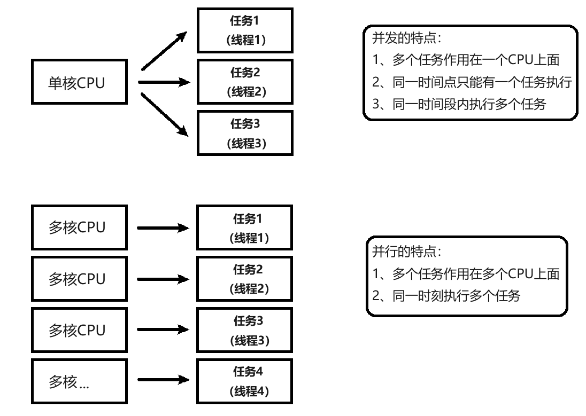

### 10.4 Golang中的协程（goroutine）以及主线程

Golang中的主线程：（可以理解为线程/也可以理解为进程），在一个Golang程序的主线程上可以起多个协程。Golang中多协程可以实现并行或者并发。

`协程（goroutine）`：可以理解为用户级线程，这是对内核透明的，也就是系统并不知道有协程的存在，是完全由用户自己的程序进行调度的。Golang的一大特色就是从语言层面原生支持协程，在函数或者方法前面加go关键字就可创建一个协程。可以说Golang中的协程就是`goroutine`。

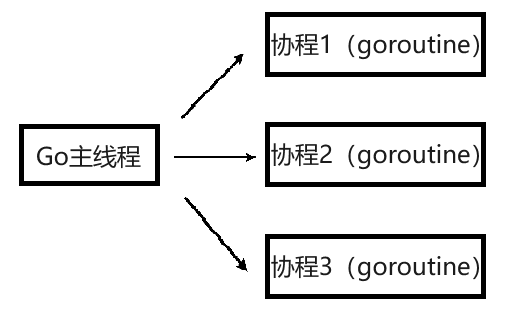

Golang中的多协程有点类似其他语言中的多线程。

多协程和多线程：Golang中每个`goroutine`（协程） 默认占用内存远比Java、C的线程少。

OS线程（操作系统线程）一般都有固定的栈内存（通常为2MB左右）,一个`goroutine`（协程）占用内存非常小，只有2KB左右，多协程`goroutine`切换调度开销方面远比线程要少。

这也是为什么越来越多的大公司使用Golang的原因之一。

|          | 协程                                                         | 线程                                                         |
| :------: | :----------------------------------------------------------- | :----------------------------------------------------------- |
| 创建数量 | 轻松创建上百万个协程而不会导致系统资源衰竭                   | 通常最多不能超过1万个                                        |
| 内存占用 | 初始分配4k堆栈，随着程序的执行自动增长删除                   | 创建线程时必须指定堆栈且是固定的，通常以M为单位              |
| 切换成本 | 协程切换只需保存三个寄存器，耗时约200纳秒                    | 线程切换需要保存几十个寄存器，耗时约1000纳秒                 |
| 调度方式 | 非抢占式，由Go runtime主动交出控制权（对于开发者而言是抢占式） | 在时间片用完后，由 CPU 中断任务强行将其调度走，这时必须保存很多信息 |
| 创建销毁 | goroutine因为是由Go runtime负责管理的，创建和销毁的消耗非常小，是用户级的 | 创建和销毁开销巨大，因为要和操作系统打交道，是内核级的，通常解决的办法就是线程池 |

### 10.5 Goroutine的使用以及sync.WaitGroup

并行执行需求：

在主线程(可以理解成进程)中，开启一个`goroutine`，该协程每隔50毫秒秒输出`"你好 golang"`。

在主线程中也每隔50毫秒输出`"你好 golang"`, 输10次后，退出程序，要求主线程和`goroutine`同时执行。

```go
package main

import (
	"fmt"
	"strconv"
	"time"
)

func test() {
	for i := 1; i <= 10; i++ {
		fmt.Println("tesst () hello,world " + strconv.Itoa(i))
		time.Sleep(time.Second)
	}
}
func main() {
	go test() // 开启了一个协程
	for i := 1; i <= 10; i++ {
		fmt.Println("main() hello,golang" + strconv.Itoa(i))
		time.Sleep(time.Second)
	}
}

```

**上面代码看上去没有问题，但是要注意主线程执行完毕后即使协程没有执行完毕，程序会退出，所以我们需要对上面代码进行改造。**

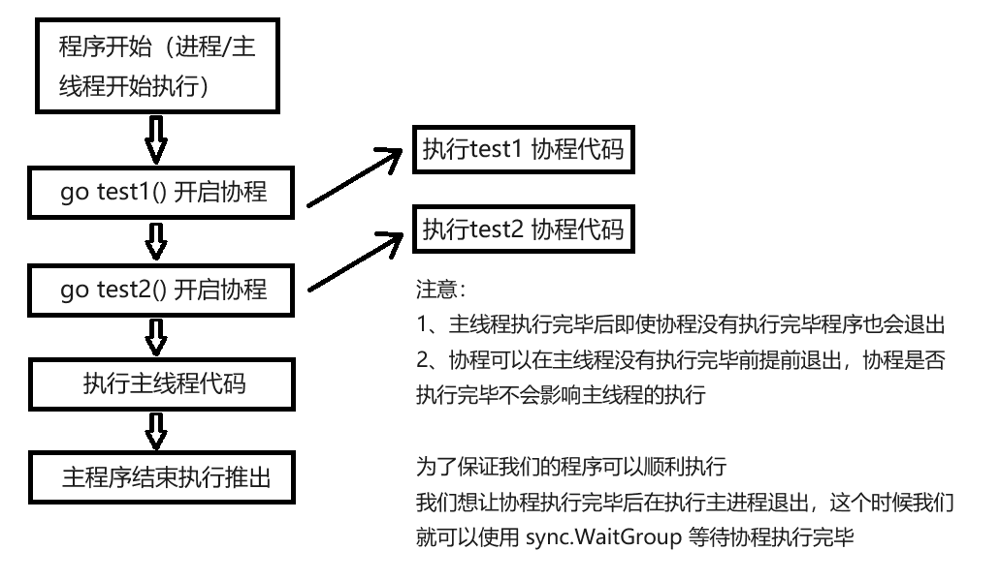

`sync.WaitGroup`可以实现主线程等待协程执行完毕。

```go
package main

import (
	"fmt"
	"strconv"
	"sync"
	"time"
)

var wg sync.WaitGroup // 1、定义全局的 WaitGroup

func test() {
	for i := 1; i <= 10; i++ {
		fmt.Println("test () 你好 golang " + strconv.Itoa(i))
		time.Sleep(time.Millisecond * 50)
	}
	wg.Done() // 4、goroutine 结束就登记-1
}

func main() {
	wg.Add(1) // 2、启动一个 goroutine 就登记+1
	go test()
	for i := 1; i <= 2; i++ {
		fmt.Println(" main() 你好 golang" + strconv.Itoa(i))
		time.Sleep(time.Millisecond * 50)
	}
	wg.Wait() // 3、等待所有登记的 goroutine 都结束
}

```

### 10.6 启动多个Goroutine

在Go语言中实现并发就是这样简单，我们还可以启动多个`goroutine`。让我们再来一个例子：

（这里使用`sync.WaitGroup`来实现等待`goroutine`执行完毕）

```go
package main

import (
	"fmt"
	"sync"
)

var wg sync.WaitGroup

func hello(i int) {
	defer wg.Done() // goroutine 结束就登记-1
	fmt.Println("Hello Goroutine!", i)
}

func main() {
	for i := 0; i < 10; i++ {
		wg.Add(1) // 启动一个 goroutine 就登记+1
		go hello(i)
	}
	wg.Wait() // 等待所有登记的 goroutine 都结束
}

```

多次执行上面的代码，会发现每次打印的数字的顺序都不一致。这是因为10个`goroutine`是并发执行的，而`goroutine`的调度是随机的。

### 10.7 设置Golang并行运行的时候占用的CPU数量

Go运行时的调度器使用`GOMAXPROCS`参数来确定需要使用多少个OS线程来同时执行Go代码。默认值是机器上的CPU核心数。例如在一个8核心的机器上，调度器会把Go代码同时调度到8个OS线程上。

Go语言中可以通过`runtime.GOMAXPROCS()函数`设置当前程序并发时占用的CPU逻辑核心数。

Go 1.5版本之前，默认使用的是单核心执行。Go 1.5版本之后，默认使用全部的CPU逻辑核心数。

```go
package main

import (
	"fmt"
	"runtime"
)

func main() {
	//获取当前计算机上面的 CPU 个数
	cpuNum := runtime.NumCPU()
	fmt.Println("cpuNum=", cpuNum)
	//可以自己设置使用多个 CPU
	runtime.GOMAXPROCS(cpuNum - 1)
	fmt.Println("ok")
}

```

### 10.8 Goroutine统计素数

需求：要统计1-120000的数字中那些是素数？

1. 通过传统的for循环来统计

```go
package main

import (
	"fmt"
	"time"
)

func main() {
	start := time.Now().Unix()
	for num := 1; num <= 120000; num++ {
		flag := true // 假设是素数
		for i := 2; i < num; i++ {
			if num%i == 0 { // 说明该 num 不是素数
				flag = false
				break
			}
		}
		if flag {
			// fmt.Println(num)
		}
	}
	end := time.Now().Unix()
	fmt.Println("普通的方法耗时=", end-start)
}

```

2. `goroutine`开启多个协程统计

```go
package main

import (
	"fmt"
	"sync"
	"time"
)

var wg sync.WaitGroup

func fn1(n int) {
	for num := (n-1)*30000 + 1; num <= n*30000; num++ {
		flag := true // 假设是素数
		for i := 2; i < num; i++ {
			if num%i == 0 {
				flag = false
				break
			}
		}
		if flag {
			// fmt.Println(num)
		}
	}
	wg.Done()
}

func main() {
	start := time.Now().Unix()
	for i := 1; i <= 4; i++ {
		wg.Add(1)
		go fn1(i)
	}
	wg.Wait()
	end := time.Now().Unix()
	fmt.Println("普通的方法耗时=", end-start)
}

```

问题：上面我们使用了`goroutine`已经能大大的提升新能了，但是如果我们想统计数据和打印数据同时进行，这个时候如何实现呢，这个时候我们就可以使用管道。

### 10.9 Channel管道

管道是Golang在语言级别上提供的`goroutine`间的通讯方式，我们可以使用`channel`在多个`goroutine`之间传递消息。如果说`goroutine`是Go程序并发的执行体，`channel`就是它们之间的连接。`channel`是可以让一个`goroutine`发送特定值到另一个`goroutine`的通信机制。

Golang的并发模型是`CSP（Communicating Sequential Processes）`，提倡通过通信共享内存而不是通过共享内存而实现通信。

Go语言中的`管道（channel）`是一种特殊的类型。管道像一个传送带或者队列，总是遵循**先入先出（First In First Out）**的规则，保证收发数据的顺序。每一个管道都是一个具体类型的导管，也就是声明channel的时候需要为其指定元素类型。

#### 10.9.1 channel类型

`channel`是一种类型，一种引用类型。

声明管道类型的格式如下：

```go
var 变量 chan 元素类型
```

举几个例子：

```go
var ch1 chan int   // 声明一个传递整型的管道
var ch2 chan bool  // 声明一个传递布尔型的管道
var ch3 chan []int // 声明一个传递int 切片的管道
```

#### 10.9.2 创建channel

声明的管道后需要使用`make()函数`初始化之后才能使用。

创建`channel`的格式如下：

```go
make(chan 元素类型, 容量)
```

举几个例子：

```go
// 创建一个能存储 10 个 int 类型数据的管道
ch1 := make(chan int, 10)
// 创建一个能存储 4 个 bool 类型数据的管道
ch2 := make(chan bool, 4)
// 创建一个能存储 3 个[]int 切片类型数据的管道
ch3 := make(chan []int, 3)
```

#### 10.9.3 channel操作

管道有`发送（send）`、`接收(receive）`和`关闭（close）`三种操作。

发送和接收都使用`<-`符号。

现在我们先使用以下语句定义一个管道：

```go
ch := make(chan int, 3)
```

##### 10.9.3.1 发送（将数据放在管道内）

将一个值发送到管道中。

```go
ch <- 10  // 把10发送到ch中
```

##### 10.9.3.2 接收（从管道内取值）

从一个管道中接收值。

```go
x := <-ch // 从ch 中接收值并赋值给变量x
<-ch      // 从ch 中接收值，忽略结果
```

##### 10.9.3.3 关闭管道

我们通过调用内置的`close()函数`来关闭管道。

```go
close(ch)
```

关于关闭管道需要注意的事情是，只有在通知接收方`goroutine`所有的数据都发送完毕的时候才需要关闭管道。管道是可以被垃圾回收机制回收的，它和关闭文件是不一样的，在结束操作之后关闭文件是必须要做的，但关闭管道不是必须的。

关闭后的管道有以下特点：

1. 对一个关闭的管道再发送值就会导致`panic`。
2. 对一个关闭的管道进行接收会一直获取值直到管道为空。
3. 对一个关闭的并且没有值的管道执行接收操作会得到对应类型的零值。
4. 关闭一个已经关闭的管道会导致`panic`。

#### 10.9.4 管道阻塞

##### 10.9.4.1 无缓冲的管道

如果创建管道的时候没有指定容量，那么我们可以叫这个管道为无缓冲的管道无缓冲的管道又称为阻塞的管道。我们来看一下下面的代码：

```go
package main

import "fmt"

func main() {
	ch := make(chan int)
	ch <- 10
	fmt.Println("发送成功")
}

```

上面这段代码能够通过编译，但是执行的时候会出现以下错误：

```
goroutine 1 [chan send]:
main.main()
        D:/go_project/src/day1/main.go:7 +0x28
exit status 2
```

##### 10.9.4.2 有缓冲的管道

解决上面问题的方法还有一种就是使用有缓冲区的管道。我们可以在使用make函数初始化管道的时候为其指定管道的容量，例如：

```go
package main

import "fmt"

func main() {
	ch := make(chan int, 1) // 创建一个容量为1 的有缓冲区管道
	ch <- 10
	fmt.Println("发送成功")
}

```

只要管道的容量大于零，那么该管道就是有缓冲的管道，管道的容量表示管道中能存放元素的数量。就像你小区的快递柜只有那么个多格子，格子满了就装不下了，就阻塞了，等到别人取走一个快递员就能往里面放一个。

管道阻塞具体代码如下：

```go
package main

import "fmt"

func main() {
	ch := make(chan int, 1)
	ch <- 10
	ch <- 12
	fmt.Println("发送成功")
}

```

解决办法：

```go
package main

import "fmt"

func main() {
	ch := make(chan int, 1)
	ch <- 10 // 放进去
	<-ch     // 取走
	ch <- 12 // 放进去
	<-ch     // 取走
	ch <- 17 // 还可以放进去
	fmt.Println("发送成功")
}

```

#### 10.9.5 for range从管道循环取值

当向管道中发送完数据时，我们可以通过`close()函数`来关闭管道。

当管道被关闭时，再往该管道发送值会引发`panic`，从该管道取值的操作会先取完管道中的值，再然后取到的值一直都是对应类型的零值。那如何判断一个管道是否被关闭了呢？我们来看下面这个例子：

```go
package main

import "fmt"

// 循环遍历管道数据
func main() {
	var ch1 = make(chan int, 5)
	for i := 0; i < 5; i++ {
		ch1 <- i + 1
	}
	close(ch1) // 关闭管道
	// 使用 for range 遍历管道，当管道被关闭的时候就会退出 for range,如果没有关闭管道就会报个错误 fatal error: all goroutines are asleep - deadlock!
	// 通过 for range 来遍历管道数据 管道没有 key
	for val := range ch1 {
		fmt.Println(val)
	}
}

```

从上面的例子中我们看到有两种方式在接收值的时候判断该管道是否被关闭，不过我们通常使用的是`for range`的方式。使用`for range`遍历管道，当管道被关闭的时候就会退出`for range`。

### 10.10 Goroutine结合Channel管道

需求1：定义两个方法，一个方法给管道里面写数据，一个给管道里面读取数据，要求同步进行。

1. 开启一个fn1的的协程给向管道inChan中写入 100 条数据

2. 开启一个fn2的协程读取inChan中写入的数据

3. 注意：fn1和fn2同时操作一个管道

4. 主线程必须等待操作完成后才可以退出

```go
package main

import (
	"fmt"
	"sync"
	"time"
)

var wg sync.WaitGroup

func fn1(intChan chan int) {
	for i := 0; i < 100; i++ {
		intChan <- i + 1
		fmt.Println("writeData 写入数据-", i+1)
		time.Sleep(time.Millisecond * 100)
	}
	close(intChan)
	wg.Done()
}

func fn2(intChan chan int) {
	for v := range intChan {
		fmt.Printf("readData 读到数据=%v\n", v)
		time.Sleep(time.Millisecond * 50)
	}
	wg.Done()
}

func main() {
	allChan := make(chan int, 100)
	wg.Add(1)
	go fn1(allChan)
	wg.Add(1)
	go fn2(allChan)
	wg.Wait()
	fmt.Println("读取完毕...")
}

```

需求2：goroutine结合channel实现统计1-120000的数字中那些是素数？

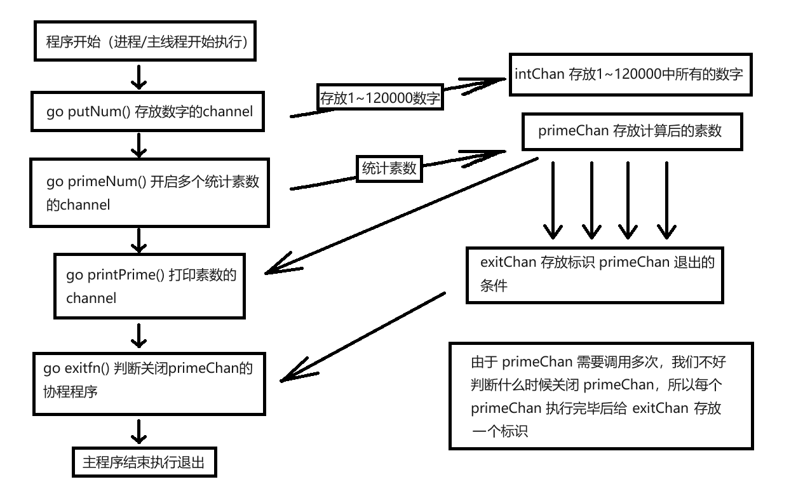

```go
package main

import (
	"fmt"
	"sync"
	"time"
)

var wg sync.WaitGroup

// 向intChan放入 1-120000 个数
func putNum(intChan chan int) {
	for i := 1; i <= 1000; i++ {
		intChan <- i
	}
	//关闭 intChan
	close(intChan)
	wg.Done()
}

// 从intChan取出数据，并判断是否为素数,如果是，就放入到primeChan
func primeNum(intChan chan int, primeChan chan int, exitChan chan bool) {
	for num := range intChan {
		var flag bool = true
		for i := 2; i < num; i++ {
			if num%i == 0 { // 说明该num不是素数
				flag = false
				break
			}
		}
		if flag {
			// 将这个数就放入到primeChan
			primeChan <- num
		}
	}
	// 判断关闭
	exitChan <- true
	wg.Done()
}

// 打印素数的方法
func printPrime(primeChan chan int) {
	for v := range primeChan {
		fmt.Println(v)
	}
	wg.Done()
}

func main() {
	start := time.Now().Unix()
	intChan := make(chan int, 1000)
	primeChan := make(chan int, 20000) // 放入结果
	// 标识退出的管道
	exitChan := make(chan bool, 8) // 8个
	// 开启一个协程，向intChan放入1-8000个数
	wg.Add(1)
	go putNum(intChan)
	// 开启4个协程，从intChan 取出数据，并判断是否为素数,如果是，就放入到primeChan
	for i := 0; i < 8; i++ {
		wg.Add(1)
		go primeNum(intChan, primeChan, exitChan)
	}
	// 打印素数
	wg.Add(1)
	go printPrime(primeChan)
	// 判断什么时候退出
	wg.Add(1)
	go func() {
		for i := 0; i < 8; i++ {
			<-exitChan
		}
		// 当我们从exitChan取出了8个结果，就可以放心的关闭prprimeChan
		close(primeChan)
		wg.Done()
	}()
	wg.Wait()
	end := time.Now().Unix()
	fmt.Println(end - start)
	fmt.Println("main 线程退出")
}

```

### 10.11 单向管道

有的时候我们会将管道作为参数在多个任务函数间传递，很多时候我们在不同的任务函数中使用管道都会对其进行限制，比如限制管道在函数中只能发送或只能接收。

1. `chan<- int`是一个只能发送的通道，可以发送但是不能接收；
2. `<-chan int`是一个只能接收的通道，可以接收但是不能发送。

例如：

(一般建议不要直接声明只读或只写管道，是没有多大意义的，以下举例代码仅供了解其意义)

```go
package main

import "fmt"

func main() {
	// 1. 在默认情况下下，管道是双向
	// var chan1 chan int //可读可写

	// 2 声明为只写
	var chan2 chan<- int
	chan2 = make(chan int, 3)
	chan2 <- 20
	// num := <-chan2 //error
	fmt.Println("chan2=", chan2)

	var chan_temp chan int
	chan_temp = make(chan int, 1)
	chan_temp <- 1

	// 3. 声明为只读
	var chan3 <-chan int = chan_temp
	num2 := <-chan3
	// chan3<- 30 //err
	fmt.Println("num2=", num2)

}

```

**一般用于对不同的任务函数中使用管道进行限制，限制管道在函数中只能发送或只能接收。**

```go
package main

import "fmt"

func counter(out chan<- int) { // 限制为只写
	for i := 0; i < 100; i++ {
		out <- i
	}
	close(out)
}

func squarer(out chan<- int, in <-chan int) { // 限制为只写、只读
	for i := range in {
		out <- i * i
	}
	close(out)
}
func printer(in <-chan int) { // 限制为只读
	for i := range in {
		fmt.Println(i)
	}
}

func main() {
	ch1 := make(chan int)
	ch2 := make(chan int)
	go counter(ch1)
	go squarer(ch2, ch1)
	printer(ch2)
}

```

### 10.12 select多路复用

在某些场景下我们需要同时从多个通道接收数据。这个时候就可以用到Golang中给我们提供的`select多路复用`。

通常情况通道在接收数据时，如果没有数据可以接收将会发生阻塞。

比如说下面代码来实现从多个通道接受数据的时候就会发生阻塞：

```go
for {
	// 尝试从ch1 接收值
	data, ok := <-ch1
	// 尝试从ch2 接收值
	data, ok := <-ch2
	...
}
```

这种方式虽然可以实现从多个管道接收值的需求，但是运行性能会差很多。为了应对这种场景，Go内置了`select`关键字，可以同时响应多个管道的操作。

`select`的使用类似于`switch语句`，它有一系列`case`分支和一个默认的分支。每个`case`会对应一个管道的通信（接收或发送）过程。`select`会一直等待，直到某个`case`的通信操作完成时，就会执行`case`分支对应的语句。

具体格式如下：

```go
select {
case <-ch1:
	...
case data := <-ch2:
	...
case ch3 <- data:
	...
default:
	默认操作
}
```

举个小例子来演示下`select`的使用：

```go
package main

import (
	"fmt"
	"time"
)

func main() {
	// 1.定义一个管道 10 个数据 int
	intChan := make(chan int, 10)
	for i := 0; i < 10; i++ {
		intChan <- i
	}
	// 2.定义一个管道 5 个数据 string
	stringChan := make(chan string, 5)
	for i := 0; i < 5; i++ {
		stringChan <- "hello" + fmt.Sprintf("%d", i)
	}
	for {
		select {
		case v := <-intChan:
			fmt.Printf("从 intChan 读取的数据%d\n", v)
		case v := <-stringChan:
			fmt.Printf("从 stringChan 读取的数据%s\n", v)
		default:
			fmt.Printf("都取不到了，不玩了, 程序员可以加入逻辑\n")
			time.Sleep(time.Second)
			return
		}
	}
}

```

### 10.13 Golang并发安全和锁

#### 10.13.1 互斥锁

互斥锁是传统并发编程中对共享资源进行访问控制的主要手段，它由标准库`sync`中的`Mutex`结构体类型表示。`sync.Mutex`类型只有两个公开的指针方法，`Lock`和 `Unlock`。`Lock`锁定当前的共享资源，`Unlock`进行解锁。

有问题代码：

```go
package main

import (
	"fmt"
	"time"
)

var count = 0

func test() {
	count++
	fmt.Println("the count is : ", count)
	time.Sleep(time.Millisecond)
}

func main() {
	for r := 0; r < 100; r++ {
		go test()
	}
	time.Sleep(time.Second)
}

```

`go build -race main.go`然后我们运行`main.exe`就知道到底哪里存在互斥

互斥锁解决这个问题：

```go
package main

import (
	"fmt"
	"time"
)

var count = 0

func test() {
	count++
	fmt.Println("the count is : ", count)
	time.Sleep(time.Millisecond)
}
func main() {
	for r := 0; r < 100; r++ {
		go test()
	}
	time.Sleep(time.Second)
}

```

使用互斥锁能够保证同一时间有且只有一个`goroutine`进入临界区，其他的`goroutine`则在等待锁；当互斥锁释放后，等待的`goroutine`才可以获取锁进入临界区，多个`goroutine`同时等待一个锁时，唤醒的策略是随机的。

虽然使用互斥锁能解决资源争夺问题，但是并不完美，通过全局变量加锁同步来实现通讯，并不利于多个协程对全局变量的读写操作。这个时候我们也可以通过另一种方式来实现上面的功能`管道（Channel）`。

#### 10.13.2 读写互斥锁

互斥锁的本质是当一个`goroutine`访问的时候，其他`goroutine`都不能访问。这样在资源同步，避免竞争的同时也降低了程序的并发性能。程序由原来的并行执行变成了串行执行。

其实，当我们对一个不会变化的数据只做“读”操作的话，是不存在资源竞争的问题的。因为数据是不变的，不管怎么读取，多少 `goroutine`同时读取，都是可以的。

所以问题不是出在“读”上，主要是修改，也就是“写”。修改的数据要同步，这样其他`goroutine`才可以感知到。所以真正的互斥应该是读取和修改、修改和修改之间，读和读是没有互斥操作的必要的。

因此，衍生出另外一种锁，叫做读写锁。

读写锁可以让多个读操作并发，同时读取，但是对于写操作是完全互斥的。也就是说，当一个`goroutine`进行写操作的时候，其他 `goroutine`既不能进行读操作，也不能进行写操作o。

Go中的读写锁由结构体类型`sync.RWMutex`表示。此类型的方法集合中包含两对方法：

一组是对写操作的锁定和解锁，简称“写锁定”和“写解锁”：

```go
func (*RWMutex)Lock()
func (*RWMutex)Unlock()
```

另一组表示对读操作的锁定和解锁，简称为“读锁定”与“读解锁”：

```go
func (*RWMutex)RLock()
func (*RWMutex)RUnlock()
```

读写锁示例：

```go
package main

import (
	"fmt"
	"sync"
	"time"
)

var count int
var mutex sync.RWMutex
var wg sync.WaitGroup

// 写的方法
func write() {
	mutex.Lock()
	fmt.Println("执行写操作")
	time.Sleep(time.Second * 3)
	mutex.Unlock()
	wg.Done()
}

// 读的方法
func read() {
	mutex.RLock()
	fmt.Println("执行读操作")
	time.Sleep(time.Second * 3)
	mutex.RUnlock()
	wg.Done()
}

func main() {
	// 开启10个协程执行写操作
	for i := 0; i < 10; i++ {
		wg.Add(1)
		go read()
	}
	// 开启10个协程执行读操作
	for i := 0; i < 10; i++ {
		wg.Add(1)
		go write()
	}
	wg.Wait()
}

```

### 10.14 Goroutine Recover解决协程中出现的Panic

```go
package main

import (
	"fmt"
	"time"
)

// 函数
func sayHello() {
	for i := 0; i < 10; i++ {
		time.Sleep(time.Second)
		fmt.Println("hello,world")
	}
}

// 函数
func test() {
	// 这里我们可以使用defer+recover
	defer func() {
		// 捕获test抛出的panic
		if err := recover(); err != nil {
			fmt.Println("test() 发生错误", err)
		}
	}()
	// 定义了一个map
	var myMap map[int]string
	myMap[0] = "golang" // error
}

func main() {
	go sayHello()
	go test()
	for i := 0; i < 10; i++ {
		fmt.Println("main() ok=", i)
		time.Sleep(time.Second)
	}
}

```

---

## 模块十一：包与工程化

### 11.1 学习目标

1. 了解Golang中的包的定义
2. 熟练并掌握学会包的使用

### 11.2 Golang中包的介绍和定义

`包（package）`是多个Go源码的集合，是一种高级的代码复用方案，Go语言为我们提供了很多内置包，如`fmt`、`strconv`、`strings`、`sort`、`errors`、`time`、`encoding/json`、`os`、`io`等。

Golang中的包可以分为三种：1、系统内置包 2、自定义包 3、第三方包

系统内置包: Golang 语言给我们提供的内置包，引入后可以直接使用，如`fmt`、`strconv`、`strings`、`sort`、`errors`、`time`、`encoding/json`、`os`、`io` 等。

自定义包：开发者自己写的包。

第三方包：属于自定义包的一种，需要下载安装到本地后才可以使用，如`"github.com/shopspring/decimal"`包解决`float`精度丢失问题。

### 11.3 Golang包管理工具go mod

在Golang 1.11版本之前如果我们要自定义包的话必须把项目放在GOPATH目录。Go1.11版本之后无需手动配置环境变量，使用go mod管理项目，也不需要非得把项目放到`GOPATH`指定目录下，你可以在你磁盘的任何位置新建一个项目，Go1.13以后可以彻底不要`GOPATH`了。

#### 11.3.1 go mod init初始化项目

实际项目开发中我们首先要在我们项目目录中用`go mod`命令生成一个`go.mod`文件管理我们项目的依赖。

比如我们的Golang项目文件要放在了day1这个文件夹，这个时候我们需要在day1文件夹 里面使用`go mod`命令生成一个`go.mod`文件。

**（2.9已经介绍过`go mod`的基础用法，这里不做过多讲述）G**

#### 11.3.2 go mod其他命令

`download` download modules to local cache （下载依赖的module到本地cache）

`edit` edit go.mod from tools or scripts （编辑go.mod文件）

`graph` print module requirement graph （打印模块依赖图）

`init` initialize new module in current directory （再当前文件夹下初始化一个新的module，创建go.mod文件）

`tidy` add missing and remove unused modules （增加丢失的module，去掉未用的module）

`vendor` make vendored copy of dependencies （将依赖复制到vendor下）

`verify` verify dependencies have expected content （校验依赖检查下载的第三方库有没有本地修改，如果有修改，则会返回非0，否则验证成功）

`why` explain why packages or modules are needed （解释为什么需要依赖）

### 11.4 Golang中自定义包

`包（package）`是多个Go源码的集合，一个包可以简单理解为一个存放多个`.go`文件的文件 夹。该文件夹下面的所有`go文件`都要在代码的第一行添加如下代码，声明该文件归属的包。

```go
package 包名
```

注意事项： 

- 一个文件夹下面直接包含的文件只能归属一个`package`，同样一个`package`的文件不能 在多个文件夹下。

- 包名可以不和文件夹的名字一样，包名不能包含 - 符号。

- 包名为`main`的包为应用程序的入口包，这种包编译后会得到一个可执行文件，而编译不包含。

#### 11.4.1 定义一个包

如果想在一个包中引用另外一个包里的标识符（如变量、常量、类型、函数等）时，该标识符必须是对外可见的（public）。在Go语言中只需要将标识符的首字母大写就可以让标识符对外可见了。

详细步骤：

**首先在工作区目录下生成并初始化一个go.work文件**

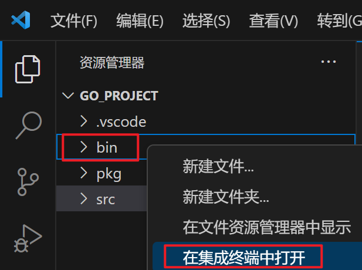

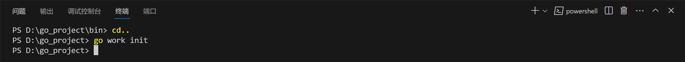

**在src下新建一个包名为calc的包**

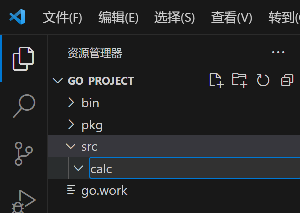

**初始化该模块**

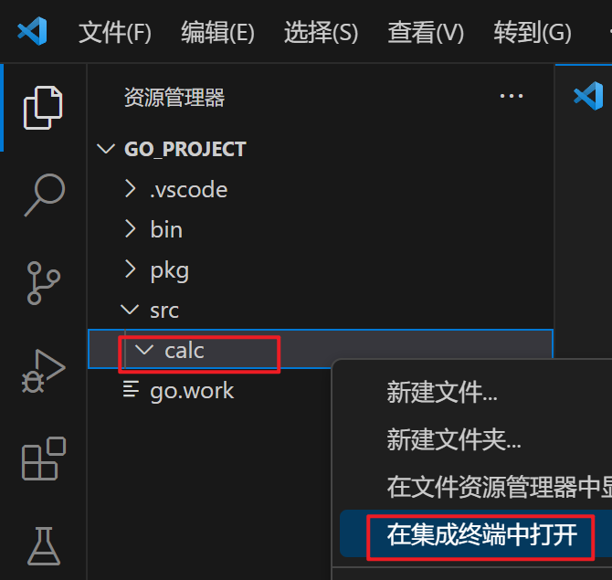

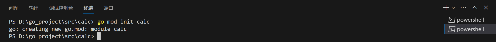

**将该模块纳入工作区，即go work use一下该模块**

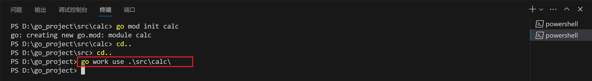

**在calc包里新建一个.go文件**

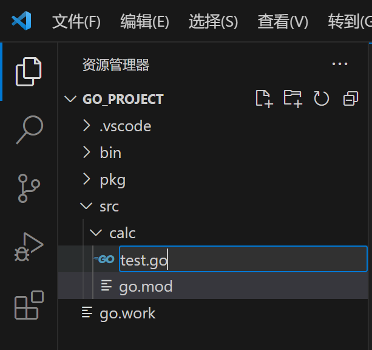

**写入以下代码，并保存**

代码如下：

```go
package calc

// 首字母大小表示公有，首字母小写表示私有
var a = 100  // 私有变量
var Age = 20 // 公有变量
func Add(x, y int) int { // 公有方法
	return x + y
}
func subTest(x, y int) int { // 私有方法
	return x - y
}
func Sub(x, y int) int { // 私有方法可以在本包中调用
	return subTest(x, y)
}
func Test() int { // 私有变量可以在本包中调用
	return a
}

```

**在src下新建main.go文件**

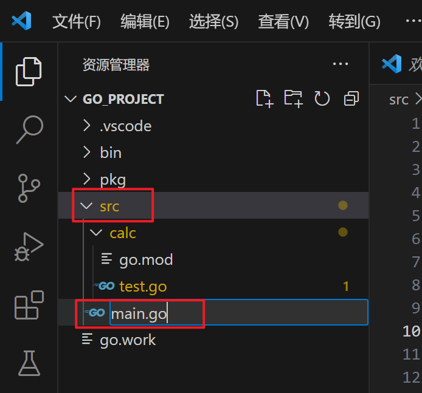

**写入以下代码，并保存

main.go中引入这个包，访问一个包里面的公有属性方法的时候需要通过包名称.去访问

```go
package main

import (
	"calc"
	"fmt"
)

func main() {
	a := calc.Add(10, 20)
	s := calc.Sub(20, 10)
	fmt.Println(a)
	fmt.Println(s)
	fmt.Println(calc.Age)
	fmt.Println(calc.Test())
}

```


**开始执行代码**

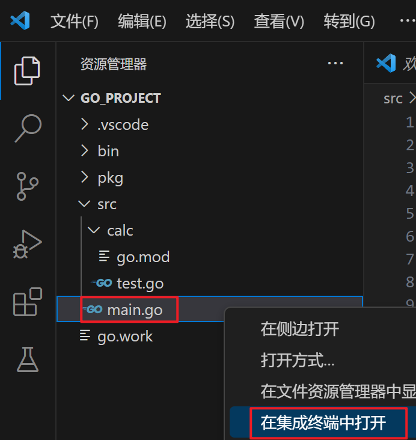

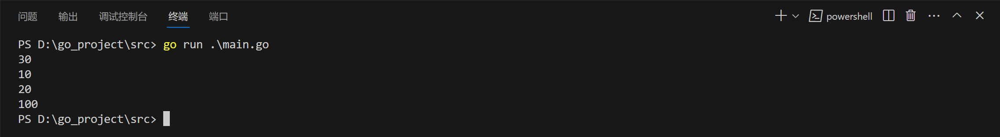

#### 11.4.2 导入一个包

##### 11.4.2.1 单行导入

单行导入的格式如下：

```go
import "包 1"
import "包 2"
```

##### 11.4.2.2 多行导入

多行导入的格式如下：

##### 11.4.2.3 匿名导入包

如果只希望导入包，而不使用包内部的数据时，可以使用匿名导入包。具体的格式如下：

```go
import  _ "包的路径"
```

匿名导入的包与其他方式导入的包一样都会被编译到可执行文件中。

#### 11.4.3 自定义包名

在导入包名的时候，我们还可以为导入的包设置别名。通常用于导入的包名太长或者导入的 包名冲突的情况。

具体语法格式如下：

```go
import 别名 "包的路径"
```

举例：

```go
package main

import (
	c "calc"
	"fmt"
)

func main() {
	a := c.Add(10, 20)
	s := c.Sub(20, 10)
	fmt.Println(a)
	fmt.Println(s)
	fmt.Println(c.Age)
	fmt.Println(c.Test())
}

```

### 11.5 Golang中init()初始化函数

#### 11.5.1 init()函数介绍

在Go语言程序执行时导入包语句会自动触发包内部init()函数的调用。

需要注意的是：`init()函数`没有参数也没有返回值。

init()函数在程序运行时自动被调用执行，不能在代码中主动调用它。

包初始化执行的顺序如下图所示：

函数的执行时机.png)

#### 11.5.2 init()函数执行顺序

Go语言包会从main包开始检查其导入的所有包，每个包中又可能导入了其他的包。

Go编译器由此构建出一个树状的包引用关系，再根据引用顺序决定编译顺序，依次编译这些包的代码。

在运行时，被最后导入的包会最先初始化并调用其`init()函数`，如下图所示：

函数的执行顺序.png)

### 11.6 Golang中使用第三方包

我们可以在[Go Packages - Go Packages](https://pkg.go.dev/)查找看常见的Golang第三方包。

**找到我们需要下载安装的第三方包的地址**

比如解决float精度损失的包decimal

https://github.com/shopspring/decimal

**安装这个包**

第一种方法：`go get 包名称` （全局）

```go
go get github.com/shopspring/decimal
```

第二种方法：`go mod  download` （全局）

```go
go mod download
```

依赖包会自动下载到`$GOPATH/pkg/mod`，多个项目可以共享缓存的`mod`，注意使用`go mod download`的时候首先需要在你的项目里面引入第三方包。

第三种方法：`go mod vendor` 将依赖复制到当前项目的vendor下 （本项目）

```go
go mod vendor
```

将依赖复制到当前项目的`vendor`下。

**注意：使用`go mod vendor`的时候首先需要在你的项目里面引入第三方包。**

**看文档使用这个包**

包安装完毕后我们就可以看文档使用这个包了...

---

## 模块十二：文件管理

### 12.1 学习目标

1.  了解文件操作的相关api
2. 了解基本的文件操作：打开关闭文件、读取文件、写入文件、拷贝文件、重命名文件、创建目录、删除目录或文件等

### 12.2 相关API

1. 根据提供的文件名创建新的文件，返回一个文件对象，默认权限是0666

    ```go
    func Create(name string) (file *File, err Error)
    ```

2. 根据文件描述符创建相应的文件，返回一个文件对象

    ```go
    func NewFile(fd uintptr, name string) *File
    ```

3. 只读方式打开一个名称为name的文件

    ```go
    func Open(name string) (file *File, err Error)
    ```

4. 打开名称为name的文件，flag是打开的方式，只读、读写等，perm是权限

    ```go
    func OpenFile(name string, flag int, perm uint32) (file *File, err Error)
    ```

5. 写入byte类型的信息到文件

    ```go
    func (file *File) Write(b []byte) (n int, err Error)
    ```

6. 在指定位置开始写入byte类型的信息

    ```go
    func (file *File) WriteAt(b []byte, off int64) (n int, err Error)
    ```

7. 写入string信息到文件

    ```go
    func (file *File) WriteString(s string) (ret int, err Error)
    ```

8. 读取数据到b中

    ```go
    func (file *File) Read(b []byte) (n int, err Error)
    ```

9. 从off开始读取数据到b中

    ```go
    func (file *File) ReadAt(b []byte, off int64) (n int, err Error)
    ```

10. 删除文件名为name的文件

    ```go
    func Remove(name string) Error
    ```

### 12.3 打开和关闭文件

#### 12.3.1 os.Open()

`os.Open()`函数能够打开一个文件，返回一个`*File`和一个`err`。对得到的文件实例调用`close()方法`能够关闭文件（一定不要忘记关闭文件）。

```go
package main

import (
	"fmt"
	"os"
)

func main() {
	// 只读方式打开当前目录下的main.go文件
	file, err := os.Open("./main.go")
	if err != nil {
		fmt.Println("open file failed!, err:", err)
		return
	}
	// 关闭文件
	file.Close()
}

```

#### 12.3.2 os.OpenFile()

`os.OpenFile()函数`能够以指定模式打开文件，从而实现文件写入相关功能。

```go
func OpenFile(name string, flag int, perm FileMode) (*File, error) { ... }
```

其中： `name`：要打开的文件名，`flag`：打开文件的模式。

模式有以下几种：

| 模式        | 含义     |
| :---------- | :------- |
| os.O_WRONLY | 只写     |
| os.O_CREATE | 创建文件 |
| os.O_RDONLY | 只读     |
| os.O_RDWR   | 读写     |
| os.O_TRUNC  | 清空     |
| os.O_APPEND | 追加     |

### 12.4 读取文件

#### 12.4.1 file.Read()和file.ReadAt()

文件读取可以用`file.Read()`和`file.ReadAt()`，读到文件末尾会返回`io.EOF`的错误。

Read 方法定义如下：

```go
func (f *File) Read(b []byte) (n int, err error)
```

它接收一个字节切片，返回读取的字节数和可能的具体错误，读到文件末尾时会返回`0`和`io.EOF`。

举个例子：

```go
package main

import (
	"fmt"
	"io"
	"os"
)

func main() {
	// 只读方式打开当前目录下的 main.go 文件
	file, err := os.Open("./main.go")
	if err != nil {
		fmt.Println("open file failed!, err:", err)
		return
	}
	defer file.Close()
	// 使用 Read 方法读取数据，注意一次只会读取 128 个字节
	var tmp = make([]byte, 128)
	n, err := file.Read(tmp)
	if err == io.EOF {
		fmt.Println("文件读完了")
		return
	}
	if err != nil {
		fmt.Println("read file failed, err:", err)
		return
	}
	fmt.Printf("读取了%d 字节数据\n", n)
	fmt.Println(string(tmp[:n]))
}

```

`file.ReadAt()`的用法与此类似。

##### 12.4.1.1 循环读取

使用for循环读取文件中的所有数据。

举个例子：

```go
package main

import (
	"fmt"
	"io"
	"os"
)

func main() {
	// 只读方式打开当前目录下的 main.go 文件
	file, err := os.Open("./main.go")
	if err != nil {
		fmt.Println("open file failed!, err:", err)
		return
	}
	defer file.Close()
	// 循环读取文件
	var content []byte
	var tmp = make([]byte, 128)
	for {
		n, err := file.Read(tmp)
		if err == io.EOF {
			fmt.Println("文件读完了")
			break
		}
		if err != nil {
			fmt.Println("read file failed, err:", err)
			return
		}
		content = append(content, tmp[:n]...)
	}
	fmt.Println(string(content))
}

```

#### 12.4.2 bufio.NewReader()

`bufio包`实现了带缓冲区的读写，是对文件读写的封装

`bufio.NewReader()`缓冲读数据

```go
package main

import (
	"bufio"
	"fmt"
	"io"
	"os"
)

// bufio 按行读取示例
func main() {
	file, err := os.Open("C:/test.txt")
	if err != nil {
		fmt.Println("open file failed, err:", err)
		return
	}
	defer file.Close()
	reader := bufio.NewReader(file)
	for {
		line, err := reader.ReadString('\n') // 注意是字符
		if err == io.EOF {
			if len(line) != 0 {
				fmt.Println(line)
			}
			fmt.Println("文件读完了")
			break
		}
		if err != nil {
			fmt.Println("read file failed, err:", err)
			return
		}
		fmt.Print(line)
	}
}

```

#### 12.4.3 ioutil.ReadFile()（Go 1.16已废弃io/ioutil包）

**修改（Go 1.16及以上版本）：ioutil.ReadFile() -> os.ReadFile()**

`io/ioutil包`的`ReadFile()方法`能够读取完整的文件，只需要将文件名作为参数传入。

```go
package main

import (
	"fmt"
	"io/ioutil"
)

// ioutil.ReadFile 读取整个文件
func main() {
	content, err := ioutil.ReadFile("./main.go")
	if err != nil {
		fmt.Println("read file failed, err:", err)
		return
	}
	fmt.Println(string(content))
}

```

### 12.5 写入文件

#### 12.5.1 file.Write()和file.WriteString()

```go
package main

import (
	"fmt"
	"os"
)

func main() {
	file, err := os.OpenFile("C:/test.txt", os.O_CREATE|os.O_RDWR, 0666)
	if err != nil {
		fmt.Println("open file failed, err:", err)
		return
	}
	defer file.Close()
	str := "你好 golang"
	file.Write([]byte(str))        // 写入字节切片数据
	file.WriteString("直接写入的字符串数据") // 直接写入字符串数据
}

```

#### 12.5.2 bufio.NewWriter()

`bufio.NewWriter()`缓冲写数据

```go
package main

import (
	"bufio"
	"fmt"
	"os"
)

func main() {
	file, err := os.OpenFile("C:/test.txt", os.O_CREATE|os.O_TRUNC|os.O_WRONLY, 0666)
	if err != nil {
		fmt.Println("open file failed, err:", err)
		return
	}
	defer file.Close()
	writer := bufio.NewWriter(file)
	for i := 0; i < 10; i++ {
		writer.WriteString("你好 golang\r\n") // 将数据先写入缓存
	}
	writer.Flush() // 将缓存中的内容写入文件（注意）
}

```

#### 12.5.3 ioutil.WriteFile()（Go 1.16已废弃io/ioutil包）

**修改（Go 1.16及以上版本）：ioutil.WriteFile() -> os.WriteFile()**

```go
package main

import (
	"fmt"
	"io/ioutil"
)

func main() {
	str := "hello golang"
	err := ioutil.WriteFile("C:/test.txt", []byte(str), 0666)
	if err != nil {
		fmt.Println("write file failed, err:", err)
		return
	}
}

```

### 12.6 拷贝文件

#### 12.6.1 第一种拷贝文件方法：ioutil包进行拷贝

**修改（Go 1.16及以上版本）：ioutil -> os**

```go
package main

import (
	"fmt"
	"io/ioutil"
)

// 自己编写一个函数，接收两个文件路径 srcFileName dstFileName
func CopyFile(dstFileName string, srcFileName string) (err error) {
	input, err := ioutil.ReadFile(srcFileName)
	if err != nil {
		fmt.Println(err)
		return err
	}
	err = ioutil.WriteFile(dstFileName, input, 0644)
	if err != nil {
		fmt.Println("Error creating", dstFileName)
		fmt.Println(err)
		return err
	}
	return nil
}
func main() {
	srcFile := "c:/test1.zip"
	dstFile := "D:/test1.zip"
	err := CopyFile(dstFile, srcFile)
	if err == nil {
		fmt.Printf("拷贝完成\n")
	} else {
		fmt.Printf("拷贝错误 err=%v\n", err)
	}
}

```

#### 12.6.2 第二种拷贝文件方法：文件流的方式拷贝

```go
package main

import (
	"fmt"
	"io"
	"os"
)

// 自己编写一个函数，接收两个文件路径 srcFileName dstFileName
func CopyFile(dstFileName string, srcFileName string) (err error) {
	source, _ := os.Open(srcFileName)
	destination, _ := os.OpenFile(dstFileName, os.O_CREATE|os.O_WRONLY, 0666)
	buf := make([]byte, 128)
	for {
		n, err := source.Read(buf)
		if err != nil && err != io.EOF {
			return err
		}
		if n == 0 {
			break
		}
		if _, err := destination.Write(buf[:n]); err != nil {
			return err
		}
	}
	return nil
}

func main() {
	//调用 CopyFile 完成文件拷贝
	srcFile := "c:/000.avi"
	dstFile := "D:/000.avi"
	err := CopyFile(dstFile, srcFile)
	if err == nil {
		fmt.Printf("拷贝完成\n")
	} else {
		fmt.Printf("拷贝错误 err=%v\n", err)
	}
}

```

### 12.7 重命名文件

```go
err := os.Rename("C:/test1.txt", "C:/test2.txt") // 只能同盘操作
if err != nil {
	fmt.Println(err)
}
```

### 12.8 创建目录

#### 12.8.1 一次创建一个目录

```go
err := os.Mkdir("./abc", 0666)
if err != nil {
	fmt.Println(err)
}
```

#### 12.8.2 一次创建多个目录

```go
err := os.MkdirAll("dir1/dir2/dir3", 0666) //创建多级目录
if err != nil {
	fmt.Println(err)
}
```

### 12.9 删除目录和文件

#### 12.9.1 删除一个目录或者文件

```go
err := os.Remove("t.txt")
if err != nil {
	fmt.Println(err)
}
```

#### 12.9.2 一次删除多个目录或者文件

```go
err := os.RemoveAll("aaa")
if err != nil {
	fmt.Println(err)
}
```

---

## 后记

**Go基础还应包括：GoWeb、、GoSocket、Go数据库等等，如果有机会，博主再与大家介绍分享。。。**

本篇文档欢迎任何人进行转载，但是必须标注来源！！！
